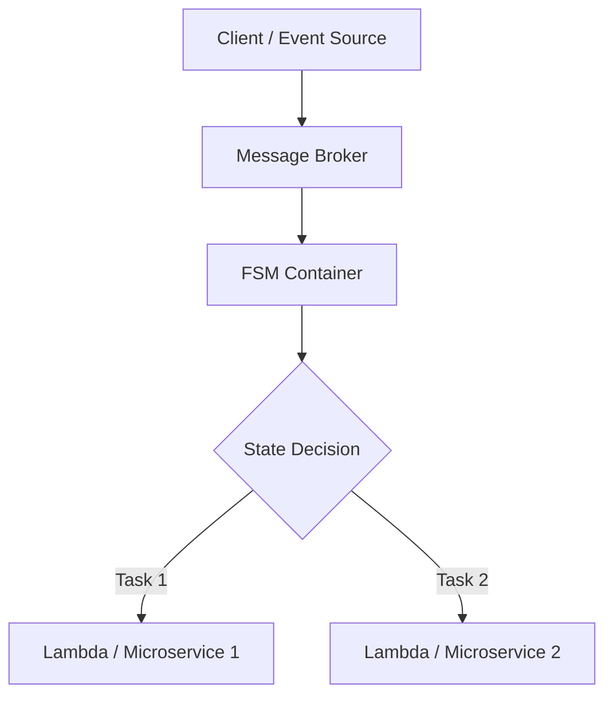

## 서문

로봇과 같이 물리적인 실세계를 다루는 서비스는 즉시성이 낮고,  
AI 기반 서비스 역시 상태 전이와 응답 지연이 빈번합니다.  
이러한 환경에서는 종종 상태관리와 통신, 처리 로직이 결합된 비효율적 구조가 만들어지며,  
특히 주니어 개발자에게는 진입장벽이 높은 구조가 됩니다.

우리는 이를 해결하기 위해 Python의 `asyncio` 기반 비동기 구조를 채택하여,  
**통신 / 상태 / 처리**의 관심사를 분리하는 방식을 사용합니다.  
이 문서는 그러한 구조를 이해하고,  
**FSM 기반의 메시지 처리 방식에서 시작하여, 확장 가능한 마이크로서비스 구조로 진화하는** 과정을 다루고자 합니다.

---

## 1. 메시지 기반 구조의 필요성

### 1.1 상태 중심 시스템의 한계

물리적/지능형 시스템에서는 상태가 지속적으로 변화하며,  
처리 타이밍이 불규칙합니다. 이때 다음과 같은 문제가 자주 발생합니다:

- 처리 로직이 통신 흐름에 뒤엉켜 유지보수 어려움
- 상태 판단 조건이 로직에 흩어져 있어 테스트 불가
- 시간 지연 및 재시도 처리 코드가 중첩됨

### 1.2 흐름 중심 로직과 상태 전이의 충돌

- API처럼 순차적 흐름을 가정한 구조는 현실의 "상태 전이"를 제대로 표현하지 못합니다.
- 메시지 기반 이벤트 처리 방식이 더 자연스럽습니다.

### 1.3 메시지 기반 분리의 장점

- 메시지를 중심으로 통신과 상태를 **완전히 분리**
- FSM을 통해 상태 전이만 관리하고, 처리는 별도 코루틴으로 위임
- 디버깅이 쉬워지고, 각 구성 요소의 책임이 명확해짐

### 1.4 `async/await` 기반 구조의 적합성

- 메시지 순서를 지키면서도 동시에 다수 처리 가능
- FSM, 외부 연동, 타이밍 이벤트 등을 자연스럽게 처리

---

## 2. Python의 비동기 구성요소

Python은 `asyncio`를 기반으로 다양한 비동기 패턴을 제공하며,  
이를 통해 효율적인 메시지 처리 구조를 만들 수 있습니다.  
이 장에서는 핵심 구성요소인 Coroutine, asyncio, Queue, Multithread를 소개합니다.

---

### 2.1 Coroutine

Python의 Coroutine은 `async def`로 정의되며, `await` 키워드로 비동기 호출을 제어합니다.

```python
async def handler(msg):
    await process(msg)
```

특징:
- 순차적으로 보이지만 실제로는 비동기적으로 실행됨
- I/O 작업 중 다른 작업으로 context switching 가능
- 비동기 메시지 처리 로직을 표현하기에 적합

### 2.2 asyncio

`asyncio`는 Python의 표준 비동기 프레임워크입니다.
이벤트 루프를 통해 Coroutine의 실행을 관리합니다.

```python
import asyncio

async def main():
    await asyncio.gather(task1(), task2())

asyncio.run(main())
```

주요 API:
- asyncio.run(): 진입점 실행
- asyncio.gather(): 병렬 실행
- asyncio.sleep(): 비동기 지연
- asyncio.create_task(): 코루틴을 태스크로 분리 실행

### 2.3 asyncio.Queue

비동기 메시지를 안전하게 공유할 수 있는 FIFO 큐입니다.
프로듀서-컨슈머 구조를 구현할 때 핵심 도구입니다.

```python
queue = asyncio.Queue()

async def producer():
    await queue.put("data")

async def consumer():
    data = await queue.get()
```

장점:
- 메시지 처리 decoupling
- 재시도/재처리 제어 가능
- FSM이나 Dispatcher와 결합 시 강력함

### 2.4 Multithread + run_in_executor

`asyncio`는 CPU 바운드 작업이나 외부 동기 API 처리에는 약점이 있습니다.
이 경우 `run_in_executor`를 통해 블로킹 함수를 별도 스레드에서 실행할 수 있습니다.

```python
import requests

def blocking_api_call():
    return requests.get("https://example.com")

async def call_in_thread():
    loop = asyncio.get_event_loop()
    result = await loop.run_in_executor(None, blocking_api_call)
```

활용 예시:
- 외부 API 호출 (REST, DB, 하드웨어 등)
- 오래 걸리는 연산을 비동기 흐름에서 분리


## 3. 메시지 처리 구조 설계

이제 앞서 설명한 비동기 구성요소를 활용하여,  
**메시지 수신 → Queue → 상태 기반 FSM → 비동기 코루틴 처리** 흐름을 설계합니다.

---

### 3.1 처리 흐름 개요

메시지는 수신 즉시 `asyncio.Queue`에 저장되고,  
`dispatcher`가 이를 소비하며 `FSM`에 전달합니다.  
FSM은 현재 상태에 따라 적절한 처리 핸들러 코루틴을 호출합니다.

```text
[Message Source] → [asyncio.Queue] → [FSM Dispatcher] → [Coroutine Handler]
```

### 3.2 전체 예제 코드
아래는 구조 전체를 간단한 코드로 구현한 예시입니다:

```python
import asyncio

# 메시지 큐
queue = asyncio.Queue()

# 메시지 수신 (예: WebSocket, TCP 등)
async def message_listener():
    while True:
        msg = await receive_message()   # 비동기 수신
        await queue.put(msg)

# 상태 기반 dispatcher
class StateMachine:
    def __init__(self):
        self.state = "idle"

    async def handle(self, msg):
        if self.state == "idle" and msg.type == "start":
            self.state = "working"
            await self.do_work()
        elif self.state == "working" and msg.type == "stop":
            self.state = "idle"
            await self.stop_work()

    async def do_work(self):
        print("작업 중...")

    async def stop_work(self):
        print("작업 종료")

# 메시지 dispatcher
async def dispatcher(fsm):
    while True:
        msg = await queue.get()
        await fsm.handle(msg)

# 외부 블로킹 연동 예시
def blocking_api_call():
    # 외부 시스템 연동 예: DB, REST, 하드웨어 등
    ...

def wrap_blocking_in_thread():
    loop = asyncio.get_event_loop()
    return loop.run_in_executor(None, blocking_api_call)

# 실행
async def main():
    fsm = StateMachine()
    await asyncio.gather(
        message_listener(),
        dispatcher(fsm)
    )

asyncio.run(main())
```

### 3.3 코드 구성 요약

| 구성 요소           | 설명                                           |
|--------------------|------------------------------------------------|
| `message_listener()` | 외부 시스템(예: WebSocket, TCP 등)으로부터 비동기 메시지를 수신 |
| `asyncio.Queue`    | 메시지를 임시 저장하고, dispatcher에 의해 소비되는 비동기 큐 |
| `StateMachine`     | 현재 상태에 따라 메시지를 분기 처리하는 FSM 클래스 |
| `dispatcher()`     | 큐에서 메시지를 꺼내 FSM에 전달하는 소비자 역할 |
| `run_in_executor()` | 블로킹 함수(예: 외부 API)를 별도 스레드에서 실행하여 비동기 흐름 유지 |

## 4. 잘못된 구조 vs 바람직한 구조

현실의 서비스 개발에서는 메시지 처리, 상태 전이, 외부 연동 등의 로직이  
서로 뒤엉킨 구조를 자주 마주하게 됩니다.  
이 장에서는 비동기 메시지 기반 구조가 왜 유리한지를,  
잘못된 패턴과 바람직한 패턴을 비교하여 설명합니다.

---

| 항목             | 잘못된 구조                         | 바람직한 구조                            |
|------------------|--------------------------------------|-------------------------------------------|
| 상태처리 위치     | 통신 흐름 중간에 분산됨              | FSM 내부로 일원화                         |
| 로직 혼합도       | 통신, 상태, 처리 로직이 섞여 있음     | 각 역할이 분리되어 관심사 명확            |
| 재시도, 대기 처리 | 각 처리 로직에 중복된 타이머, 예외 처리 | Queue 기반의 재처리 구조로 단순화         |
| 테스트 및 디버깅  | 테스트 코드 작성이 어렵고 디버깅 복잡  | FSM 단위 테스트, 메시지 단위 검증 가능     |
| 유지보수성        | 로직 변경 시 전파 범위가 넓음          | 각 구성 요소 독립 변경 가능               |

---

### 핵심 요약

- **Decoupling**이 핵심입니다.  
  통신 → 상태 → 처리 단계를 명확히 분리하면 설계가 단순해집니다.
- 상태는 FSM에서만 다루고,  
  실제 처리는 외부 코루틴이나 핸들러로 위임하는 것이 이상적입니다.
- 메시지 Queue는 재처리와 흐름 통제를 위해 반드시 도입하는 것이 좋습니다.

---

## 5. 고급 확장 전략

앞서 소개한 구조는 단일 서비스나 로컬 환경에서는 충분히 효과적입니다.  
하지만 시스템이 커지고 팀이 나뉘면 다음과 같은 확장 전략이 필요합니다:

---

### 5.1 FSM 로직 분리 및 외부화

FSM(State Machine)을 독립 모듈로 분리하면 다음과 같은 이점이 있습니다:

- 상태 전이 정책을 코드에서 분리하여 관리 가능
- 다양한 FSM 라이브러리(`transitions`, `aiomachine`) 활용 가능
- 테스트/모니터링 용이

예시:

```bash
pip install transitions
```

```python
from transitions import Machine

class Worker:
    pass

worker = Worker()
machine = Machine(model=worker, states=["idle", "working"], initial="idle")
machine.add_transition(trigger="start", source="idle", dest="working")
machine.add_transition(trigger="stop", source="working", dest="idle")
```

### 5.2 메시지 큐 외부화

`asyncio.Queue`는 단일 프로세스 내에서는 유용하지만,  
다중 서비스 간 연동 및 장애 대응을 위해서는 외부 메시지 브로커 도입이 필요합니다.

| 항목        | asyncio.Queue       | Kafka / NATS / RabbitMQ        |
|-------------|---------------------|--------------------------------|
| 범위        | 로컬 프로세스 내부   | 네트워크 기반, 멀티 컨테이너   |
| 확장성      | 제한적              | 수평 확장 가능                  |
| 내구성      | 메모리 기반, 휘발성  | 디스크 기반, 재처리 가능        |
| 장애 복구    | 직접 로직 구성 필요  | 내장 오프셋, ack/nack 기반 안정성 |

**도입 효과**:
- 메시지 유실 방지 및 재처리 용이
- 다수 컨슈머 구성 가능 (e.g. FSM 별 처리기)
- 외부 시스템과 느슨한 결합으로 확장성 향상

---

### 5.3 FSM 컨테이너화

FSM 로직을 컨테이너 단위로 분리하면 다음과 같은 아키텍처 장점이 생깁니다:

- 상태 전이 정책을 **버전별로 분리**하여 배포
- FSM을 독립된 마이크로서비스 또는 Lambda로 구성 가능
- 트래픽에 따른 **독립적 스케일링** 가능

**운용 방식 예시**:

- `fsm-v1`, `fsm-v2` 처럼 처리 정책별 컨테이너
- 메시지 메타데이터에 따라 FSM 컨테이너 라우팅
- 상태 전이 실패 시 컨테이너 단위 재시도 또는 복구 처리

---

### 5.4 메시지 흐름 트레이싱 및 모니터링

이벤트 기반 아키텍처는 흐름 추적이 어려우므로  
트레이싱 체계를 반드시 병행 설계해야 합니다.

**트레이싱 전략**:

- 모든 메시지에 `trace_id`, `correlation_id` 포함
- FSM 상태 전이 시 로그 (`from_state` → `to_state`) 기록
- 주요 이벤트 로그는 중앙 시스템 (e.g. Elasticsearch, Loki) 로 전송

**모니터링 구성 예시**:

- Prometheus → 상태별 처리 수/오류율 수집
- Grafana 대시보드 → FSM 상태 전이/실패 추이 시각화
- OpenTelemetry 도입 → 서비스 간 흐름 연결

---

## 6. 스케일 가능한 구조로의 진화

앞서 설명한 구조는 단일 시스템에서도 효과적이지만,  
이를 **마이크로서비스 아키텍처 또는 클라우드 기반 분산 시스템**으로 확장하면 다음과 같은 장점을 얻을 수 있습니다.

---

### 6.1 메시지 브로커 도입

단일 프로세스의 `asyncio.Queue`를  
NATS, Kafka, RabbitMQ와 같은 외부 메시지 브로커로 대체하면 다음과 같은 효과가 있습니다:

- 수평 확장 가능 (컨슈머 수 무제한)
- 메시지 내구성 보장 (디스크 저장, 재처리 가능)
- 타 시스템과 연동 간 느슨한 결합 유지

**예시 코드**: 외부 메시지 브로커 사용 (Kafka/NATS)  
```python
import asyncio
from nats.aio.client import Client as NATS

async def run():
    nc = NATS()
    await nc.connect(servers=["nats://localhost:4222"])

    async def message_handler(msg):
        subject = msg.subject
        data = msg.data.decode()
        print(f"Received a message on '{subject}': {data}")
        await queue.put(data)

    await nc.subscribe("robot.events", cb=message_handler)

    while True:
        await asyncio.sleep(1)  # keep loop alive

asyncio.run(run())
```

---

### 6.2 FSM 컨테이너화

FSM 모듈을 컨테이너로 나누고,  
처리 정책 또는 버전에 따라 분기 처리하는 구조를 설계할 수 있습니다:

- 버전별 FSM 컨테이너: `fsm-v1`, `fsm-v2` 등
- FSM 컨테이너는 메시지를 입력받고 상태 전이 후 다음 핸들러 호출

**예시 코드**: FSM 라우팅 처리 구조  
```python
async def fsm_router(msg):
    fsm_version = msg.get("version", "v1")

    if fsm_version == "v1":
        await call_fsm_service("http://fsm-v1/api/fsm", msg)
    elif fsm_version == "v2":
        await call_fsm_service("http://fsm-v2/api/fsm", msg)
    else:
        raise ValueError(f"Unsupported FSM version: {fsm_version}")

async def call_fsm_service(url, msg):
    import aiohttp
    async with aiohttp.ClientSession() as session:
        async with session.post(url, json=msg) as resp:
            return await resp.json()
```

---

### 6.3 Coroutine Handler → Lambda 구조

코루틴 기반 핸들러를 서버리스 함수로 분리하여 운영할 수 있습니다:

| 항목            | Coroutine 기반 구조       | Lambda 기반 구조             |
|-----------------|----------------------------|-------------------------------|
| 실행 방식       | 이벤트 루프 내 실행        | 요청 시 외부 트리거 실행     |
| 기술 스택       | Python 중심                | Polyglot (Go, Node.js 등)     |
| 배포/운영       | 코드 수정 후 재배포 필요   | 함수 단위 독립 배포 가능     |
| 장애 대응       | 수동 재시작                | 자동 리트라이 및 격리 가능    |

**예시 코드**: Lambda 호출형 핸들러 예시  
```python
import boto3
import json

lambda_client = boto3.client("lambda", region_name="ap-northeast-2")

async def trigger_lambda(handler_name, payload):
    loop = asyncio.get_event_loop()
    return await loop.run_in_executor(None, lambda: lambda_client.invoke(
        FunctionName=handler_name,
        InvocationType='Event',
        Payload=json.dumps(payload).encode()
    ))

# 사용 예
await trigger_lambda("process-task-1", {"id": 123, "type": "update"})

```

---

### 6.4 최종 구조 시각화 (Mermaid)

아래는 메시지 기반 비동기 FSM 구조를 확장한  
최종 형태의 아키텍처 다이어그램입니다:



---

## 7. 결론

비동기 메시지 기반 아키텍처는  
복잡한 실시간 시스템, 특히 로봇이나 AI 기반 물리 서비스와 같이  
상태 전이와 응답 지연이 빈번한 환경에서 매우 효과적입니다.

이 문서에서 소개한 구조는 다음과 같은 이점을 제공합니다:

---

### 🎯 주요 정리

- **가독성**  
  각 기능(수신, 상태, 처리)이 명확히 분리되어 코드 이해가 쉬움

- **유지보수성**  
  FSM, 핸들러, 외부 연동 등을 모듈화하여 독립적으로 변경 가능

- **확장성**  
  메시지 브로커, FSM 컨테이너, 서버리스 핸들러 도입을 통해  
  시스템 규모에 따라 유연한 확장이 가능

- **테스트 용이성**  
  FSM 단위 테스트, 메시지 단위 시뮬레이션, trace 기반 흐름 추적 가능

---

### 🚀 실전 적용 시 고려사항

- 메시지 포맷은 표준화 (`trace_id`, `type`, `version` 등)
- FSM과 Handler는 반드시 상태 중심 설계가 되어야 함
- 장애 복구 및 트레이싱 구조를 사전에 설계할 것
- 점진적 확장을 위해 `Queue → 브로커`, `코루틴 → Lambda` 식 단계별 이관이 적절

---

이 문서가 현실 시스템에 적합한 메시지 처리를 설계하고자 하는 개발자들에게
좋은 출발점이 되기를 바랍니다.

> “상태를 제어할 수 있어야 비동기를 이해할 수 있다.”
> — 실세계를 다루는 개발자에게 필요한 구조적 사고