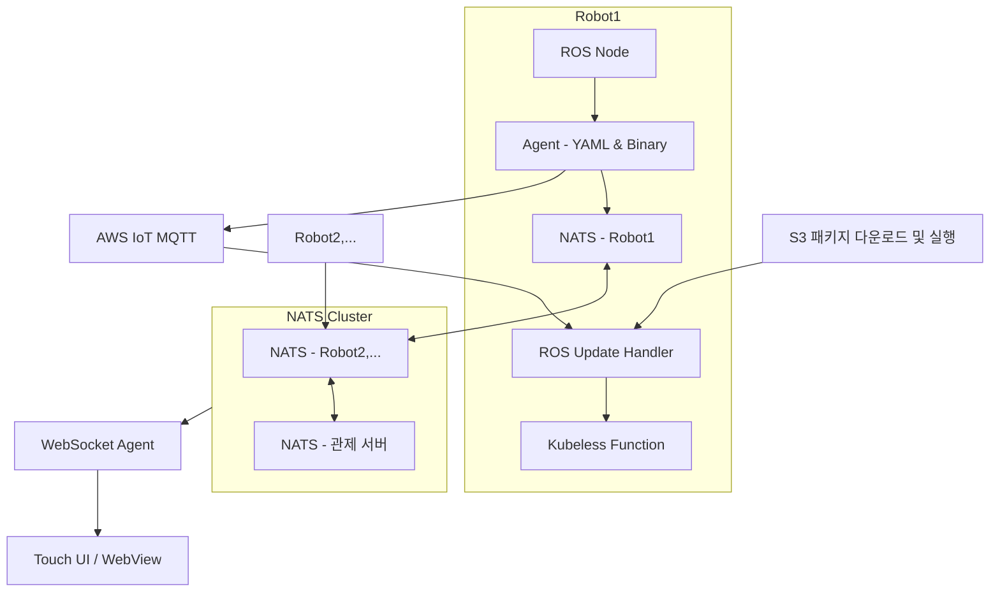

# 플릿 기반 로봇 운영 플랫폼 설계 및 적용 사례
> 온프레미스 환경에서의 실시간 메시징, 분산 클러스터, 자동화 업데이트 흐름 설계 경험

## 1. 개요 및 문제 정의

ROS 기반 자율주행 로봇을 다수 운용하는 **보안구역 내 제한된 네트워크 환경**에서, 다음과 같은 요구사항을 만족하는 **운영 인프라 아키텍처**가 필요했습니다:

- 다양한 센서(라이다, 오도메터리, 카메라 등)에서 발생하는 **고빈도 메시지를 실시간으로 처리**
- **카메라 영상 스트림을 포함한 실시간 데이터 중계**를 지원하도록 설계
- **로컬 터치 모니터 UI**를 통해 현장 상태를 직관적으로 시각화
- 폐쇄망 기반의 온프레미스 환경에서도 **클라우드 수준의 자동화 배포와 원격 제어 기능** 일부를 구현
- 운영자나 관제 서버가 실시간으로 상태를 파악하고 문제를 조치할 수 있도록 **경량화된 분산 메시징 구조** 필요

> ※ 카메라 영상 스트림 기능은 설계에 포함되었으나, 폐쇄망 환경과 리소스 제약으로 인해 **최종 운영 배포에서는 제외**되었습니다.

### 📌 운영 환경의 제약

- **인터넷이 차단된 독립 네트워크**, 클라우드 직접 연결 불가
- MQTT 기반 서비스 트리거는 AWS IoT로 제한
- 운영 대상은 ROS 기반 로봇 6대, 각 로봇은 독립적인 메시지 처리와 UI 제공 필요

---

## 아키텍처 다이어그램 (Mermaid)

## 3. 주요 설계 요소

이 프로젝트는 구성 요소 간의 역할을 명확히 분리하면서도, 보안구역 내에서 실시간성과 안정성을 동시에 확보하는 것을 목표로 했습니다.  
주요 설계 포인트는 다음 다섯 가지 영역으로 나눌 수 있습니다.

---

### 3.1 메시징 처리 구조

- 각 로봇에는 **NATS 브로커 인스턴스**를 직접 탑재하여, 로컬에서 발생하는 센서 메시지를 즉시 처리할 수 있도록 구성
- 모든 로봇과 관제 서버 간에는 NATS 클러스터를 구성하여 **분산 메시지 라우팅**이 가능하도록 설계
- **ROS 메시지 → YAML 변환 → 바이너리 직렬화** 과정을 거쳐, 효율적인 전송 포맷으로 표준화
- 카메라 스트림도 초기 설계에 포함되었으며, **프레임 단위 메시지 처리 성능을 NATS 기반으로 검증**  
  (※ 해당 기능은 폐쇄망 제약으로 운영 배포에는 포함되지 않음)
- 실험 결과, 초당 100MB 이상의 메시지 처리 성능을 확보

---

### 3.2 UI 연동 구조

- 각 로봇은 **리눅스 기반 터치모니터**를 탑재하고, WebView UI를 내장하여 **현장 조작 및 상태 확인**이 가능하도록 구성
- 로봇 내부 WebSocket Agent는 NATS 메시지를 구독하여 WebView에 실시간 반영
- 관제 서버에도 WebSocket Agent를 설치하여 **외부 운영자용 Web UI에서도 동일한 메시지를 시각화**
- **UI는 현장(로봇 터치)과 관제(운영자 콘솔)로 이원화**되어 있으나, 메시지 구조는 동일하게 유지

---

### 3.3 자동화 배포 흐름

- **AWS IoT MQTT 메시지**를 수신하여 배포 트리거로 활용
- 로봇 내 ROS 노드는 해당 메시지를 감지하면, **ROS Service를 통해 배포 요청**을 전달
- 요청을 받은 ROS Update Handler는 **Kubeless Function을 호출**하여, S3에서 패키지를 다운로드 및 실행
- 해당 구조는 AWS Lambda 기반 배포 모델을 **온프레미스 환경에 이식한 형태**
- 배포는 일부 기능에 한해 적용되었으며, 안정성이 중요한 핵심 앱은 수동 배포 방식을 유지

---

### 3.4 장애 감지 및 모니터링

- **상태머신 기반의 조건 판별 로직**을 통해 로봇 상태 이상 감지
- 메시지 누락, 속도 저하, 센서 미응답 등을 기준으로 경보 발생
- 실시간 알림은 AWS IoT MQTT 메시지를 통해 푸시되며, 관제 서버 로그 및 상태판에 반영
- **Prometheus를 통한 일부 메트릭 수집과 시각화(Grafana 연동)**도 실험적으로 구성되었음
- 주 모니터링 방식은 로그 기반의 사후 분석

---

### 3.5 운영 및 유지보수 전략

- 모든 로봇은 **터널링 서버를 통해 외부 운영자에게 원격 등록**
- 장애 발생 시 운영자는 터널링을 통해 직접 접속해 로그 확인 및 수동 조작 가능
- 앱 배포는 Helm을 기반으로 수동 롤아웃 구조로 유지
- **Kubeless는 Helm으로 설치하고, 함수는 CLI 또는 YAML로 정의**
- 실험적 자동화 흐름이 적용되지 않은 앱은 운영자 승인 및 점검 후 수동 배포

## 4. 기술 선택 및 설계 판단 근거

아키텍처 설계 및 실제 구현 과정에서는 다양한 기술 대안을 검토하고, 환경과 요구사항에 맞게 선택 또는 제외하였습니다.  
다음은 주요 기술 선택 사례와 그 판단 근거입니다.

---

| 항목 | 선택 또는 전환 | 설계 판단 근거 |
|------|----------------|----------------|
| **Kafka → NATS** | ✅ NATS 선택 (Kafka 제외) | Kafka는 고대역폭 메시징에 적합하나, Python 클라이언트의 처리 지연과 복잡한 설치 요구가 문제가 되었음. 영상 프레임 메시지 테스트 결과, NATS가 Python 기반 환경에서 더 경량화되고 안정적이었음. |
| **Lambda → Kubeless** | ✅ Kubeless 채택 (온프레미스) | AWS Lambda 기반 자동화 흐름을 온프레미스 환경에 이식하기 위해, Kubernetes-native인 Kubeless를 Lambda 대체 구조로 활용함. Helm 기반 배포와 로컬 실행이 가능함. |
| **MQTT 트리거 기반 자동화** | ✅ 부분 적용 | 클라우드 기반 MQTT 메시지를 로봇이 수신하고, ROS → Kubeless 흐름으로 연결. 하지만 모든 기능에 적용되진 않았고, 일부 업데이트 기능에 한해 실험적 도입에 그침. |
| **Prometheus + Grafana** | ⚪ 실험적 적용 | 메시지 처리량 및 상태 지표 시각화를 위해 일부 노드에 Prometheus 수집기를 구성. 핵심 운영은 로그 기반 수동 분석에 의존. |
| **영상 스트림 메시징** | ❌ 운영 배포 제외 | 초기에는 NATS 기반의 영상 프레임 단위 메시지 처리 구조를 포함했으나, 폐쇄망 환경에서의 대역폭 제약 및 실시간성 유지 부담으로 최종 배포에는 포함되지 않음. |

---

## 5. 기술 스택 요약

| 범주 | 기술 | 적용 위치 / 목적 |
|------|------|------------------|
| **메시징** | NATS (Cluster) | 로봇 및 관제 서버 간의 실시간 메시지 중계 및 클러스터링 |
|  | WebSocket | 로컬 WebView 및 관제 UI로 메시지 전달 |
| **메시지 처리** | YAML 변환기 | ROS 메시지 → YAML 구조화 |
|  | 바이너리 직렬화 | 고속 전송을 위한 데이터 포맷 압축 |
| **UI** | WebView (Kiosk) | 로봇 터치 모니터 UI 구성 |
|  | Web UI (관제) | 운영자용 관제 서버 대시보드 |
| **자동화 배포** | AWS IoT MQTT | 클라우드 이벤트 트리거 수신 |
|  | ROS Service | MQTT 트리거 감지 및 로컬 배포 요청 |
|  | Kubeless | 온프레미스 서버리스 앱 배포 실행 |
|  | S3 | 배포 대상 앱 패키지 저장소 |
| **운영 도구** | Helm | 수동 앱 롤아웃 및 구성 관리 |
|  | 터널링 서버 | 보안구역 내 로봇 원격 접근 및 유지보수 |
| **모니터링** | Prometheus + Grafana | 실험적 메시지 지표 수집 및 시각화 |
|  | 상태머신 기반 로깅 | 장애 조건 탐지 및 사후 분석 |

---

## 6. 요약 및 인사이트

이 프로젝트는 보안구역 내 자율주행 로봇 6대를 운영하는 환경에서,  
**클라우드 수준의 메시징 처리 구조와 자동화 흐름을 온프레미스에서 유연하게 실현**한 사례입니다.

전체 구조는 다음의 세 가지 관점에서 의미를 가집니다:

1. **실시간성과 구조 안정성의 균형**
   - 카메라 스트림까지 고려한 설계였지만, 운영 환경의 현실적 제약을 감안하여 제거
   - 그 대신 메시지 필터링, 직렬화, 네임스페이스 등으로 트래픽을 유연하게 제어

2. **자동화와 수동 운용의 병행 전략**
   - MQTT → ROS → Kubeless 흐름으로 서버리스 기반 자동 배포를 설계했지만,
   - 실제 운영에서는 수동 롤백 전략과 운영자 승인 흐름이 병행되어야 했음

3. **설계 의도와 현실 제약 간의 타협 지점 설계**
   - Lambda, Kafka 등 강력한 클라우드 기술을 직접 도입하기 어려운 환경에서,
   - Kubeless, NATS와 같은 대체 기술로 구조를 재현하여 설계 일관성을 유지

> 이 구조는 단지 메시징 시스템이나 로봇 제어를 구현한 것이 아니라,  
> **운영 환경과 기술 가능성 사이의 경계에서 구조를 설계하고, 실험하고, 타협해낸 과정**입니다.

