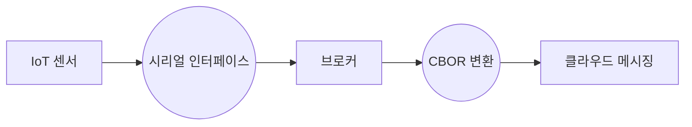
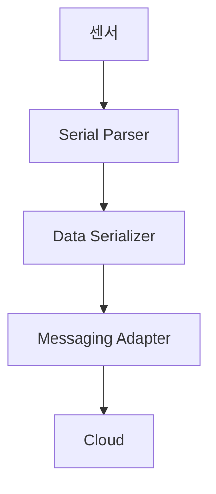

## **1. IoT 환경에서의 메시징과 비동기 구조 필요성**

- **사물(IoT)과 클라우드 간의 데이터 연계 문제**
- **마이크로서비스 아키텍처(MSA)로 변화하는 클라우드 환경**
 - 기존 동기 API 기반에서 **비동기 메시징 중심 구조**로 전환
- **임베디드 환경의 한계: 오버헤드 및 제한된 컴퓨팅 리소스**
 - 시리얼(UART, SPI, I2C) 기반 데이터 처리 방식
 - Polling 중심의 동기 처리 구조로 인한 비효율성

---

## **2. 메시징 오버헤드를 줄이기 위한 브로커 전략**

- **임베디드 환경에서 비동기 메시징을 구현하기 어려운 이유**
 - 기존의 동기 처리 방식은 **연산량 증가 및 실시간 데이터 손실 문제 초래**
 - 네트워크 불안정(LPWAN, LoRa, Wi-Fi, BLE)으로 인한 메시지 무결성 이슈
- **브로커를 활용한 메시징 최적화 필요성**
 - 클라우드 MSA에 적합한 **비동기 메시징 전환 (Sync → Async 변환)**
 - 메시지 직렬화(Serialize) 및 역직렬화(Deserialize) 연산 부하 감소
- **임베디드 시스템의 브로커 역할**
 - 저전력 디바이스에서 **메시지 큐를 활용한 비동기 처리**
 - **시리얼 데이터를 메시지 형태로 변환하여 클라우드와 연계**

---

## **3. 시리얼 데이터와 메시징 시스템 간의 연계**

- **임베디드 시스템은 시리얼 통신(UART, SPI, I2C)이 핵심 인터페이스**
- **시리얼 데이터를 효율적으로 메시징 포맷으로 변환해야 함**
- **오버헤드를 줄이기 위한 경량 직렬화 방식 적용**
 - JSON 대신 **CBOR, MessagePack, Protobuf, FlatBuffers 활용**
- **시리얼 → 메시지 변환을 위한 브로커 및 SDK 구조 필요**

### 데이터 흐름 예시

---

## **4. 브로커 기반의 경량 메시징 SDK 설계**

- **SDK의 역할: 시리얼 데이터를 메시징 구조로 변환**
- **RTOS 기반 이벤트 드리븐 아키텍처 적용**
 - Polling 방식 제거 → **비동기 이벤트 기반 메시징 처리**
 - Task Queue, Event Queue 활용하여 **저전력 최적화**
- **경량 메시징 프로토콜과의 연계**
 - MQTT-SN, CoAP, Zenoh, Micro DDS 활용

**SDK 계층 구조**

| **컴포넌트**       | **기능**        |
| --------------------- | --------------------- |
| **Serial Parser**   | 시리얼 데이터를 패킷으로 변환   |
| **Data Serializer**  | CBOR, Protobuf 기반 직렬화 |
| **Messaging Adapter** | MQTT, CoAP, Zenoh로 전송 |

---

## **5. 클라우드 및 마이크로서비스 환경과의 연계**

- **임베디드 환경과 클라우드 간의 인터페이스 표준화**
- **메시징 브로커를 통한 확장성 확보**
- **서버리스(Serverless) 및 이벤트 기반 아키텍처와의 연계 방안**

**IoT 메시징 흐름 예시**

---

## **6. 결론 및 방향성**

- **임베디드에서 비동기 메시징을 직접 구현하는 대신 브로커를 활용해야 함**
- **시리얼 데이터를 클라우드 메시징에 연계하는 SDK 구조 필수**
- **RTOS 기반 이벤트 드리븐 구조와 경량 직렬화 방식을 결합한 최적화 필요**