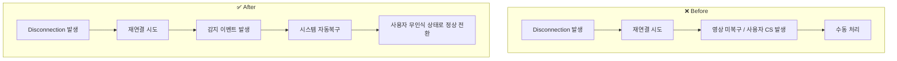

# 레거시 기술부채를 구조적으로 해결한 네트워크 장애 대응

### 1. 문제 배경: 반복되는 장애와 기술부채의 누적

제가 처음 합류했을 때, 실시간 영상 전송 기능에서 매월 반복적으로 장애가 발생하고 있었습니다.  
장애가 생기면 수동으로 대응해야 했고, 원인을 정확히 파악하기 어려운 상황이었습니다.

문제가 되는 기능은 이전부터 레거시 형태로 남아 있었고, 팀에서도 이를 인지하고 있었지만  
지속적인 개선 없이 방치된 기술부채로 자리잡고 있었습니다.

---

### 2. 문제 분석: 구조적 원인 도출

우선 로그와 모니터링 데이터를 분석하면서, 장애가 네트워크 **재연결(reconnection)** 과정에서 반복된다는 사실을 파악했습니다.  
단순한 연결 실패가 아니라, **재연결 이후에도 서비스가 복구되지 않는 현상**이 핵심 원인이었습니다.

현장 환경은 네트워크가 불안정할 수밖에 없었습니다. 건물 구조나 공공망 제약, 그리고 디바이스 자체의 한계 때문이죠.  
결국 네트워크 장애는 피할 수 없으며, 문제의 본질은 ‘불안정성’이 아니라 **복구 실패**에 있다는 것을 알게 되었습니다.

---

### 3. 해결 전략: 회복 가능한 시스템으로의 전환

핵심 결론은 이렇습니다.  
**네트워크 장애는 제거할 수 없으니, 장애 이후에 회복할 수 있는 구조를 설계하자.**

이를 위해 다음과 같은 전략을 수립하고 실행했습니다:

| 전략 요소        | 설명                                                                                                                                             |
| ---------------- | ------------------------------------------------------------------------------------------------------------------------------------------------ |
| **핵심 방향**    | 네트워크 자체를 완벽하게 안정화하는 것은 현실적으로 어려웠기 때문에, **회복 가능성(Resilience)**을 갖춘 시스템 구조로 전환하였습니다.            |
| **워치독 로직**  | 브릿지 서버에서 발생하는 **카메라 감지 이벤트**를 워치독처럼 활용해, 이상 징후를 감지하고 복구를 트리거하도록 했습니다.                          |
| **자동 복구**    | 네트워크가 다시 연결되었을 때, 서비스가 자동으로 복구되도록 로직을 설계했습니다. 수동 개입 없이도 정상 상태로 전환됩니다.                        |
| **CS 감소 목표** | 무엇보다 중요한 목표는 **사용자가 문제를 인식하기 전에 시스템이 먼저 복구되는 것**이었습니다. 이로써 고객지원(CS) 접수 자체를 줄이고자 했습니다. |

---

### 4. 실행 결과

실제 운영 환경에서, 서비스 중단 없이 자동으로 복구되는 사례들이 계속해서 발생했습니다.  
그 결과, 기존에는 월 3건 이상 접수되던 고객 불편 건수가 **0.2건 이하**로 대폭 줄었습니다.

무엇보다 중요한 점은,  
이 문제가 단순히 네트워크의 물리적 제약 때문이 아니라, **레거시 코드 내에 비정상 상황을 처리하지 않는 설계 부재** 때문이었다는 것입니다.  
저희는 그 기술부채를 구조적으로 정의하고, 회복 가능한 설계를 통해 **근본적으로 해결**한 것입니다.

---

### 5. 회고 및 인사이트

이번 경험은 단순히 장애를 복구하거나 기능을 개선한 수준이 아니었습니다.  
저는 이 사례를, **기술부채를 구조적으로 정의하고, 시스템을 전환함으로써 해결한 아키텍처 개선** 사례로 보고 있습니다.

특히 IoT 환경에서는 **현장 조건 자체를 바꾸기 어렵다는 점**에서 출발해야 합니다.  
그렇기 때문에, 바꿀 수 없는 조건을 인정하고 **회복 가능한 구조**를 설계하는 것이 가장 현실적인 대응 전략이라는 점을 절감했습니다.

무엇보다 인상 깊었던 부분은,  
**“무엇을 바꿀 수 없을 때, 어디를 바꿔야 하는가?”를 판단하는 것이 아키텍트의 역할**이라는 점을 몸소 체감할 수 있었다는 점입니다.

---

### 시각 자료 구성 예시

#### ▸ Before-After 흐름도 (네트워크 장애 시 처리 구조)

### ▸ 장애 발생 건수 차트

| 구분    | 내용              |
| ------- | ----------------- |
| 시점    | 월 장애 접수 건수 |
| 개선 전 | (평균) 3건 이상   |
| 개선 후 | 0.2건 이하        |
