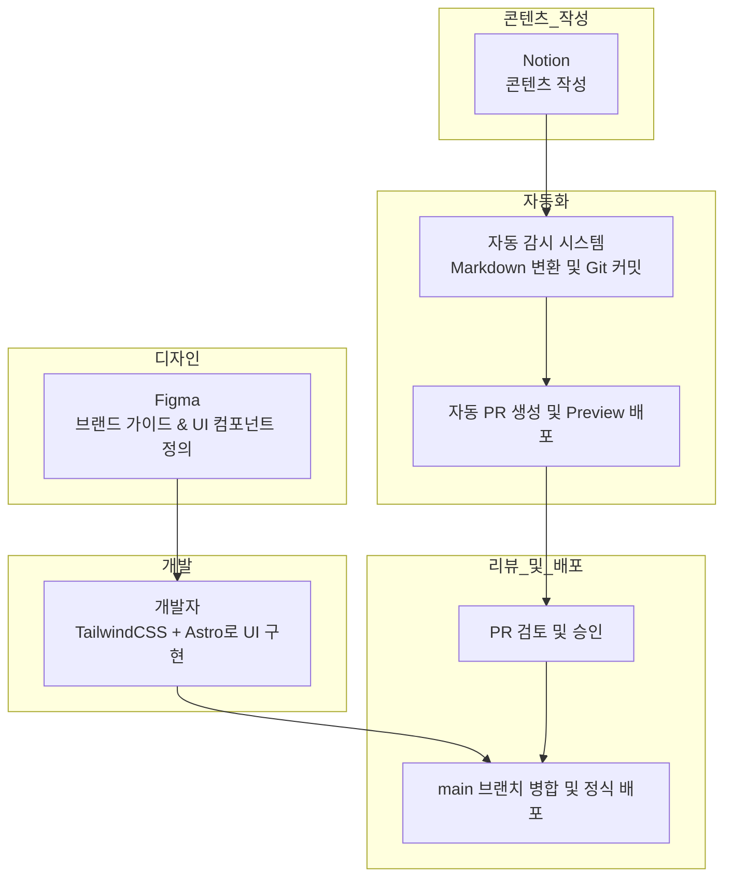
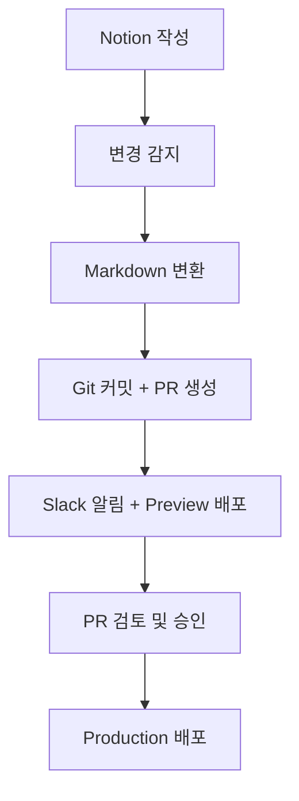
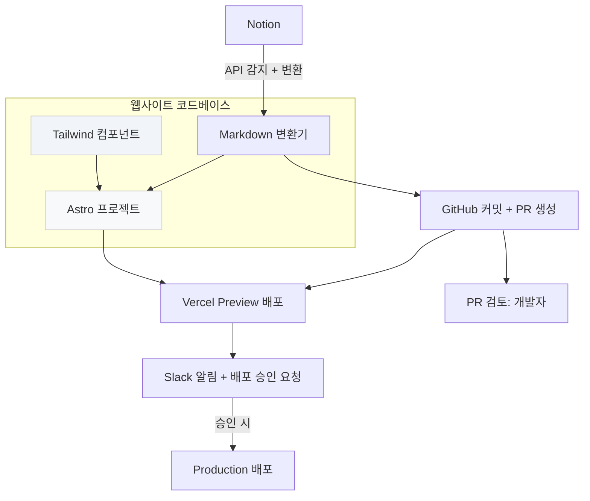

# 디자인과 콘텐츠를 분리하고, DX로 운영한다
> "저비용, 유연성, 속도 중심의 구조화 전략"

---

# 1. 문서 개요

## 문서의 목적

이 문서는 브랜드 웹사이트를 빠르게 설계, 개발, 운영하기 위한 **구축 전략과 협업 기준**을 정리한 실전 가이드입니다.

디자인, 콘텐츠, 개발, 배포에 이르는 전체 흐름을 **역할 중심**으로 구조화하고,

**저비용, 고유연성, 빠른 반복 실행**이 가능한 환경을 만들기 위한 기준을 제공합니다.

우리 팀은 빠르게 실험하고, 빠르게 개선하며, 사용자와 제품 간의 상호작용을 민첩하게 관리하기 위해

**삭제 준비(Expiry-Ready)된 구조, 코드화된 콘텐츠, 자동화된 협업**을 지향합니다.

이 문서는 그러한 철학을 기반으로, 실무에 적용 가능한 실행 구조를 정의합니다.

## 이 문서가 필요한 이유

스타트업의 브랜드 웹사이트는 단순한 소개 페이지를 넘어,

- 고객 경험의 시작점이며,
- 콘텐츠 마케팅의 중심이고,
- 팀 외부와 내부 모두에게 **브랜드가 어떤 기술과 기준으로 움직이는지를 보여주는 창**입니다.

따라서 단순히 보기 좋은 화면을 넘어,

**팀 전체가 빠르게 협업할 수 있는 구조와 프로세스**를 정립하는 것이 중요합니다.

기존의 워드프레스나 정적 페이지 방식은 다음의 문제를 안고 있습니다:

- 콘텐츠 수정 시 개발 리소스가 필요함
- 디자인 커스터마이징이 어렵거나 과도하게 종속됨
- 배포 절차가 불투명하거나 비표준화됨

이 문서는 위 문제를 해결하고, 다음을 가능하게 합니다:

- **디자인과 콘텐츠의 역할 분리**
- **개발자 리소스를 최소화한 콘텐츠 관리**
- **자동화된 배포 및 리뷰 절차**
- **삭제 준비(Expiry-Ready)된 기술 구성과 DX 기반 확장성**

## 대상 독자 및 활용 방법

이 문서는 아래와 같은 구성원이 함께 활용하는 것을 전제로 작성되었습니다:

| 대상             | 역할                                                |
| ---------------- | --------------------------------------------------- |
| 디자이너         | 브랜드 가이드 및 UI 설계, 시각적 QA                 |
| 개발자           | 컴포넌트 구축, 자동화 구현, 배포 시스템 관리        |
| 콘텐츠 운영자    | 콘텐츠 작성 및 검수, PR 요청 및 승인 흐름 참여      |
| 제품/마케팅 리더 | 릴리즈 승인, 콘텐츠 우선순위 결정, 구조 개선 피드백 |

**활용 방법**:

- 신규 브랜드 또는 페이지 런칭 시 **참고 템플릿 및 기준 문서**로 활용
- 신규 입사자 또는 외주 협업 시 **온보딩 자료**로 활용
- 내부 개발 표준 수립 또는 변경 시 **의사결정 근거 문서**로 활용
- 반복 가능한 콘텐츠 운영 흐름을 위한 **운영 프로세스 정착 문서**로 활용

## 유지 및 갱신 계획

이 문서는 **고정된 규칙이 아닌, 살아 있는 문서**입니다.

실제 협업과 자동화 흐름을 적용하고 피드백을 반영하며 다음 항목이 발생하면 갱신됩니다:

- Notion → CMS 변경 등 구조적 변화 발생 시
- 자동화 프로세스 변경 또는 도구 교체 시
- 팀 구성원의 역할 분담이 변경될 때
- 확장 전략이 실행되거나 새로운 도입이 이루어질 때

---

# 2. 운영 전략 개요

## 선언: 우리는 빠르게 만들고, 빠르게 바꾸며, 기술에 종속되지 않는다.

브랜드 페이지는 우리 제품의 얼굴이며,

동시에 내부 팀의 **협업 방식과 기술 문화가 드러나는 대표적 산물**입니다.

우리는 브랜드 페이지 운영을 통해 다음을 실현하고자 합니다:

- **속도**: 요청에서 배포까지 최소한의 리소스로 대응한다.
- **자율성**: 콘텐츠는 비개발자가 스스로 만들고, 운영하고, 배포할 수 있어야 한다.
- **분리**: 디자인, 콘텐츠, 개발, 배포는 명확히 역할을 나누되, 유기적으로 연결된다.
- **유연성**: 어떤 도구도 절대적인 기준이 아니다. 언제든지 바꾸고, 버릴 수 있어야 한다.
- **가시성**: 모든 변경은 PR과 자동화 흐름을 통해 기록되고, 공유되고, 승인된다.

이 구조는 단순한 도구 조합이 아니라,

**작고 민첩한 팀이 빠르게 실험하고 검증할 수 있도록 설계된 DX 기반 전략**입니다.

## 핵심 운영 원칙

| 원칙                          | 설명                                                                                     |
| ----------------------------- | ---------------------------------------------------------------------------------------- |
| **삭제 준비(Expiry-Ready)된 구조**          | 우리는 TailwindCSS와 Notion을 사용하지만, 언제든 교체할 수 있는 구조로 설계한다.         |
| **분리된 협업 구조**          | 콘텐츠, 디자인, 개발은 서로를 방해하지 않으면서도 잘 연결되도록 구조화된다.              |
| **자동화된 반복 실행**        | PR, Preview, QA, 승인, 배포까지 전 과정은 반복 가능하고 자동화 가능한 흐름으로 구성된다. |
| **디자인 시스템 기반 개발**   | Figma를 통해 정의된 컴포넌트를 TailwindCSS 기반의 구조화된 UI로 구현한다.                |
| **콘텐츠는 코드처럼 다룬다**  | Notion 기반 작성 → Git PR → 승인 → 배포 흐름으로 콘텐츠 관리의 품질과 기록을 유지한다.   |
| **유지보수 가능한 협업 흐름** | 개발자의 개입 없이도 운영팀이 사이트를 개선하고 유지할 수 있도록 역할을 분리한다.        |

## 우리가 워드프레스를 버린 이유

기존의 WordPress 기반 운영은 다음의 문제를 반복적으로 야기했습니다:

- 콘텐츠 수정에 **개발자 리소스가 필요**하거나, 불안정한 편집 경험으로 인해 운영 속도가 느려짐
- 디자인을 바꾸려면 **플러그인/테마 제한에 묶임**
- 커스터마이징이 **복잡하거나 유지가 어려움**
- **배포 이력, 승인 흐름, 품질 관리**가 존재하지 않음

우리는 위 문제들을 해결하기 위해 다음 구조를 채택합니다:

- **정적 사이트 프레임워크(Astro)** 기반으로 빠르고 예측 가능한 배포 구조를 구성하고,
- **Markdown + Notion 기반 콘텐츠 구조**로 작성과 관리의 자유도를 확보하며,
- **TailwindCSS로 디자인 시스템을 코드화**하고, 유지보수 가능한 방식으로 UI를 구현합니다.
- 전체 작업 흐름은 Git 기반 PR → Preview → QA → 승인 → 배포로 관리되어,
  **팀원 누구나 협업의 흐름을 이해하고, 따라갈 수 있습니다.**

## 이 전략은 DX다

이 구조는 단순한 웹사이트 개발 방법론이 아니라,

**우리가 일하는 방식을 구조화하고, 지속 가능하게 만드는 일**입니다.

- **디자인은 시스템으로 정리되고**,
- **콘텐츠는 코드처럼 다루어지며**,
- **배포는 자동화되어 반복 가능**하게 되고,
- **역할은 분리되되, 흐름은 연결**됩니다.

우리는 이 구조를 통해 다음과 같은 문화를 만듭니다:

> “개발하지 않아도 바꿀 수 있는 사이트,
> 바꿔도 무너지지 않는 구조,
> 무너져도 다시 세울 수 있는 시스템”

---

# 3. 전체 시스템 구조 개요

이 장에서는 브랜드 페이지를 구성하는 전체 시스템의 흐름과 구성 요소들을 개괄한다.

핵심은 디자인, 콘텐츠, 개발, 배포가 하나의 파이프라인 내에서 유기적으로 연결되면서도, 각자의 책임을 분리해 유지보수 가능성과 협업 유연성을 높인다는 점이다.

## 3.1 시스템 구성 흐름

브랜드 페이지 운영은 다음과 같은 단계적 흐름으로 구성된다:



1. 디자이너는 Figma를 통해 브랜드 가이드 및 UI 컴포넌트를 정의한다.
2. 개발자는 TailwindCSS를 활용하여 해당 디자인을 Astro 기반의 UI 컴포넌트로 구현한다.
3. 콘텐츠 운영자는 Notion에서 콘텐츠를 작성하고, 이를 자동화된 감시 시스템이 감지해 Markdown으로 변환한다.
4. 변환된 Markdown은 Git 저장소에 커밋되어 PR이 생성되고, 자동으로 Preview 배포가 이루어진다.
5. PR은 검토 및 승인 과정을 거쳐 main 브랜치에 병합되며, 배포가 진행된다.

이러한 구조는 디자인 변경, 콘텐츠 업데이트, 배포를 각각 독립적으로 수행할 수 있도록 분리되었으며, 동시에 변경 이력과 승인 기록이 모두 Git 기반으로 관리된다.

## 3.2 기술 구성 요소

다음은 시스템 구성에 사용되는 핵심 기술 스택이다:

- Astro: 정적 사이트 생성기. 빠른 빌드와 컴포넌트 중심 구조를 제공.
- TailwindCSS: 디자인 시스템을 코드로 재현하고, 구조화된 스타일 구현에 활용.
- Notion: 콘텐츠 작성 및 관리 도구. 운영자가 직접 사용.
- Notion-to-Markdown 변환기: Notion 콘텐츠를 Markdown으로 자동 변환.
- GitHub: 버전 관리 및 협업 도구. PR 기반 승인과 리뷰 관리에 활용.
- Vercel: 자동 배포 플랫폼. Preview와 Production 환경을 분리하여 관리.
- Slack: 배포 요청 및 승인 알림을 위한 협업 커뮤니케이션 도구.

이외에도 향후 확장에 따라 콘텐츠 검증을 위한 테스트 도구, 검색 기능, 번역 시스템 등이 추가될 수 있다.

## 3.3 콘텐츠·스타일·배포의 구조적 분리

이 시스템은 다음 세 가지 축을 분리함으로써 운영의 유연성을 극대화한다:

1. **콘텐츠 분리**

   콘텐츠는 코드에 내장되지 않는다. 운영자는 Notion에서 콘텐츠를 작성하며, 자동화된 프로세스를 통해 마크다운 파일로 변환되고, Git 기반 변경 이력과 함께 관리된다.

2. **스타일 분리**

   스타일은 TailwindCSS 기반으로 구현되며, 각 컴포넌트는 디자인 시스템에서 정의된 기준을 따르고, 특정 페이지나 콘텐츠에 종속되지 않는다. 향후 Tailwind 외 스타일 시스템으로의 교체도 용이한 구조로 유지된다.

3. **배포 분리**

   배포는 GitHub PR 병합을 기준으로 자동화되어 있으며, Preview 환경에서 콘텐츠와 스타일을 검수한 후 승인 시에만 Production으로 반영된다. 배포 자체는 코드 작성자 혹은 승인자의 동의 없이는 이루어지지 않는다.

이러한 구조는 다음과 같은 효과를 제공한다:

- 개발자는 UI와 자동화 프로세스에 집중하고,
- 운영자는 콘텐츠 수정과 릴리즈를 독립적으로 수행하며,
- 디자이너는 브랜드 경험의 일관성 유지를 위한 QA에만 집중할 수 있다.

이 구조는 추후 CMS나 스타일 프레임워크가 변경되더라도, 핵심 협업 방식은 그대로 유지될 수 있도록 설계되어 있다.

---

# 4. 역할 분담 및 협업 기준

브랜드 페이지 운영의 효율성과 지속 가능성을 높이기 위해, 모든 참여자의 역할은 분리되고 명확히 정의되어야 한다.

각 역할은 고유한 책임을 가지며, 자동화된 협업 흐름을 통해 서로 연결된다. 이 구조는 혼선을 줄이고, 업무의 병렬 처리 및 의사결정의 명확화를 유도한다.

## 4.1 디자이너

**책임**

- 브랜드 가이드 정의 (색상, 폰트, 컴포넌트 형태, 여백 등)
- 페이지 및 컴포넌트 단위 UI 설계
- Figma를 통한 시각적 명세 제공
- Preview 상태에서 시각적 품질 확인 및 QA 피드백

**산출물**

- 디자인 시스템 문서 (Figma 내 정의된 컴포넌트 및 스타일 가이드)
- 페이지별 레이아웃 구성안
- UI 컴포넌트 상태 정의 (기본, 호버, 포커스 등)

**협업 기준**

- 개발자와의 협업은 컴포넌트 단위 명세를 기준으로 진행
- 시각적 QA는 Preview 환경에서 진행하며, PR 기준으로 피드백 제공
- 콘텐츠 구조와는 분리되어 작업하며, 디자인 요소에 집중

## 4.2 개발자

**책임**

- Astro + Tailwind 기반 UI 컴포넌트 구현
- 디자인 시스템 기반 구조 설계 및 재사용 컴포넌트 구성
- 콘텐츠 자동화 구조 설계 (Notion 변환 → Git PR 자동화)
- Preview 및 Production 배포 자동화 흐름 구성
- PR 승인 기준에 따른 검토 및 릴리즈 관리

**산출물**

- 컴포넌트 코드, 레이아웃 템플릿
- 자동화 스크립트 (Notion to Markdown, Git 연동, Slack 알림 등)
- GitHub Actions 또는 CI 설정 파일
- 테스트 및 검증 스크립트 (선택)

**협업 기준**

- Figma → Tailwind 변환 시 명확한 대응표 작성 및 피드백 수렴
- PR 생성 시 Preview 확인 가능하도록 환경 유지
- 콘텐츠 변경 PR은 콘텐츠 구조 검증 및 빌드 정상 여부 확인 후 승인

## 4.3 콘텐츠 운영자

**책임**

- Notion을 기반으로 콘텐츠 작성
- 콘텐츠 변경 요청 시 PR 자동 생성 확인 및 Slack에서 배포 승인 요청
- Preview 환경에서 실제 렌더링 상태 검토
- 승인 대상자에게 QA 완료된 콘텐츠 전달

**산출물**

- Notion 콘텐츠 문서 (카테고리, 태그, 작성일 포함)
- Slack 배포 요청 메시지 및 변경 요약
- 콘텐츠 릴리즈 로그 (작성자, 변경 이유, 적용일 등)

**협업 기준**

- 작성된 콘텐츠는 템플릿 기준에 따라 구조화되어야 하며, 자동 PR 생성과 빌드 오류 방지를 고려
- Preview 링크를 기준으로 시각적 검토와 배포 요청을 분리
- 기술적 오류 발생 시 개발자와 협의하여 수정 또는 롤백 가능

## 4.4 승인자 (리더 또는 검수 담당자)

**책임**

- Preview 검토 결과에 따라 콘텐츠 또는 스타일 변경 승인 여부 결정
- Slack 또는 GitHub 상에서 PR 승인 및 릴리즈 확정
- 긴급 배포 혹은 롤백 판단 수행

**산출물**

- 승인 로그 또는 댓글 내 피드백
- 변경 내용에 대한 승인 결정 기록
- 배포 후 피드백 (필요 시)

**협업 기준**

- 콘텐츠 운영자와의 커뮤니케이션을 통해 배포 시점 확인
- 승인 여부는 Preview 기준으로 판단하며, QA 및 오류 발생 시 승인 보류
- 반복적인 승인 기준은 가이드라인화하여 시스템적으로 적용 가능

## 4.5 역할 간 상호 연결 요약

| 역할     | 주요 협업 대상   | 연결 지점                               |
| -------- | ---------------- | --------------------------------------- |
| 디자이너 | 개발자           | UI 명세 → 컴포넌트 구현                 |
| 개발자   | 디자이너, 운영자 | 컴포넌트 구현 / 콘텐츠 자동화 / PR 승인 |
| 운영자   | 개발자, 승인자   | 콘텐츠 작성 → PR 요청 → 배포 승인 요청  |
| 승인자   | 운영자, 개발자   | Preview 확인 → 배포 승인 → 릴리즈 판단  |

이 구조를 통해 각 구성원은 본인의 영역에 집중할 수 있으며, 변경 이력과 승인 기록은 모두 Git과 Slack을 통해 문서화된다.

이러한 역할 분담은 내부 협업 뿐만 아니라, 외주 디자이너나 프리랜서 콘텐츠 작성자와의 연결에도 유효한 기준이 된다.

---

# 5. 콘텐츠 운영 및 배포 프로세스

이 장에서는 콘텐츠가 작성된 이후 배포되기까지의 자동화된 흐름과 각 단계에서 수행되는 작업, 책임 주체를 통합적으로 설명한다.

이 구조는 콘텐츠를 코드처럼 다루는 철학을 기반으로 하며, PR, 리뷰, 승인, 릴리즈라는 협업의 전체 사이클을 자동화된 흐름 속에 구성한다.

## 5.1 전체 자동화 흐름 개요

콘텐츠 운영은 다음과 같은 자동화 흐름으로 구성된다:

1. 콘텐츠 운영자가 Notion에서 새 콘텐츠를 작성하거나 기존 콘텐츠를 수정한다.
2. Notion Observer는 해당 변경을 감지하고, 이를 Markdown 포맷으로 변환한다.
3. 변환된 Markdown 파일은 Git 저장소에 커밋되며, 별도 브랜치와 함께 Pull Request가 생성된다.
4. Slack으로 PR 생성 알림 및 Preview 링크가 공유되고, 배포 요청 버튼을 통해 승인 플로우가 시작된다.
5. 개발자는 PR의 정적 렌더링 결과를 검토하고, 에러나 레이아웃 문제가 없는지 확인한다.
6. 승인자는 PR을 승인하고 병합하며, 자동으로 Production 환경에 배포된다.

이 과정은 모두 자동화되어 있으며, 반복 가능한 단일 프로세스로 설계되어 있다.

## 5.2 주요 역할과 책임

| 단계              | 책임자        | 작업 내용                               |
| ----------------- | ------------- | --------------------------------------- |
| 콘텐츠 작성       | 콘텐츠 운영자 | Notion 기반 콘텐츠 입력                 |
| 변경 감지 및 변환 | 자동화 시스템 | Notion → Markdown 변환, Git 커밋        |
| PR 생성 및 알림   | 자동화 시스템 | 브랜치 생성, PR 오픈, Slack 메시지 전송 |
| 정적 렌더링 검토  | 개발자        | PR 빌드 확인, 렌더링 정상 여부 확인     |
| 승인 및 배포      | 승인자        | PR 승인 및 병합, Production 릴리즈 승인 |

## 5.3 시스템 구성 요소 및 기술 스택

- Notion: 콘텐츠 작성 및 수정
- Notion Observer: API 기반 Polling 또는 변경 감지 스크립트
- Markdown 변환기: `notion-to-md` 또는 자체 변환 로직
- GitHub: 저장소 및 PR 자동 생성, 커밋 이력 관리
- GitHub Actions: PR 생성 → Preview 배포, 병합 → Production 배포
- Vercel: 정적 웹사이트 호스팅 및 Preview 환경 제공
- Slack: 배포 요청 알림 및 승인 요청 UI 구성 (Block Kit 사용 가능)

## 5.4 자동화 흐름 상세

### 1. Notion 변경 감지

- 콘텐츠는 Notion 내 지정된 페이지 또는 데이터베이스에서 작성됨
- 변경 시점은 감시 스크립트가 주기적으로 확인하거나, Webhook이 지원될 경우 실시간으로 감지

### 2. Markdown 변환 및 PR 생성

- 페이지는 내부 템플릿에 따라 Markdown 파일로 변환됨
- 파일은 Git 저장소 내 콘텐츠 디렉토리(`/content/posts/` 등)에 커밋됨
- 새로운 브랜치가 자동으로 생성되며, PR이 오픈됨
- 커밋 메시지 예: `feat: update blog "DX 전략 발표"`
- PR 제목 예: `[콘텐츠] DX 전략 발표 문서 추가`

### 3. Slack 알림 및 승인 요청

- PR이 생성되면 Slack에 알림 전송
- 메시지에는 Preview 링크, 변경 요약, 승인 버튼 포함
- 운영자와 승인자가 Slack 또는 GitHub에서 직접 확인 가능

### 4. Preview 및 테스트

- PR은 GitHub Actions 또는 Vercel을 통해 자동 Preview 배포됨
- 개발자는 렌더링 결과, 레이아웃 깨짐 여부, Markdown 파싱 에러 등을 검토
- 필요 시 콘텐츠 구조 수정 요청 가능

### 5. 승인 및 Production 배포

- Preview가 이상 없을 경우 승인자가 GitHub에서 PR을 승인
- 병합되면 Production 브랜치로 자동 반영됨
- Vercel을 통해 최종 사이트에 배포 완료

## 5.5 유지 및 확장 전략

- CMS 교체 시 Notion API만 대체하여 동일한 구조 유지 가능
- Slack을 통한 승인 요청은 향후 ChatOps 확장 기반으로 유지
- 향후 Lighthouse, HTML validator, Playwright 등의 자동화 테스트를 연결하여 PR 시점에서 콘텐츠 검증 가능
- 다국어 지원, 템플릿 자동 생성, 카테고리 분기 등도 같은 구조 하에 확장 가능

이 구조는 운영자가 콘텐츠를 손쉽게 작성하고, 개발자의 검토를 거쳐 신속히 배포되는 전체 흐름을 표준화한다.

모든 변경은 기록되고, 승인 기반으로 릴리즈되며, 팀의 협업은 자동화된 흐름을 통해 명확히 연결된다.

---

# 6. 구축 및 유지 일정보고서

이 장에서는 브랜드 페이지 시스템의 초기 구축을 위한 예상 일정과 인력 투입 계획, 그리고 지속적인 유지 관리를 위한 리소스 구조를 정리한다.

목표는 **최소한의 리소스로 최대한의 운영 유연성을 확보하는 구조**를 실현하는 것이다.

## 6.1 초기 구축 일정

아래는 일반적인 브랜드 페이지 MVP를 기준으로 한 예상 일정이다.

각 단계는 병렬 가능성이 있으며, 콘텐츠/디자인/자동화는 독립적으로 일정 조정이 가능하다.

| 단계                            | 기간  | 주요 작업                                        |
| ------------------------------- | ----- | ------------------------------------------------ |
| 요구사항 정의 및 역할 설정      | 1일   | 문서 기반 협업 모델 정의, 책임자 지정            |
| 디자인 시스템 수급              | 2~3일 | Figma 기준 UI 컴포넌트 정의                      |
| UI 컴포넌트 개발                | 2~4일 | Astro + Tailwind 기반 UI 구성                    |
| Notion 자동화 구성              | 2~3일 | Notion 감지 → Markdown 변환 → PR 자동화 스크립트 |
| GitHub Actions 및 Vercel 설정   | 1~2일 | Preview / Production 배포 구성                   |
| 콘텐츠 템플릿 정의 및 초기 작성 | 1~2일 | Markdown 구조 정의, 초기 콘텐츠 작성             |
| QA 및 구조 정리                 | 1일   | Preview 기반 QA, 문제 해결 및 릴리즈 기준 확정   |

**총 예상 기간**: 8~14일 (디자인 소스 및 운영 환경에 따라 달라질 수 있음)

## 6.2 인력 투입 계획

| 역할                | 예상 필요 인원 | 투입 기간 | 비고                               |
| ------------------- | -------------- | --------- | ---------------------------------- |
| 디자이너            | 1명            | ~3일      | 디자인 시스템 수립 후 QA 중심 전환 |
| 개발자              | 1명            | ~7일      | UI 구성 + 자동화 구조 설계/구현    |
| 콘텐츠 운영자       | 1명            | ~2일      | 콘텐츠 구조 정의, 작성 테스트      |
| 기술 리더 or 승인자 | 1명            | ~1일      | 승인 기준 수립 및 배포 확정        |

**총 인력 기준**: 2~3인 내외의 소규모 팀으로 MVP 수준 구현 가능

## 6.3 운영 유지 전략

브랜드 페이지는 다음과 같은 기준으로 유지 관리된다:

- 콘텐츠 변경은 운영자 주도로 이루어지며, 개발자 개입 없이 PR이 생성되도록 유지
- PR 기반의 변경 이력을 통해 승인자/리더는 콘텐츠 배포 이력을 상시 파악 가능
- 정적 사이트 기반 구조로 인해 서버 관리나 보안 대응 리소스가 거의 필요 없음
- 변경되는 도구(Tailwind, Notion 등)는 삭제 준비(Expiry-Ready)된 구조로 설계되어 교체 시 기술적 리스크가 낮음

### 운영 주기 제안

| 작업 유형              | 주기                 | 책임자                         |
| ---------------------- | -------------------- | ------------------------------ |
| 콘텐츠 업데이트        | 수시 (비개발자 중심) | 콘텐츠 운영자                  |
| 스타일/디자인 업데이트 | 분기별 또는 필요 시  | 디자이너 + 개발자              |
| 자동화 시스템 점검     | 월 1회               | 개발자                         |
| 구조 개선 및 확장      | 필요 시              | 기술 리더 또는 팀 논의 후 결정 |

## 6.4 예상 비용 구조

| 항목   | 도구/서비스        | 비용 기준          | 비고                             |
| ------ | ------------------ | ------------------ | -------------------------------- |
| 도메인 | 외부 도메인 등록처 | 연 10,000~30,000원 | 일반 도메인 비용                 |
| 호스팅 | Vercel Free        | 무료               | 기본 배포 기능, Preview 포함     |
| Notion | Free 플랜          | 무료               | 협업 계정 수에 따라 유료 가능    |
| GitHub | Free               | 무료               | 개인/조직 계정 기준              |
| Slack  | Free 플랜          | 무료               | 메시지 제한 있음 (알림용은 무방) |

초기 도입 시에는 자동화 구조 설계, 협업 환경 정리, 템플릿 구성 등에 따른 **일시적인 개발 리소스 집중**이 필요하며,

이로 인해 **일반 운영 대비 2~3배의 초기 비용(인건비 기준)이 소요될 수 있다**.

그러나 위 테이블에서 확인할 수 있듯, 시스템 유지에 필요한 실질적 비용은 극히 낮고,

정적 배포 구조와 자동화 기반 협업으로 인해 지속적인 유지비용은 매우 안정적으로 관리된다.

**따라서 초기 비용 증가가 있더라도, 운영 안정성·유지 효율성·협업 명료성 등을 고려할 때
의사결정에 부정적인 영향을 줄 수준은 아니다.**

## 6.5 유지보수 리소스 요약

- **운영자 중심 구조**로 인해 콘텐츠 변경에 개발 리소스 불필요
- 자동화 시스템은 최소한의 개발 유지만으로 장기간 운영 가능
- 문제가 발생할 경우 Git 기반 이력과 PR 리뷰로 원인 추적 가능
- 문서화된 기준을 통해 외주 운영자 또는 신규 팀원에게 빠른 인수인계 가능

---

# 7. 온보딩 요약 가이드

브랜드 페이지 시스템은 단순한 정적 웹사이트가 아니라,

콘텐츠 작성, 디자인 구현, 협업 승인, 자동 배포에 이르는 전체 구조를 포함한 협업 프레임워크이다.

이 장에서는 역할별로 시스템을 빠르게 이해하고 실무에 투입될 수 있도록

**업무 흐름, 도구 사용법, 체크리스트**를 중심으로 요약 정리한다.

## 7.1 디자이너 온보딩 가이드

**목표**

- Figma를 통해 전달된 디자인이 개발과 연결되도록 명확한 기준을 제공하고, QA 과정에 자연스럽게 참여한다.

**필수 이해사항**

- 디자인 시스템 기반 컴포넌트화 구조
- Figma 내에서 상태별 UI 정의 방식
- PR Preview 환경에서의 QA 피드백 흐름

**시작 체크리스트**

- [ ] 브랜드 가이드 (색상, 폰트, 여백 기준) 숙지
- [ ] Figma에 컴포넌트 상태 정의 포함
- [ ] 컴포넌트 명칭과 파일 구조 일치 확인
- [ ] Preview 확인 시 QA 의견 전달 채널 숙지 (GitHub 또는 Slack)

## 7.2 개발자 온보딩 가이드

**목표**

- 컴포넌트 구현과 자동화 흐름의 유지보수를 담당하며, 구조를 유연하게 확장할 수 있는 기반을 이해한다.

**필수 이해사항**

- Astro + Tailwind 구조
- 컴포넌트 추상화 및 재사용 전략
- Notion → Markdown → Git PR 자동화 흐름
- PR 리뷰 및 Preview 환경 구조

**시작 체크리스트**

- [ ] 저장소 구조 이해 (컴포넌트 / 레이아웃 / 콘텐츠 분리)
- [ ] Tailwind 토큰화 방식 숙지
- [ ] 자동화 스크립트 위치 및 구성 확인
- [ ] GitHub Actions 또는 Vercel 설정 구조 이해
- [ ] PR 승인 시점의 역할과 체크 포인트 정리

## 7.3 콘텐츠 운영자 온보딩 가이드

**목표**

- Notion을 기반으로 콘텐츠를 작성하고, Preview 확인 및 릴리즈 요청까지 자율적으로 수행할 수 있다.

**필수 이해사항**

- 콘텐츠 템플릿 구조 (제목, 태그, 작성일 등)
- 변경 시 자동 PR 생성 및 Slack 알림 흐름
- Preview 링크 확인 및 승인 요청 기준

**시작 체크리스트**

- [ ] Notion 콘텐츠 템플릿 확인 및 작성법 숙지
- [ ] 변경이 PR로 전환되는 주기 또는 버튼 확인
- [ ] Slack 내 배포 요청 버튼 또는 승인 요청 흐름 이해
- [ ] QA 피드백을 정리할 수 있는 메시지 예시 확인

## 7.4 승인자 온보딩 가이드

**목표**

- 최종 승인자로서 콘텐츠와 배포 결과를 확인하고, 릴리즈 여부를 결정한다.

**필수 이해사항**

- PR 생성 → Preview → 승인 → 배포의 전체 흐름
- PR 기준으로 확인해야 할 체크 항목
- 긴급 롤백 또는 승인 보류 시 처리 방식

**시작 체크리스트**

- [ ] PR 확인 방법 및 Preview 접근 링크 확인
- [ ] 승인 기준(콘텐츠 품질, 디자인 오류 등) 숙지
- [ ] Slack에서 배포 요청이 온 경우의 대응 방식 이해
- [ ] PR 승인 또는 커멘트 방식의 의견 전달 절차 숙지

## 7.5 공통 문서/경로 안내

- GitHub 저장소 주소: `<your-repo-url>`
- Figma 디자인 시스템 링크: `<your-figma-link>`
- Notion 콘텐츠 DB 경로: `<your-notion-db>`
- Slack 채널명: `#브랜드-콘텐츠`
- 콘텐츠 템플릿 마크다운 예시: `/templates/post-template.md`
- 자동화 로그 확인 위치: `.github/workflows/`, `/logs/`

---

# 8. 향후 확장 전략

현재 구축된 브랜드 페이지 구조는 최소 비용으로 빠르게 운영이 가능하도록 설계되었으며,

동시에 다음과 같은 미래 변화에도 유연하게 대응할 수 있도록 구조적으로 준비되어 있다.

이 장에서는 예상 가능한 변화 시나리오와 그에 대응하는 전략을 기술하며,

삭제 준비(Expiry-Ready)된 구조와 교체 가능한 기술 스택이 어떤 방식으로 유지될 수 있는지를 정리한다.

## 8.1 TailwindCSS 교체 전략

TailwindCSS는 빠른 UI 구현에 유리하지만, 커스터마이징 복잡도나 팀 내 스타일 일관성 유지에 어려움이 발생할 수 있다.

이를 고려하여 다음과 같은 조건이 충족될 경우 Tailwind를 제거하거나 다른 스타일 시스템으로 전환할 수 있다:

- 디자인 시스템이 충분히 정제되어 CSS Token 기반 스타일로 관리되는 경우
- 기존 Tailwind 추상화를 컴포넌트 레벨로 캡슐화해둔 경우
- 스타일을 팀 고유의 디자인 프레임워크로 이관할 필요가 생긴 경우

**대체 방안**

- CSS Modules 또는 SCSS 기반 스타일 시트
- Vanilla Extract 또는 Stitches 등 CSS-in-JS 프레임워크
- shadcn/ui, Radix UI 등 커스텀 UI 키트와의 통합

**전환 전략**

- Tailwind 클래스는 전역 사용을 피하고, 컴포넌트 내부에서만 사용
- 디자인 토큰은 CSS 변수로 정리해두어, 추후 스타일 시스템에서도 재사용 가능
- 스타일 레이어와 로직/콘텐츠 레이어 분리를 통해 컴포넌트 구조는 유지한 채 스타일만 교체 가능

## 8.2 CMS 교체 전략 (Notion → Headless CMS)

Notion은 초기 도입이 빠르고 비용이 적지만,

다양한 콘텐츠 타입 관리나 다국어 지원, 워크플로우 자동화 등에서는 한계가 존재할 수 있다.

이 경우 CMS 교체가 필요하며, 이를 위해 아래와 같은 준비가 되어 있어야 한다:

- 콘텐츠는 Markdown 파일 기반으로 정리되어 Git 저장소에 관리되고 있음
- 콘텐츠 레이아웃은 템플릿 구조로 추상화되어 있음
- Notion 변환기는 외부 CMS의 API 또는 Markdown Export 기능으로 대체 가능

**대체 가능 CMS 예시**

- Contentful, Sanity, Strapi, Hygraph (GraphQL 기반 Headless CMS)
- Git 기반 CMS (Netlify CMS, TinaCMS 등)

**전환 전략**

- 기존 Notion 감지 스크립트를 새로운 CMS Webhook으로 대체
- 기존 Markdown 생성 스크립트를 CMS API 호출 결과로 대체
- 콘텐츠 구조의 명세(JSON, slug, tags, 작성일 등)를 유지하여 UI는 변경 없이 유지 가능

## 8.3 콘텐츠 자동화의 고도화

현재는 Notion 기반 Markdown 변환 및 PR 생성이 자동화되어 있으나, 다음과 같은 고도화를 통해 품질과 확장성을 높일 수 있다:

- PR 생성 시 자동 테스트 연동 (Lighthouse, HTML validator, 이미지 누락 등)
- Slack에서의 배포 승인 버튼 외에도, 승인 시점에서 콘텐츠 변경 요약 자동 출력
- 콘텐츠 분류에 따라 Preview 자동 라벨링 및 태깅 기능 추가
- 카테고리, 태그, 작성자별 콘텐츠 집계 및 통계 대시보드 구성

## 8.4 다국어/다브랜드 대응

복수 브랜드 또는 다국어 페이지를 운영해야 할 경우, 다음과 같은 구조가 필요하다:

- 콘텐츠 폴더 구조를 브랜드/언어 단위로 분리: `/content/en/`, `/content/kr/`, `/content/brand-a/`
- 각 브랜드/언어에 대한 레이아웃 컴포넌트 및 템플릿 분기 구성
- 슬러그 처리와 URL 구조를 브랜드/언어 기준으로 처리

이러한 구조는 현재 시스템에서도 무리 없이 적용 가능하며,

폴더 구조와 라우팅 설정만으로 상당 부분 대응 가능하다.

## 8.5 협업 자동화 확장 (ChatOps 기반)

- Slack에 등록된 배포 요청 메시지를 통해 "배포 승인" 뿐 아니라 "릴리즈 로그 확인", "테스트 결과 보기", "롤백 요청"까지 확장 가능
- 승인자 또는 운영자가 Slack 인터페이스를 통해 릴리즈 전환을 수행할 수 있는 구조
- 향후 PR 승인 → GitHub Comment → 자동 배포 승인 처리 등 **ChatOps 기반의 승인 시스템**으로 발전 가능

---

# 9. 부록

본 장은 앞서 설명한 시스템 구성과 운영 프로세스를 실제로 적용하는 데 도움이 되는 보조 자료들로 구성되어 있다.

모든 예시는 기본적인 형태로 제공되며, 실제 조직에 맞게 커스터마이징하여 사용할 수 있다.

## 9.1 폴더 구조 예시

```tree
.
├── content
│   ├── posts
│   │   └── 2024-03-dx-principles.md
│   ├── brand
│   │   └── brand-a
│   └── pages
├── components
│   ├── layout
│   ├── ui
│   └── markdown
├── public
├── styles
│   └── tokens.css
├── scripts
│   ├── notion-observer.js
│   └── md-generator.js
└── .github
    └── workflows
        └── deploy.yml

```

## 9.2 Markdown 콘텐츠 템플릿

```markdown
---
title: "브랜드 DX 전략"
slug: "dx-strategy"
date: "2025-04-03"
tags: ["DX", "운영", "브랜드"]
author: "팀 브랜딩"
description: "우리가 운영하는 브랜드 DX 전략과 시스템 구조에 대한 설명입니다."
---

## 개요

이 문서는 우리 팀의 브랜드 운영 전략과 기술 설계를 설명합니다...
```

## 9.3 Slack 메시지 구성 예시 (Block Kit)

```json
{
  "blocks": [
    {
      "type": "section",
      "text": {
        "type": "mrkdwn",
        "text": "*신규 콘텐츠 PR이 생성되었습니다.*\n<https://github.com/org/repo/pull/123|PR 보기>"
      }
    },
    {
      "type": "context",
      "elements": [
        {
          "type": "plain_text",
          "text": "변경자: 마케팅팀 | 태그: 브랜드, 운영",
          "emoji": true
        }
      ]
    },
    {
      "type": "actions",
      "elements": [
        {
          "type": "button",
          "text": { "type": "plain_text", "text": "Preview 확인" },
          "url": "https://preview-url.vercel.app"
        },
        {
          "type": "button",
          "style": "primary",
          "text": { "type": "plain_text", "text": "배포 승인" },
          "value": "approve_deploy"
        }
      ]
    }
  ]
}
```

## 9.4 커밋 메시지 작성 가이드

- 콘텐츠 추가: `feat: add content "브랜드 DX 전략"`
- 콘텐츠 수정: `fix: update content "dx-principles.md"`
- 스타일 수정: `style: refine layout spacing for hero section`
- 자동화 수정: `chore: update notion parser for new format`

## 9.5 Mermaid 업무 흐름 다이어그램



## 9.6 참고 링크 모음

- Astro 공식 문서: https://docs.astro.build
- TailwindCSS 문서: [https://tailwindcss.com/docs](https://tailwindcss.com/docs)
- Notion API: https://developers.notion.com/
- GitHub Actions Docs: [https://docs.github.com/en/actions](https://docs.github.com/en/actions)
- Vercel Docs: https://vercel.com/docs
- Mermaid.js: https://mermaid.js.org/

## 9.7 기술 스택 구성 및 선택 배경

아래는 본 시스템에 도입된 주요 기술 스택의 역할과 선택 배경을 설명한 표이다.

| 구성 요소       | 역할                     | 선택 이유                                                                                                |
| --------------- | ------------------------ | -------------------------------------------------------------------------------------------------------- |
| **Astro**       | 정적 사이트 생성기 (SSG) | 빠른 빌드 속도, 정적 콘텐츠 최적화, Markdown 통합 우수, CSR/SSR 유연한 확장성                            |
| **TailwindCSS** | 디자인 시스템 구현       | 클래스 기반 유틸리티 스타일로 빠른 UI 구성, 디자인 시스템을 코드로 표현 가능, 추상화 및 교체 가능성 확보 |
| **Notion API**  | 콘텐츠 작성 인터페이스   | 비개발자가 접근하기 쉬운 에디터, 구조화된 DB 형태의 콘텐츠 관리 가능, API 기반 자동화 연동               |
| **GitHub**      | 협업 및 버전 관리        | PR 기반 리뷰 및 승인 흐름, 콘텐츠를 코드처럼 관리, 배포 승인 이력 자동화                                 |
| **Vercel**      | 배포 및 Preview 환경     | Git 연동 자동 배포, Preview URL 자동 생성, 설정이 간단하며 정적 사이트에 최적화됨                        |

이들 도구는 각자의 영역에서 독립적으로 동작하지만,

**협업 자동화 및 콘텐츠 운영이라는 하나의 흐름 내에서 유기적으로 연결**되어 있다.

## 9.8 시스템 구조 상관도

다음 다이어그램은 각 기술 스택의 위치와 흐름 내 상호작용을 시각적으로 정리한 관계도이다.



## 9.9 기술 구성 종합 해석

- 콘텐츠 작성의 출발점은 **Notion**이며, 이를 **Markdown으로 자동 변환**함으로써 개발자의 개입 없이 콘텐츠가 Git으로 전환된다.
- **GitHub**는 콘텐츠 변경 이력을 관리하고, PR 단위로 Preview 배포와 협업을 연결한다.
- 정적 사이트를 생성하는 핵심은 **Astro**이며, 여기에 **TailwindCSS**를 사용해 빠르게 스타일링된 UI를 구성한다.
- 배포는 **Vercel**이 담당하며, GitHub와 자동으로 연동되어 Preview 환경 및 Production 릴리즈를 지원한다.
- 전체 변경 흐름은 **Slack**을 통해 팀원에게 알림으로 전달되며, 승인 및 배포까지 이어지는 자동화된 파이프라인을 형성한다.

이러한 구조는 각 구성요소가 **완전히 탈착 가능한 구조로 설계**되어 있으며,

개별 요소의 교체 또는 확장이 전체 흐름을 무너뜨리지 않도록 설계되었다.

---

이상의 부록은 시스템을 실제로 구현하거나, 팀원에게 온보딩 시 실무 이해를 돕기 위한 자료로 제공된다.

모든 내용은 실제 운영 환경에 따라 커스터마이징되어야 하며, 가능한 범위 내에서 자동화 및 재사용을 고려하여 관리하는 것이 바람직하다.
