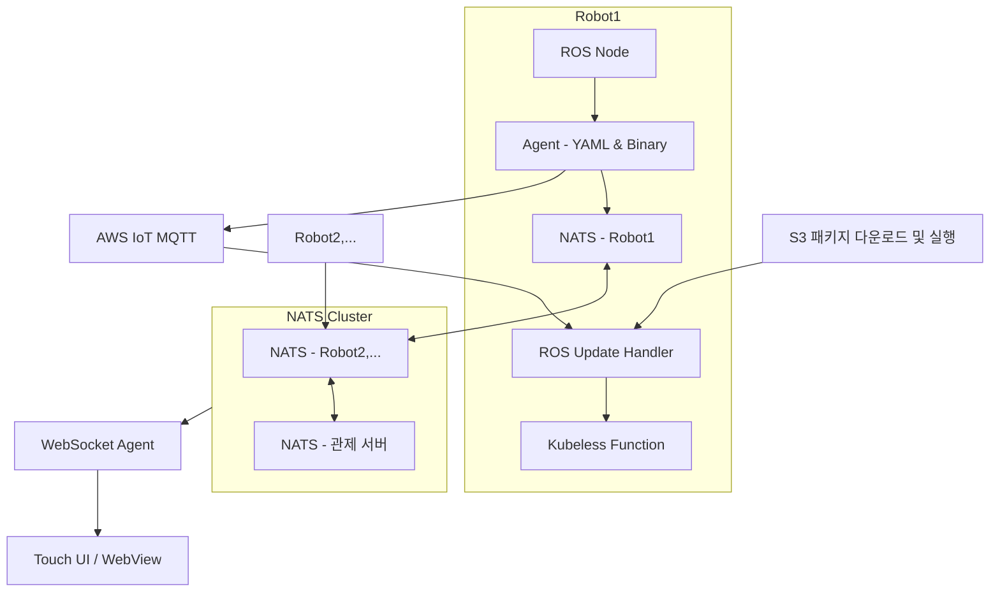

# 온프레미스에서 클라우드 경험을 구현한 로봇 운영 플랫폼 설계

온프레미스 환경에서도 클라우드 수준의 개발 경험과 관제 흐름을 구현하고자 한 설계 사례입니다.  
단순히 기술 스택을 옮긴 것이 아니라, **클라우드에서의 개발자 경험 전체를 재현**한 점이 핵심입니다.

---

# 설계 철학

저는 기술을 복제하는 것이 아니라, **익숙한 흐름을 새로운 환경에 이식하는 것**이 설계의 본질이라 생각합니다.  
즉, 개발자와 운영자가 **환경에 구애받지 않고 동일한 개발·운영 경험을 유지**할 수 있어야 합니다.

이 설계는 클라우드 기술을 직접 사용할 수 없는 환경에서도 **"흐름 자체가 유지될 수 있는 구조"를 만드는 것**을 목표로 하였습니다.

---

# 문제 정의 및 운영 환경의 제약

이 프로젝트는 **보안구역 내 폐쇄망 환경**에서 다수의 자율주행 로봇을 운용해야 하는 과제를 안고 있었습니다.  
기존 시스템은 AWS Lambda, WebSocket 등 **완전히 클라우드에 최적화된 구성**이었지만, 실제 운영 환경에서는 인터넷 접근이 불가하여 다음과 같은 제약이 존재하였습니다.

## 환경적 제약 조건

- 외부 인터넷과 단절된 **독립 네트워크 환경**
- 클라우드 서비스를 직접 사용할 수 없음 (예: AWS MQTT, S3, Lambda 등)
- 모든 로봇은 **현장에서 직접 메시지를 처리하고 시각화**해야 함
- ROS 기반 로봇 6대를 동시에 운영하며, 각기 **독립적인 UI 및 상태 제어 흐름** 필요

---

# 전체 아키텍처 구조

전체 시스템은 ROS 기반 로봇에서 발생하는 센서 및 상태 메시지를 NATS 기반 클러스터 메시징 구조를 통해 **관제 서버와 UI에 실시간 반영**하는 방식으로 구성되었습니다.  
또한, 서버리스 이벤트 처리 흐름(Lambda 스타일)은 **Kubeless 기반 FaaS 구조**로 이식하여 구현하였습니다.

## 아키텍처 다이어그램

구조 요약

- NATS 클러스터를 활용한 분산 메시징 구조
- WebSocket Agent를 통해 로봇 터치 UI 및 관제 UI에 실시간 연동
- Kubeless + S3를 통한 온프레미스 서버리스 배포 흐름 구현
- 각 로봇은 개별적으로 메시지를 처리하고, 동시에 클러스터 메시지로 연동됨

---

# 주요 설계 요소와 구현

이 프로젝트의 핵심은 제한된 온프레미스 환경에서 **클라우드 수준의 실시간성과 운영 유연성을 확보하는 구조를 구현**하는 것이었습니다.  
다음 다섯 가지 영역을 중심으로 설계를 진행하였습니다.

## 1. 메시징 처리 구조

- 각 로봇에 **NATS 브로커 인스턴스**를 직접 탑재하여, 로컬 발생 메시지를 즉시 처리
- NATS 클러스터 구성으로 관제 서버와의 **분산 메시지 라우팅** 실현
- ROS 메시지를 **YAML 변환 및 바이너리 직렬화**하여 경량화된 전송 포맷으로 표준화
- 카메라 프레임 단위 메시지 처리도 구조에 포함되었으나, 운영 환경 제약으로 실제 배포에서는 제외

## 2. UI 연동 구조

- 각 로봇에 **터치 모니터 + WebView UI** 탑재하여 현장 제어 가능
- **WebSocket Agent**가 NATS 메시지를 수신하여 실시간 반영
- 관제 서버에서도 동일한 구조로 **운영자용 Web UI 제공**
- UI는 현장과 관제로 이원화되었지만, 메시지 구조는 동일하게 유지

## 3. 자동화 배포 흐름

- AWS IoT MQTT 메시지를 통해 로봇이 **배포 트리거**를 수신
- ROS 노드가 이를 감지하고 ROS Service를 호출하여 **배포 요청 전달**
- Kubeless Function이 **S3 패키지를 다운로드 및 실행**하여 앱을 배포
- Lambda의 배포 흐름을 **Kubeless로 이식한 구조**, 일부 기능에 실험적으로 적용

## 4. 장애 감지 및 모니터링

- **상태머신 기반 조건 판별** 로직으로 장애 탐지 (속도 저하, 센서 미응답 등)
- 실시간 경고는 MQTT 메시지를 통해 푸시
- Prometheus 기반 메트릭 수집 및 Grafana 시각화도 실험적으로 구현
- 운영의 주체는 여전히 로그 기반 수동 분석 방식

## 5. 운영 및 유지보수 전략

- 모든 로봇은 **터널링 서버를 통해 원격 등록**
- 운영자는 터널링을 통해 로봇 내부에 직접 접속, 로그 확인 및 조작 가능
- **Helm을 이용한 수동 배포 구조** 병행 유지
- Kubeless 함수는 CLI 또는 YAML 정의 방식으로 관리

이러한 설계를 통해 **실시간 제어, 원격 배포, 장애 대응**까지 온프레미스에서도 일관되게 작동하는 구조를 확보할 수 있었습니다.

---

# 기술 선택 및 설계 판단 근거

설계 과정에서는 기존 클라우드 기반 기술을 그대로 사용할 수 없는 환경적 제약을 고려하여, **유사한 기능을 갖되 온프레미스에서 동작 가능한 기술 대안**을 검토하고 선택하였습니다.  
다음은 주요 기술 요소에 대한 판단 근거입니다.

| 항목                        | 선택 또는 전환                   | 설계 판단 근거                                                                                                                                                                     |
| --------------------------- | -------------------------------- | ---------------------------------------------------------------------------------------------------------------------------------------------------------------------------------- |
| **Kafka → NATS**            | ✅ NATS 선택 (Kafka 제외)     | Kafka는 높은 처리량에 강점이 있지만, Python 클라이언트의 처리 지연과 설치 복잡도가 문제였음. 반면, NATS는 경량화되어 있고 Python 환경에서도 안정적으로 동작하여 실시간성에 유리함. |
| **Lambda → Kubeless**       | ✅ Kubeless 채택 (온프레미스) | Lambda의 서버리스 아키텍처를 온프레미스에서 재현하기 위해 Kubeless를 사용. Kubernetes-native 구조로 Helm 배포 및 로컬 실행이 가능하여 대체 가능성이 높았음.                        |
| **MQTT 트리거 기반 자동화** | ✅ 부분 적용                     | 클라우드의 MQTT 이벤트 메시지를 온프레미스 로봇이 수신하고, 내부적으로 ROS와 Kubeless를 통해 동작하도록 구성. 전체 앱 배포에는 적용하지 않았고, 핵심 기능 중심으로 실험적 도입.    |
| **Prometheus + Grafana**    | ⚪ 실험적 적용                   | 메시지 처리량 및 상태 지표 시각화를 위해 일부 노드에 Prometheus 수집기를 구성하고 Grafana 연동을 시도. 운영상 필수는 아니었으나, 확장성과 진단 도구로 고려됨.                      |
| **영상 스트림 메시징**      | ❌ 운영 배포 제외                | 초기에는 NATS 기반의 프레임 단위 영상 메시지 처리를 설계했으나, 폐쇄망 환경에서 대역폭과 실시간성 이슈로 인해 실제 운영 구조에는 포함되지 않음.                                    |

이처럼 **환경에 맞춘 기술 대안 선택과 구조 재설계**를 통해, 기존 클라우드 기반 개발 흐름을 끊김 없이 온프레미스에서 유지할 수 있었습니다.

---

# 설계 결과 및 인사이트

이 설계는 단순히 기술을 바꾸는 작업이 아니라, **운영 환경과 기술 구조 사이의 간극을 메우는 구조적 실험이자 조율 과정**이었습니다.  
전체 결과는 다음 세 가지 관점에서 정리할 수 있습니다.

## 1. 실시간성과 구조 안정성의 균형

- 카메라 영상까지 포함된 고빈도 메시지 처리 구조를 설계하였으나, 실환경의 제약을 고려하여 메시지 필터링, 직렬화, 네임스페이스 구성 등으로 트래픽을 유연하게 조절하였습니다.
- 결과적으로 **필수 실시간성을 유지하면서도 시스템의 안정성을 확보**하였습니다.

## 2. 자동화와 수동 운용의 병행 전략

- MQTT → ROS → Kubeless 흐름을 통한 서버리스 기반 자동 배포는 기술적으로 유효했으나, **운영 안정성 확보를 위해 일부 앱은 수동 배포 방식과 병행**하였습니다.
- 자동화된 흐름은 반복 가능한 업데이트에만 제한적으로 사용하여 **위험 분산 전략을 적용**했습니다.

## 3. 설계 의도와 현실 제약 간의 타협 지점 설계

- Lambda, Kafka 같은 강력한 클라우드 기술은 도입할 수 없었지만, Kubeless, NATS와 같은 **온프레미스 대체 기술로 구조를 재현**하였습니다.
- 그 과정에서 **흐름의 일관성과 사용자의 경험을 유지하는 것을 최우선 가치로 삼았습니다.**

> 이 프로젝트는 로봇 시스템, 메시징 구조, 클라우드 기술의 단순 조합이 아니라, **제약 속에서도 원래의 개발 경험을 유지하려는 구조 설계의 철학적 실현**입니다.

---

# 정리하며

이 사례는 기술의 문제가 아니라 **흐름을 어떻게 설계하는가**의 문제였습니다.  
클라우드 환경에서만 가능할 것 같았던 개발 경험과 운영 구조를, 온프레미스에서도 **거의 동일한 수준으로 구현**할 수 있었던 이유는 바로 "기술을 복제한 것이 아니라, 경험을 이식했기 때문"입니다.

## 설계자의 역할

제가 생각하는 설계자의 역할은 단순히 새로운 기술을 가져오는 사람이 아닙니다.  
진정한 설계자는 **익숙한 흐름이 새로운 환경에서도 작동하도록 설계하는 사람**입니다.  
즉, 구조는 바뀌어도 **사용자의 경험은 바뀌지 않도록 만드는 것**, 그것이 설계의 힘이라고 믿습니다.

## 앞으로의 가능성

이 구조는 단일 프로젝트에만 머물지 않습니다.

- 다른 실내 로봇 서비스로의 확장
- 멀티 사이트 연동을 위한 재사용 가능성
- 클라우드-온프레미스 하이브리드 구조 설계 기반

설계는 언제나 현실을 고려한 타협이지만, 그 타협의 방식이 **사용자에게 느껴지지 않도록 만드는 것**이 우리가 지향해야 할 구조적 완성도라고 생각합니다.
