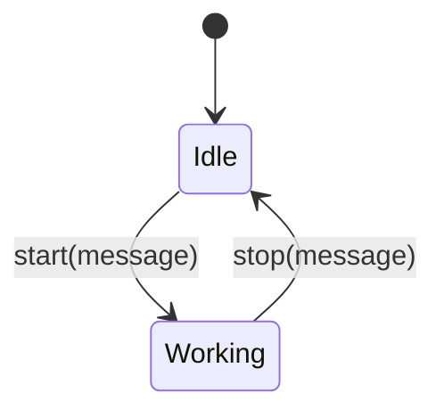
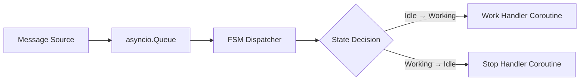
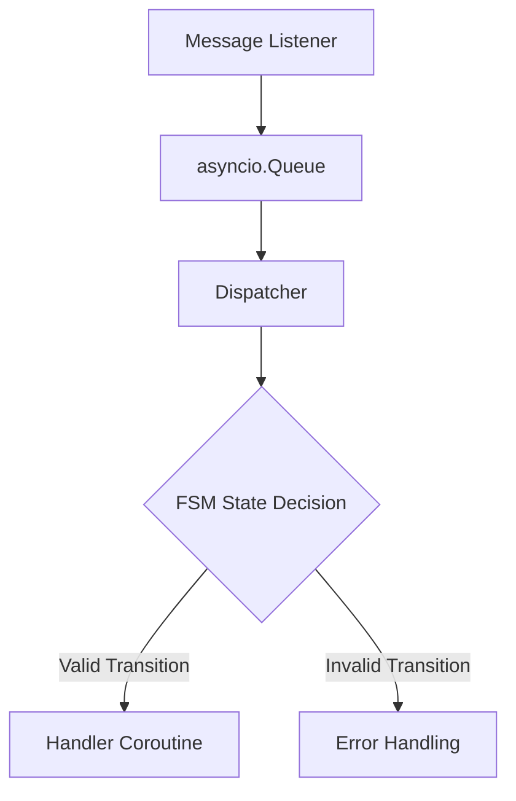
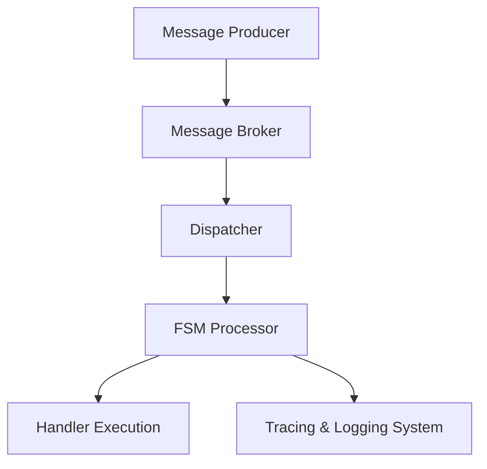

# 비동기 메시지와 MSA를 위한 Python 시스템 설계

---

# 1. 개요 (Overview)

본 문서는 AI 기반 로봇 제어 시스템을 개발하고,  
핸들러를 FaaS(Function as a Service) 형태로 운영한 실전 경험을 바탕으로 작성하였습니다.

실세계 시스템, 특히 로봇이나 AI 서비스를 다루는 환경에서는  
상태 변화가 빈번하고, 외부 응답 지연이 일상적으로 발생합니다.  
이러한 환경에서는 통신 흐름, 상태 관리, 처리 로직이 서로 얽히기 쉬워,  
결과적으로 다음과 같은 문제를 야기하게 됩니다:

- 통신, 상태, 처리 로직이 뒤엉켜 유지보수성이 저하됩니다.
- 상태 전이 과정이 코드 곳곳에 흩어져 테스트가 어려워집니다.
- 지연 및 재시도 처리 로직이 중복되면서 복잡성이 급격히 증가합니다.

이 문서에서는 이러한 문제를 해결하기 위해,  
Python `asyncio` 기반의 비동기 메시지 아키텍처를 설계하는 방법을 설명하고자 합니다.

메시지 기반 흐름, FSM(Finite State Machine)을 통한 상태 전이 관리,  
Queue를 통한 통신과 처리 분리 전략을 중심으로,  
**복잡한 시스템을 구조적으로 정리하고 확장 가능한 아키텍처를 구축하는 방법**을 다루고 있습니다.

---

# 2. 메시지 기반 구조 이해 (Message-driven Architecture)

## 2.1 상태 중심 구조의 문제점

상태 중심 시스템(State-centric System)에서는 다음과 같은 문제가 발생할 수 있습니다:

- 비동기 처리 미흡: 순차적 흐름을 가정하여 응답 지연 상황을 처리하지 못합니다.
- 상태 전이의 복잡화: 로직 곳곳에 분산된 조건 분기문이 상태 전이 흐름을 모호하게 만듭니다.
- 로직 커플링: 통신, 상태, 처리 로직이 강하게 결합되어 변경에 취약해집니다.

## 2.2 메시지 기반 처리 모델

메시지 중심 처리(Message-driven Processing)에서는 다음과 같은 접근 방식을 택합니다:

- 모든 외부 입력을 하나의 메시지 객체로 추상화합니다.
- Queue를 이용해 메시지를 일시 저장하고, 순차적/비동기적으로 처리합니다.
- FSM(Finite State Machine)을 통해 상태 전이만을 담당하고,  
  실제 비즈니스 처리는 별도의 핸들러 코루틴으로 위임합니다.

## 2.3 FSM 기반 전이 모델

FSM(유한 상태 기계) 기반 모델은 다음과 같은 원칙을 따릅니다:

- 명확한 상태(State)와 전이(Transition)를 정의합니다.
- 각 상태 전이는 트리거(trigger) 이벤트(=메시지)에 의해 발생합니다.
- 상태 전이와 처리 로직을 분리하여 시스템의 예측 가능성을 높입니다.

메시지 기반 FSM 모델 다이어그램은 다음과 같습니다:



## 2.4 async/await와 메시지 기반 처리의 궁합

Python의 `async/await` 구문은 메시지 기반 아키텍처에 매우 적합합니다:

- 논블로킹 I/O 처리: 외부 통신, 하드웨어 인터페이스 등을 비동기로 다룰 수 있습니다.
- 메시지 순서 유지: Queue를 통해 메시지 순서를 제어하며 병렬 처리가 가능합니다.
- 타임아웃, 재시도, 에러 핸들링을 자연스럽게 구현할 수 있습니다.

결론적으로,  
`asyncio` 기반 구조는 FSM + 메시지 기반 모델과 결합하여  
실세계 시스템에서 필요한 유연성과 견고함을 모두 제공합니다.

---

# 3. Python 비동기 구성요소 소개 (Key Components)

Python의 비동기 프로그래밍은 `asyncio`를 중심으로 다양한 핵심 구성요소를 제공합니다.  
이를 효과적으로 활용하면, 복잡한 메시지 흐름을 관리하면서도 구조적인 코드를 유지할 수 있습니다.

이 장에서는 주요 비동기 구성요소를 소개하고, 메시지 기반 아키텍처 설계에 어떻게 적용할 수 있는지 설명드립니다.

## 3.1 Coroutine

Coroutine은 Python 비동기 프로그래밍의 기본 단위입니다.

- `async def` 키워드로 정의합니다.
- `await` 키워드를 통해 다른 비동기 함수를 호출합니다.
- 비동기 작업 도중 다른 작업으로 컨텍스트 전환이 가능합니다.

```python
async def fetch_data():
    await asyncio.sleep(1)
    return "data"

async def main():
    result = await fetch_data()
    print(result)

asyncio.run(main())
```

## 3.2 asyncio 기본 API

`asyncio`는 코루틴 실행과 관리, 태스크 스케줄링을 위한 표준 라이브러리입니다.

주요 함수는 다음과 같습니다:

- `asyncio.run()`: 비동기 프로그램의 진입점을 실행합니다.
- `asyncio.gather()`: 여러 코루틴을 동시에 실행하고, 결과를 모읍니다.
- `asyncio.sleep()`: 지정 시간만큼 비동기적으로 대기합니다.

```python
import asyncio

async def task(name, delay):
    await asyncio.sleep(delay)
    print(f"Task {name} done")

async def main():
    await asyncio.gather(
        task("A", 1),
        task("B", 2)
    )

asyncio.run(main())
```

## 3.3 asyncio.Queue를 활용한 메시지 버퍼링

`asyncio.Queue`는 다수의 프로듀서와 컨슈머 간에 안전하게 메시지를 전달할 수 있는 구조를 제공합니다.

특징:

- FIFO(First-In-First-Out) 방식
- 비동기적으로 `put`, `get` 메서드를 사용합니다.

```python
import asyncio

queue = asyncio.Queue()

async def producer():
    for i in range(5):
        await queue.put(f"message {i}")
        print(f"Produced: message {i}")

async def consumer():
    while True:
        message = await queue.get()
        print(f"Consumed: {message}")
        queue.task_done()

async def main():
    consumer_task = asyncio.create_task(consumer())
    await producer()
    await queue.join()
    consumer_task.cancel()

asyncio.run(main())
```

## 3.4 run_in_executor를 이용한 외부 동기 API 처리

CPU 바운드 작업이나 외부 동기 API 호출은 `asyncio`의 `run_in_executor`를 통해 별도 스레드 또는 프로세스에서 처리할 수 있습니다.

활용 예시:

- 외부 HTTP API 호출
- 데이터베이스 쿼리
- 하드웨어 제어 인터페이스

```python
import asyncio
import time

def blocking_io():
    time.sleep(2)
    return "blocking result"

async def main():
    loop = asyncio.get_event_loop()
    result = await loop.run_in_executor(None, blocking_io)
    print(result)

asyncio.run(main())
```

---

# 4. 기본 메시지 처리 구조 설계 (Design Pattern)

메시지 기반 비동기 시스템은 다음과 같은 기본 처리 흐름을 따릅니다:

1. **메시지 수신**: 외부 입력(WebSocket, TCP 등)으로부터 메시지를 비동기로 수신합니다.
2. **Queue 저장**: 수신한 메시지는 즉시 `asyncio.Queue`에 저장합니다.
3. **Dispatcher 소비**: 별도의 Dispatcher가 Queue를 소비하며 FSM으로 메시지를 전달합니다.
4. **FSM 처리**: 현재 상태에 따라 메시지를 분기하고, 적절한 핸들러 코루틴을 호출합니다.
5. **핸들러 실행**: 비즈니스 로직을 핸들러에서 수행합니다.

## 4.1 시스템 흐름 다이어그램



## 4.2 메시지 수신 → Queue → FSM 분기 → 핸들러 처리

구조를 요약하면 다음과 같습니다:

- 메시지 수신기는 단순히 Queue에 메시지를 적재합니다.
- Dispatcher는 Queue에서 메시지를 꺼내 FSM으로 넘깁니다.
- FSM은 현재 상태와 메시지 타입을 기준으로 핸들러를 결정합니다.

```python
import asyncio

# 메시지 큐
queue = asyncio.Queue()

# 메시지 수신 (예: WebSocket, TCP 등)
async def message_listener():
    while True:
        msg = await receive_message()  # 비동기 수신
        await queue.put(msg)

# 상태 기반 FSM
class StateMachine:
    def __init__(self):
        self.state = "idle"

    async def handle(self, msg):
        if self.state == "idle" and msg.type == "start":
            self.state = "working"
            await self.do_work()
        elif self.state == "working" and msg.type == "stop":
            self.state = "idle"
            await self.stop_work()

    async def do_work(self):
        print("작업을 시작합니다.")

    async def stop_work(self):
        print("작업을 종료합니다.")

# Dispatcher
async def dispatcher(fsm):
    while True:
        msg = await queue.get()
        await fsm.handle(msg)
        queue.task_done()

# 메인 루프
async def main():
    fsm = StateMachine()
    await asyncio.gather(
        message_listener(),
        dispatcher(fsm)
    )

asyncio.run(main())
```

## 4.3 코드 구성 요약

| 구성 요소           | 설명                                           |
|--------------------|------------------------------------------------|
| `message_listener()` | 외부 시스템으로부터 비동기적으로 메시지를 수신하고 Queue에 저장합니다 |
| `asyncio.Queue`    | 메시지를 안전하게 버퍼링하고 순차적으로 소비합니다 |
| `StateMachine`     | 상태에 따라 메시지를 분기하고 핸들러를 호출합니다 |
| `dispatcher()`     | Queue에서 메시지를 꺼내 FSM에 전달합니다 |
| `main()`           | 전체 비동기 작업을 병렬 실행합니다 |

---

# 5. 잘못된 구조 vs 권장 구조 (Bad vs Good Practices)

복잡한 시스템에서는 통신, 상태, 처리 로직이 서로 얽혀  
구조적인 문제를 일으키기 쉽습니다.

이 장에서는 흔히 발생하는 잘못된 구조(안티패턴)와  
권장하는 아키텍처 패턴을 비교하여 설명드리겠습니다.

## 5.1 잘못된 구조(안티패턴) 예시

특징:

- 통신, 상태, 처리 로직이 하나의 함수나 모듈에 혼재되어 있습니다.
- 상태 변경과 메시지 처리가 명확히 분리되지 않았습니다.
- 재시도, 타임아웃, 예외 처리가 코드마다 중복 발생합니다.
- 테스트 및 디버깅이 매우 어렵습니다.

예시 코드:

```python
async def handle_request():
    msg = await receive_message()

    if msg.type == "start":
        await start_work()
    elif msg.type == "stop":
        await stop_work()
    else:
        print("Unknown message")

    if error_detected():
        await retry()
```

문제점:

- 메시지 수신과 상태 분기, 작업 처리, 오류 대응이 한 함수에 섞여 있습니다.
- 새로운 메시지 타입이 추가되면 함수 크기가 기하급수적으로 증가합니다.
- 상태 추적 및 예외 복구가 어려워집니다.

## 5.2 권장 구조

특징:

- **수신 → Queue → FSM → 핸들러** 단계로 명확히 분리합니다.
- FSM은 상태 전이만을 담당합니다.
- 핸들러는 비즈니스 로직만 수행합니다.
- 오류 처리와 재시도는 별도 로직으로 관리합니다.

권장 구조 흐름도:



권장 코드 예시:

```python
async def dispatcher(fsm):
    while True:
        msg = await queue.get()
        await fsm.handle(msg)
        queue.task_done()

class StateMachine:
    async def handle(self, msg):
        handler = self.route(msg)
        if handler:
            await handler(msg)
        else:
            await self.handle_error(msg)

    def route(self, msg):
        # 상태와 타입에 따라 핸들러 선택
        ...

    async def handle_error(self, msg):
        print(f"Unhandled message: {msg}")
```

## 5.3 테스트/디버깅 관점 비교

| 항목            | 잘못된 구조                      | 권장 구조                     |
|----------------|---------------------------------|-------------------------------|
| 테스트 용이성    | 수신/상태/로직이 섞여 테스트가 어렵습니다.  | FSM/핸들러를 별도로 테스트할 수 있습니다. |
| 상태 추적       | 복잡한 분기문으로 흐름을 파악하기 어렵습니다. | 상태 전이 기록으로 흐름을 추적할 수 있습니다. |
| 예외 처리       | 코드마다 중복된 예외 처리가 발생합니다. | 전역 오류 핸들링이 가능합니다. |
| 유지보수성      | 작은 변경에도 광범위한 수정이 필요합니다. | 각 구성요소를 독립적으로 변경할 수 있습니다. |

# 정리

- 수신, Queue, FSM, 핸들러를 명확히 구분하는 구조를 반드시 지켜야 합니다.
- FSM은 상태 전이만을 책임지고, 실제 비즈니스 로직은 핸들러에 위임해야 합니다.
- 오류 및 예외 상황은 FSM 레벨에서 별도로 통제할 수 있어야 합니다.

---

# 6. 고급 확장 전략 (Scalability Strategies)

작은 시스템에서는 `asyncio.Queue`만으로 충분할 수 있습니다.  
그러나 시스템 규모가 커질수록 다음과 같은 요구가 발생하게 됩니다:

- 다수의 서비스 인스턴스가 메시지를 공유해야 합니다.
- 장애 발생 시 메시지 유실 없이 복구할 수 있어야 합니다.
- 상태 전이 정책을 동적으로 관리해야 합니다.

이러한 요구를 해결하기 위한 고급 확장 전략을 소개드립니다.

## 6.1 FSM 로직 분리 및 외부화

FSM(State Machine) 로직을 별도 모듈로 분리하면 다음과 같은 이점이 있습니다:

- 상태 전이 정책을 코드 수정 없이 변경할 수 있습니다.
- 버전별 FSM 정책을 관리할 수 있습니다.
- 테스트 및 시뮬레이션이 용이해집니다.

라이브러리 예시:

```python
from transitions import Machine

class Worker:
    pass

worker = Worker()
machine = Machine(model=worker, states=["idle", "working"], initial="idle")
machine.add_transition(trigger="start", source="idle", dest="working")
machine.add_transition(trigger="stop", source="working", dest="idle")
```

## 6.2 외부 메시지 브로커 도입

`asyncio.Queue`는 프로세스 내부에서만 동작합니다.  
서비스 간 메시지를 공유하려면 외부 브로커를 도입하는 것이 필요합니다.

주요 선택지는 다음과 같습니다:

- **Kafka**: 대용량 스트림 처리에 강점을 가집니다.
- **NATS**: 경량화된 메시징에 최적화되어 있습니다.
- **RabbitMQ**: 다양한 라우팅 패턴을 지원합니다.

구조 비교:

| 항목        | asyncio.Queue | Kafka/NATS/RabbitMQ |
|-------------|----------------|---------------------|
| 범위         | 프로세스 내부       | 네트워크 전역          |
| 내구성       | 메모리 기반, 유실 가능 | 디스크 기반, 재처리 가능 |
| 확장성       | 제한적           | 수평 확장 가능         |

외부 브로커 연동 예시 (NATS):

```python
import asyncio
from nats.aio.client import Client as NATS

async def run():
    nc = NATS()
    await nc.connect(servers=["nats://localhost:4222"])

    async def message_handler(msg):
        data = msg.data.decode()
        await queue.put(data)

    await nc.subscribe("robot.events", cb=message_handler)

asyncio.run(run())
```

## 6.3 FSM 컨테이너화 및 버전 분리

FSM 자체를 컨테이너화하면 다음과 같은 구성을 만들 수 있습니다:

- 버전별 FSM 컨테이너 운영 (`fsm-v1`, `fsm-v2`)
- 메시지 메타데이터를 기반으로 라우팅
- 특정 FSM 버전만 독립적으로 롤링 업데이트 가능

FSM 라우팅 예시:

```python
async def fsm_router(msg):
    version = msg.get("version", "v1")
    if version == "v1":
        await call_fsm_service("http://fsm-v1/api/fsm", msg)
    elif version == "v2":
        await call_fsm_service("http://fsm-v2/api/fsm", msg)

async def call_fsm_service(url, msg):
    import aiohttp
    async with aiohttp.ClientSession() as session:
        async with session.post(url, json=msg) as resp:
            return await resp.json()
```

## 6.4 메시지 트레이싱 및 모니터링 체계

대규모 시스템에서는 메시지 흐름을 추적할 수 있어야 합니다.

필수 전략:

- 모든 메시지에 `trace_id`, `correlation_id`를 추가합니다.
- 상태 전이 시 로그를 기록합니다.
- 중앙 집중형 로깅 시스템과 연동합니다 (예: Elasticsearch, Loki).

구조 다이어그램:



---


# 7. 실전 적용시 체크리스트 (Best Practices Checklist)

메시지 기반 비동기 아키텍처를 실제 프로젝트에 적용할 때에는  
다음 체크리스트를 통해 구조적 품질을 점검하는 것이 중요합니다.

## 7.1 설계 단계

- [ ] 시스템 주요 이벤트를 메시지로 추상화하였습니까?
- [ ] 메시지 포맷(`trace_id`, `type`, `payload`)을 표준화하였습니까?
- [ ] FSM의 상태와 전이 조건을 명확히 정의하였습니까?
- [ ] 각 핸들러가 비즈니스 로직만 담당하도록 분리하였습니까?

## 7.2 개발 단계

- [ ] 메시지 수신기, Queue, FSM, 핸들러가 명확히 분리되어 있습니까?
- [ ] 외부 연동(블로킹 작업)을 `run_in_executor` 또는 별도 스레드로 처리하고 있습니까?
- [ ] 오류/예외 상황에 대한 공통 처리 로직을 마련하였습니까?
- [ ] 테스트가 FSM 단위, 메시지 단위로 가능하도록 구성되어 있습니까?

## 7.3 운영/확장 단계

- [ ] 시스템 규모에 따라 외부 메시지 브로커 도입을 고려하였습니까?
- [ ] FSM 로직을 모듈화하거나 컨테이너화하였습니까?
- [ ] 메시지 트레이싱을 통해 흐름을 추적할 수 있도록 구성하였습니까?
- [ ] 모니터링 지표(처리 수, 실패율 등)를 수집하고 있습니까?

---


# 8. 참고 자료 (References)

본 문서에서 다룬 개념과 기술은 다음 자료들을 참고하여 구성하였습니다.

## 8.1 공식 문서

- [Python asyncio — 공식 문서](https://docs.python.org/3/library/asyncio.html)
- [asyncio Queue — Python 공식 가이드](https://docs.python.org/3/library/asyncio-queue.html)
- [transitions — FSM 파이썬 라이브러리](https://github.com/pytransitions/transitions)

## 8.2 심화 학습 자료

- [Async IO in Python: A Complete Walkthrough - RealPython](https://realpython.com/async-io-python/)
- [Writing a Simple Python Async Message Queue Server - Bytepawn](https://bytepawn.com/writing-a-simple-python-async-message-queue-server.html)
- [Asynchronous Messaging, Part 1: Basic Distributed Architecture - Stephen Cleary](https://blog.stephencleary.com/2021/01/asynchronous-messaging-1-basic-distributed-architecture.html)

## 8.3 관련 키워드

- Python Coroutine / Async Programming
- Event-driven Architecture
- FSM (Finite State Machine)
- Message Broker (Kafka, NATS, RabbitMQ)
- Distributed Messaging System
- Tracing & Observability
