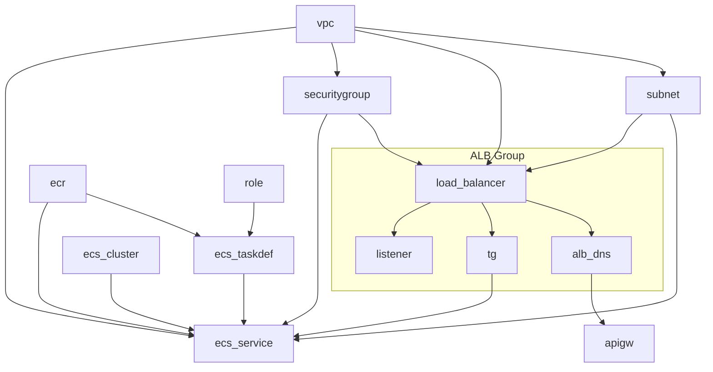

이 글은 [`aws-devops-example`](https://github.com/devchan64/aws-devops-example) 프로젝트의 구조와 설계 과정을 기록한 회고입니다.  
CloudFormation과 GitHub Actions를 중심으로, 인프라와 애플리케이션의 배포를 자동화한 실전 사례를 공유하고자 합니다.

---

## 왜 이 프로젝트를 시작했는가?

현대적인 서비스 운영은 단순히 코드를 잘 작성하는 것만으로는 부족합니다.  
다음과 같은 배경에서 이 프로젝트를 기획하게 되었습니다:

- **매뉴얼 배포**의 한계를 넘고 싶었습니다.  
  → 수동으로 배포하는 과정은 반복적이고 오류 가능성이 높으며, 재현성이 떨어졌습니다.

- **구성은 작게, 구조는 명확하게** 하고 싶었습니다.  
  → 모든 리소스를 한 템플릿에 몰아넣기보다, 네트워크, 보안, 서비스, API를 명확히 구분해보고자 했습니다.

- **CloudFormation에 익숙해지고 싶었습니다.**  
  → Terraform이나 Pulumi를 쓰기 전, AWS 네이티브 방식에 대한 충분한 이해를 목표로 했습니다.

---

## 어떤 경험을 담고 싶은가?

이 글은 단순히 실행 결과를 나열하는 문서가 아닙니다.  
대신 **다음 세 가지 관점에서 실전 경험을 정리**하고자 합니다:

1. **구조화(Structure)**: 리소스를 어떻게 쪼개고 연결했는가
2. **자동화(Automation)**: 어떤 트리거와 흐름으로 배포가 진행되는가
3. **실패와 학습(Lessons)**: 무엇이 잘 작동했고, 무엇을 되돌아보게 되었는가

---

이후 섹션에서는 설계 목표부터 전체 구성, 리소스 분리 방식, 배포 흐름, 시행착오까지 순차적으로 설명합니다.

---

## 설계 목표 (Design Goals)

이 프로젝트는 단순한 "배포 자동화 예제"를 넘어서,  
**"구조화된 인프라 설계와 실행 가능한 자동화"**를 목표로 시작되었습니다.

---

### 1. 코드로 정의되는 인프라 (Infrastructure as Code)

- 모든 AWS 리소스는 CloudFormation 템플릿으로 정의합니다.
- VPC, Subnet, Security Group부터 ECS, ALB, API Gateway까지 분리된 YAML 파일로 관리합니다.
- 수동 클릭 없이, **GitHub Actions에서 템플릿을 직접 실행**합니다.

---

### 2. 명확한 스택 분리와 변경 유연성 (Modular & Mutable Stacks)

- 모든 리소스를 하나의 거대한 템플릿에 넣는 방식은 확장이 어렵고 변경이 위험합니다.
- 따라서 기능 단위로 스택을 분리하여, **변경의 범위를 제한할 수 있도록 설계**했습니다.

예:

- VPC/Subnet/Security는 상대적으로 변하지 않기 때문에 **고정 스택으로 분리**합니다.
- ECS TaskDefinition, ALB Listener 등은 **자주 바뀔 수 있으므로 별도 관리**합니다.

이러한 구조는 다음과 같은 유연성을 제공합니다:

- 새로운 서비스를 추가할 때 ECS 관련 스택만 확장하면 됩니다.
- ALB 라우팅 규칙을 수정해도 네트워크 스택에는 영향이 없습니다.
- 특정 스택만 `workflow_dispatch`로 개별 실행 가능하므로 **안정성과 실험 가능성을 동시에 확보**할 수 있습니다.

이런 스택 분리는 단지 구성 요소를 나누는 것이 아니라,  
**실제 운영 환경에서의 "변경 가능성"을 기준으로 리소스를 구조화**하는 데 중점을 두었습니다.

---

### 3. GitOps 방식의 자동화 (Declarative Git-based Deployment)

- 모든 배포는 GitHub Actions를 통해 자동화됩니다.
- 수동 CLI 명령 없이, `git push`나 `workflow_dispatch` 이벤트만으로 인프라가 배포됩니다.
- 배포 흐름은 다음과 같이 구성됩니다:

```text
코드 커밋 → GitHub Actions → CloudFormation → AWS 리소스 생성
```

### 4. 최소 구조, 명확한 흐름

- ECS 기반 서비스 구성 중에서도 가장 작은 단위부터 설계합니다:

  - Task Definition
  - IAM Role
  - ECS Cluster
  - ALB Listener 및 Target Group

- 추상화보다 구체화를 선택하여 각 리소스가 어떤 역할을 하는지 직접 체감할 수 있도록 합니다.

## 전체 인프라 구성 (Architecture Overview)

이 프로젝트는 AWS 상에서 다음과 같은 흐름을 따라 구성됩니다:

- VPC, Subnet, SecurityGroup 등 네트워크 리소스 구성
- ALB와 연결된 ECS 서비스 배포
- API Gateway와 ALB의 연동
- GitHub Actions로 배포 자동화

---

### 전체 흐름 요약 (Mermaid)



---

### 인프라 세부 계층 구조 (D2)

```d2
direction: down

Infra: {
  label: "AWS Infrastructure"

  INET: "Internet"

  Traffic: {
    label: "Traffic Management"
    Route53: "Route 53"
  }

  CDN: {
    label: "CDN"
    CloudFront: "CloudFront"
  }

  API: {
    label: "API Gateway"
    APIGateway: "API Gateway"
  }

  NetworkLayer: {
    label: "Network Layer"

    VPC: {
      label: "VPC Network"

      IGW: "Internet Gateway"
      RouteTable: "Route Table"
      SecurityGroup: "Security Group"

      IGW -> RouteTable
      RouteTable -> SecurityGroup

      Subnets: {
        label: "Subnets"
        Subnet1: "Subnet 1"
        Subnet2: "Subnet 2"
        Subnet3: "Subnet 3"
      }

      LoadBalancers: {
        label: "Load Balancers"

        LB1: {
          label: "Load Balancer 1"
          Listener1: "ELB Listener 1"
          TargetGroup1: "Target Group 1"
          Listener1 -> TargetGroup1
        }

        LB2: {
          label: "Load Balancer 2"
          Listener2: "ELB Listener 2"
          TargetGroup2: "Target Group 2"
          Listener2 -> TargetGroup2
        }

        LB3: {
          label: "Load Balancer 3"
          Listener3: "ELB Listener 3"
          TargetGroup3: "Target Group 3"
          Listener3 -> TargetGroup3
        }
      }

      SecurityGroup -> Subnets
      LoadBalancers.LB1.TargetGroup1 -> Subnets.Subnet1
      LoadBalancers.LB2.TargetGroup2 -> Subnets.Subnet2
      LoadBalancers.LB3.TargetGroup3 -> Subnets.Subnet3
    }
  }

  Application: {
    label: "Application Layer"

    ECS: {
      label: "ECS Cluster"

      SRV1: {
        label: "ECS Service 1"
        Task1: "ECS Task 1"
        Frontend: "Frontend"
        Task1 -> Frontend
      }

      SRV2: {
        label: "ECS Service 2"
        Task2: "ECS Task 2"
        API: "API Service"
        Task2 -> API
      }

      SRV3: {
        label: "ECS Service 3"
        Task3: "ECS Task 3"
        Data: "Data Service"
        Task3 -> Data
      }
    }
  }

  NetworkLayer.VPC.Subnets.Subnet1 -> Application.ECS.SRV1.Task1
  NetworkLayer.VPC.Subnets.Subnet2 -> Application.ECS.SRV2.Task2
  NetworkLayer.VPC.Subnets.Subnet3 -> Application.ECS.SRV3.Task3

  DATA: {
    label: "Data Platform"

    IoT: {
      IoTCore: "IoT Core"
      IoTRules: "IoT Rules"
      IoTCore -> IoTRules
    }

    CW: "Cloud Watch"
    IoT.IoTRules -> CW

    Storage: {
      S3: "S3 Bucket"
      DynamoDB
    }
  }

  AUTH: {
    label: "Authentication"
    CognitoUserPool: "Cognito User Pool"
    CognitoIdentityPool: "Cognito Identity Pool"
  }

  Application -> DATA
  Application -> AUTH

  INET -> Traffic.Route53 -> CDN.CloudFront -> API.APIGateway -> NetworkLayer.VPC.LoadBalancers
  INET -> NetworkLayer.VPC.IGW
}
```

---

## 리소스 구성 상세 (Resource Stack Breakdown)

이 프로젝트는 리소스를 기능 단위로 분리하여 총 네 개의 주요 스택으로 구성되어 있습니다:

1. **네트워크 스택**: VPC, Subnet, SecurityGroup 등 기반 구조
2. **애플리케이션 스택**: ECS Cluster, Task Definition, Service, IAM Role
3. **로드 밸런서 스택**: ALB, Listener, Target Group
4. **API Gateway 스택**: ALB와 연결되는 API Gateway 구성

---

### 4.1 네트워크 스택

**포함 템플릿**:

- `vpc.yaml`
- `subnet.yaml`
- `security.yaml`

**주요 리소스**:

- VPC (CIDR 블록 지정)
- Public Subnet 3개 (각기 다른 AZ)
- Internet Gateway + Route Table
- Security Group (ALB용, ECS용 분리 가능)

**설계 포인트**:

- 서브넷은 향후 서비스 확장을 고려해 세 개로 구성
- Security Group은 ALB와 ECS에서 재사용 가능한 규칙 기반 설계

---

### 4.2 애플리케이션 스택

**포함 템플릿**:

- `ecs-cluster.yaml`
- `ecs-taskdef-hello.yaml`
- `ecs-service-hello.yaml`
- `ecs-role.yaml`

**주요 리소스**:

- ECS Cluster (Fargate 기반)
- ECS Task Definition (`hello` 이미지 사용)
- ECS Service (ALB TargetGroup 연결)
- IAM Role (ECR Pull, CloudWatch Logs 권한 포함)

**설계 포인트**:

- `hello` Task는 단일 컨테이너로 구성되어 테스트에 적합
- Task Role과 Execution Role을 명확히 분리
- Service는 ALB TargetGroup을 통해 외부와 연결됨

---

### 4.3 로드 밸런서 스택

**포함 템플릿**:

- `alb-with-tg.yaml`

**주요 리소스**:

- Application Load Balancer (ALB)
- Listener (HTTP 80 포트)
- Target Group (ECS Service 연결 대상)

**설계 포인트**:

- Listener는 향후 여러 경로 기반 규칙으로 확장 가능
- Target Group은 ECS Service와 동적으로 연결되며, 헬스체크 설정 포함
- ALB는 앞단 API Gateway와 연동됨

---

### 4.4 API Gateway 스택

**포함 템플릿**:

- `apigw.yaml`

**주요 리소스**:

- REST API Gateway
- VPC Link
- ALB Listener를 대상으로 한 통합 설정

**설계 포인트**:

- ALB와 연결되는 API Gateway 구성은 실무에서도 자주 사용되는 패턴
- API Gateway → VPC Link → ALB → ECS 로 이어지는 구조
- 실질적인 public endpoint는 API Gateway가 담당함

---

이러한 분리는 배포 단위 유연성과 유지보수 편의성을 동시에 제공합니다.  
특정 리소스만 수정할 때 전체를 재배포할 필요 없이, 해당 스택만 GitHub Actions에서 선택적으로 실행할 수 있습니다.

---

## GitHub Actions 기반 배포 자동화 (CI/CD)

이 프로젝트는 수동 CLI 없이도 인프라를 배포할 수 있도록,  
**GitHub Actions를 중심으로 완전 자동화된 배포 흐름**을 구성했습니다.

---

### 워크플로우 구성

각 스택은 별도의 GitHub Actions 워크플로우 파일로 관리되며, 다음과 같은 규칙을 따릅니다:

| 스택        | 워크플로우 파일   | 트리거 조건                          |
| ----------- | ----------------- | ------------------------------------ |
| VPC         | `vpc-stack.yml`   | `workflow_dispatch`, 또는 Push       |
| ALB         | `alb-stack.yml`   | VPC 스택 완료 후 자동 실행           |
| ECS         | `ecs-stack.yml`   | ALB 스택 완료 후 자동 실행           |
| API Gateway | `apigw-stack.yml` | 수동 실행 또는 ECS 완료 후 연결 가능 |

---

### 트리거 구조 (의존성 연결)

워크플로우 간에는 다음과 같은 순서로 자동 실행되도록 설정되어 있습니다:

```text
vpc-stack
   ↓ (성공 시)
alb-stack
   ↓
ecs-stack
   ↓
apigw-stack (선택적 연결)
```

이 구조는 다음을 가능하게 합니다:

- 실패한 스택만 선택적으로 재실행 가능
- 각 스택을 독립적으로 테스트/수정할 수 있음
- GitHub Actions UI에서 실행 상태 시각적으로 확인

---

### 환경 변수 및 시크릿 관리

모든 AWS 인증 정보 및 파라미터는 GitHub 저장소의 Secrets에 저장하고, Actions 내에서 참조합니다.

예시:

```yaml
env:
  AWS_REGION: ${{ secrets.AWS_REGION }}
  AWS_ACCOUNT_ID: ${{ secrets.AWS_ACCOUNT_ID }}
```

Secrets 항목:

- AWS_ACCESS_KEY_ID
- AWS_SECRET_ACCESS_KEY
- AWS_REGION
- AWS_ACCOUNT_ID

---

### 수동 실행 (workflow_dispatch)

개발 환경에서는 전체 스택을 수동으로 실행할 수 있도록 workflow_dispatch를 설정해두었습니다.

- 스택별 실험 가능
- 코드 수정 없이 배포 테스트 가능
- main 브랜치에 병합하지 않아도 배포 가능

이 구조는 로컬 개발 환경에 의존하지 않고,
버전 관리된 YAML 파일만으로 인프라를 통제할 수 있는 GitOps 운영 방식을 실현합니다.

---

## 배포 흐름 요약 (Deployment Flow)

이 프로젝트는 GitHub Actions와 CloudFormation을 통해  
**인프라 구성부터 애플리케이션 실행까지 완전 자동화된 흐름**을 갖습니다.

---

### 전체 흐름

```text
GitHub에 코드 Push
       ↓
GitHub Actions 워크플로우 실행
       ↓
CloudFormation 스택 생성/업데이트
       ↓
VPC → ALB → ECS → API Gateway 순으로 배포
       ↓
ECS Task 실행 상태 확인 및 ALB 연결
       ↓
최종적으로 API Gateway Endpoint에서 서비스 접근 가능
```

---

### 실제 흐름 예시

1. 사용자가 main 브랜치에 코드 변경을 Push
2. GitHub Actions가 .github/workflows/vpc-stack.yml을 실행
3. 이후 workflow_run 조건에 따라 alb-stack.yml, ecs-stack.yml 순차 실행
4. ECS Task가 등록된 Target Group과 연결되며, ALB가 트래픽을 분산 처리
5. 마지막으로 API Gateway에서 ALB를 대상으로 연결해 외부 요청을 수신

---

### 배포 후 검증

- hello ECS Task의 URL에 접근하여 서비스 응답을 확인할 수 있습니다.
- ALB DNS 또는 API Gateway URL을 통해 외부 요청이 정상적으로 처리되는지 확인합니다.
- CloudWatch Logs 및 ALB 헬스체크 로그로 상태 모니터링 가능

---

### 요약하면

이 구조는 다음과 같은 특성을 가집니다:

- 명시적: 배포 흐름이 코드로 명확하게 드러남
- 자동화: 사용자 개입 없이 순차 실행
- 확장 가능: 추가 스택이 쉽게 연결 가능
- 롤백 가능: CloudFormation의 변경 이력 기반으로 복구 가능

---

## 시행착오 및 개선 사례 (What Went Wrong & Fixed)

프로젝트를 진행하면서 단순히 코드만 작성한 것이 아니라,  
**AWS 리소스 간의 의존성과 시차, 권한 문제**로 다양한 시행착오를 겪었습니다.  
이 섹션에서는 그중 의미 있었던 사례들을 정리합니다.

---

1. GitHub Actions 트리거 순서 꼬임
   **문제**: workflow_run 트리거가 예상대로 동작하지 않음
   **원인**: 이전 워크플로우 이름 불일치 또는 conclusion 조건 누락
   **해결 방법**:

```yaml
on:
  workflow_run:
    workflows: ["vpc-stack"]
    types:
      - completed
```

이름이 정확히 일치해야만 다음 워크플로우가 실행됨

---

### 2. ECS Service와 TargetGroup 헬스체크로 인한 CloudFormation 대기 지연

**문제**: CloudFormation 스택 생성 시, ECS 서비스 생성 단계에서  
TargetGroup의 헬스체크 결과를 기다리느라 **스택 진행이 수 분간 지연**됨

**원인**: ECS Service는 TargetGroup과 연결된 후, 최소 하나 이상의 Task가  
헬시(Healthy) 상태가 되어야만 "CREATE_COMPLETE" 상태로 넘어감

**영향**:

- 초기 배포 시 Task가 시작되었음에도 스택이 완료되지 않아 Actions 워크플로우가 멈춘 듯 보임
- 헬스체크 실패가 반복되면 스택 생성 자체가 롤백됨

**해결 방법**:

- Task Definition의 컨테이너 포트, ALB 리스너 포트, 대상 포트 정합성 검증
- 서비스 초기화 시간이 필요한 경우, ECS Task의 entrypoint에 **준비 상태 확인 로직 추가**

```yaml
HealthCheckPath: "/health"
Matcher:
  HttpCode: "200"
```

---

### 3. ECR 배포 후 ECS TaskDefinition이 갱신되지 않음 (`latest` 태그 사용)

**문제**: ECR에 새로운 이미지를 Push했지만, ECS 서비스가 **이전 이미지로 계속 실행됨**

**원인**:  
ECS의 TaskDefinition은 `image` 필드에 `:latest` 태그를 명시하더라도,  
CloudFormation은 `repository:latest` URI가 같다면 **변경사항이 없다고 판단**하여  
새로운 리비전을 생성하지 않음 → 배포 누락 발생

**임시 해결 방법**: `force-new-deployment` 사용

CI 워크플로우(`push-ecr-hello`)에 다음 스크립트를 추가하여,  
**ECR 이미지 Push 후 ECS 서비스에 강제로 재배포**되도록 구성함:

```bash
aws ecs update-service \
  --cluster dev-ecs-cluster \
  --service dev-ecs-service-hello \
  --force-new-deployment \
  --region $AWS_REGION
```

- 이미지 URI는 그대로 :latest 태그를 사용하되
- ECS 서비스가 강제로 새 Task를 시작하도록 명령함
- TaskDefinition revision은 변경되지 않지만, ECS는 새 컨테이너를 pull하여 실행함

**향후 개선 방향**: Immutable Tag 전략
이 방식은 매 배포마다 강제 재시작이 필요하고,
CloudFormation으로는 추적이 되지 않으므로 다음 개선이 필요합니다:

- 이미지 태그에 git sha, build number 등 고유한 버전 태그를 사용

  - 예: myapp:20250613-a1b2c3

- CI에서 태그 → 이미지 Push → TaskDefinition 등록까지 자동화
- force-new-deployment 없이도 TaskDefinition revision 생성만으로 배포 가능

**예시 전략**:

```yaml
image: ${AWS_ACCOUNT_ID}.dkr.ecr.${AWS_REGION}.amazonaws.com/dev-hello:${{ github.sha }}
```

**교훈**:
latest는 로컬 테스트에는 편리하지만,
프로덕션 배포에서는 정확한 버전 추적과 변경 감지가 어려움.
CI/CD 파이프라인에는 가급적 immutable tag 전략을 도입해야 한다.

---

### 다음 단계

#### 1. 멀티 서비스/멀티 환경 구성 확장

- 현재는 단일 서비스, 단일 환경(`dev`) 중심 구성입니다.
- 이후 다음을 고려한 구조로 확장하고자 합니다:
  - 프로덕션 환경 분리 (`dev`, `prod`)
  - 멀티 컨테이너 ECS Task
  - ALB Listener Rule 분기 (경로 기반 라우팅)

#### 2. 모니터링 및 알림 연동

- 현재 구조는 CloudWatch 로그만 연결되어 있습니다.
- 이후 다음 기능을 추가할 수 있습니다:
  - ECS 헬스체크 이상 시 Slack 알림
  - 배포 성공/실패 시 GitHub Actions → SNS → 알림 전파

---

### 마치며

이 글이 비슷한 목표를 가진 분들께 작은 힌트가 되길 바랍니다.
