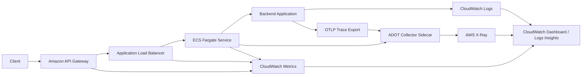

# CloudWatch 중심 관측 개선과 OpenTelemetry, ADOT 도입기

클라우드 환경에서 관측성을 개선할 때 가장 먼저 부딪히는 문제는 "무엇을 어디까지 로그로 남길 것인가"가 아닙니다. 더 본질적인 문제는 인프라가 책임져야 할 관측과 애플리케이션이 책임져야 할 관측을 분리하지 못할 때 운영 복잡도와 비용이 함께 커진다는 점입니다.

이번 글에서는 AWS 기반 백엔드에서 관측 체계를 다시 정리하면서, CloudWatch 중심의 인프라 관측과 OpenTelemetry 기반의 내부 추적을 어떻게 연결했는지 정리합니다.

## 문제 정의

초기 상태의 문제는 크게 네 가지였습니다.

- CloudWatch로 로그는 들어오지만 운영에 필요한 구조로 정리되어 있지 않았습니다.
- 요청 상관관계 ID가 응답, 서버 로그, 추적 정보 사이에서 일관되지 않았습니다.
- 정상 요청 로그, SQL 쿼리 로그, 반복 성공 로그가 비용을 키울 가능성이 컸습니다.
- 향후 컨테이너 오케스트레이션 전환을 고려하면, 특정 벤더에 묶이지 않는 추적 표준이 필요했습니다.

여기서 중요한 판단은 "로그를 더 많이 남기자"가 아니라 "인프라와 애플리케이션의 관측 책임을 나누자"였습니다.

## 관측 책임 분리

이번 개선에서 세운 원칙은 단순했습니다.

- API Gateway, ALB, ECS, RDS 같은 인프라 상태는 AWS가 제공하는 메트릭과 로그를 우선 사용한다.
- 애플리케이션은 내부 요청 흐름, 비즈니스 문맥, 예외 원인, 외부 의존성 호출 추적에 집중한다.
- 로그는 조사 도구로 쓰고, 알람은 가능한 메트릭 중심으로 설계한다.

이 원칙을 기준으로 보면, 인프라 계층의 요청 수나 지연 시간까지 애플리케이션 로그로 다시 만들 필요는 없습니다. 반대로 비즈니스 실패 원인이나 서비스 내부 병목은 인프라 메트릭만으로는 알 수 없습니다.

## 전체 아키텍처

이번에 정리한 관측 구조는 아래와 같습니다.

핵심은 두 갈래입니다.

- 인프라 관측은 CloudWatch가 맡습니다.
- 애플리케이션 내부 추적은 OpenTelemetry로 만들고, ADOT Collector를 통해 X-Ray로 보냅니다.

이 구조를 택하면 CloudWatch와 X-Ray를 AWS 운영 경험 안에서 함께 사용할 수 있으면서도, 애플리케이션 계측 자체는 OpenTelemetry 표준 위에 둘 수 있습니다.

## CloudWatch 중심으로 인프라 관측 보강

가장 먼저 한 일은 AWS 인프라 관측 지점을 보강하는 것이었습니다.

- API Gateway access log 활성화
- API Gateway detailed metrics 활성화
- CloudWatch 대시보드 추가
- ECS 로그 그룹과 서비스 지표 연결

이 단계의 목적은 애플리케이션 로그로 인프라 상태를 대체하지 않도록 만드는 것입니다.

예를 들어 요청 수, 4xx/5xx 비율, edge latency 같은 값은 API Gateway와 ALB가 더 정확하게 알고 있습니다. 이런 값까지 애플리케이션에서 중복 집계하면 운영 관점의 기준점이 흔들립니다.

## 로그 정책: 기본값을 낮추고 조사 시에만 확장

관측성을 강화한다고 해서 로그를 더 많이 남기는 것은 좋은 전략이 아닙니다. CloudWatch Logs 비용은 보통 에러 로그보다 정상 요청 로그와 반복 성공 로그에서 더 크게 증가합니다.

그래서 로그 정책은 아래처럼 가져갔습니다.

- 기본 로그 레벨은 `warn`
- 정상 요청 완료 로그는 기본 비활성화
- SQL query log는 기본 비활성화
- 장애 대응 시에만 로그 레벨과 샘플링을 높인다

이 접근의 장점은 명확합니다.

- 평시 비용을 낮출 수 있습니다.
- 조사 시에만 필요한 범위만 확장할 수 있습니다.
- 애플리케이션 로그가 운영 신호를 덮어버리는 문제를 줄일 수 있습니다.

또한 반복 성공 로그와 대형 payload 로그를 제거하고, 실패 로그에는 식별자와 문맥만 구조적으로 남기도록 정리했습니다. 비용 최적화에서 중요한 것은 로그 레벨보다 로그의 형태와 빈도였습니다.

## 요청 상관관계와 구조화 로그

다음 단계는 요청 단위 상관관계를 맞추는 일이었습니다.

실제 운영에서는 "에러가 났다"보다 "어느 요청에서, 어떤 문맥으로, 어떤 의존성 호출 중 실패했는가"가 더 중요합니다. 이를 위해 다음 기준을 맞췄습니다.

- 요청마다 공통 상관관계 ID를 유지한다
- 예외 응답과 서버 로그가 같은 추적 키를 공유한다
- 요청 로그, 예외 로그, 서비스 로그를 구조화 포맷으로 남긴다

이렇게 해두면 CloudWatch Logs Insights에서 같은 요청을 기준으로 서버 로그를 조회할 수 있고, 이후 분산 추적을 붙였을 때도 연결이 쉬워집니다.

## 왜 OpenTelemetry를 선택했는가

내부 추적 표준으로는 OpenTelemetry를 선택했습니다. 이유는 단순히 최신 표준이라서가 아니라, 관측 데이터를 특정 APM 제품의 SDK에 종속시키고 싶지 않았기 때문입니다.

OpenTelemetry를 선택하면 다음 이점이 있습니다.

- 추적 표준을 벤더 중립적으로 유지할 수 있습니다.
- 현재는 X-Ray를 쓰더라도 나중에 다른 백엔드로 전환하기 쉽습니다.
- 컨테이너 오케스트레이션 전환 후에도 계측 코드를 최대한 유지할 수 있습니다.

이번 단계에서는 로그, 메트릭, 트레이스를 한 번에 다 해결하려 하지 않았습니다. 우선은 trace부터 최소 범위로 붙여 실제 요청 흐름이 보이는지 확인하는 것을 목표로 삼았습니다.

## 왜 ADOT Collector Sidecar를 선택했는가

OpenTelemetry를 붙인 뒤 바로 애플리케이션에서 X-Ray로 직접 전송하는 방법도 검토했습니다. 하지만 최종적으로는 ADOT Collector를 sidecar로 두는 방향이 더 적절하다고 판단했습니다.

그 이유는 세 가지였습니다.

- 애플리케이션은 OTLP만 알면 되고, AWS 전송 책임은 플랫폼이 맡을 수 있습니다.
- 샘플링, exporter 변경, 후속 확장을 Collector 계층에서 제어할 수 있습니다.
- 현재는 모놀리스에 가깝지만, 이후 서비스가 쪼개져도 같은 패턴을 유지하기 쉽습니다.

초기 구조를 sidecar로 잡은 이유도 비슷합니다. 애플리케이션과 Collector를 같은 태스크 안에서 로컬 엔드포인트로 연결하면 시작 비용이 낮고, 추후 필요하면 별도 Collector 서비스로 확장할 수 있습니다.

## OpenTelemetry PoC에서 먼저 확인한 것

전면 도입 전에 먼저 확인한 것은 "정말로 동작하는가"였습니다.

PoC에서 확인한 질문은 다음과 같았습니다.

- 현재 Node.js 런타임과 패키지 관리 환경에서 OTel auto-instrumentation이 정상 작동하는가
- 데이터베이스 연결과 외부 호출에서 span이 생성되는가
- 현재 로그의 trace ID와 OTel trace ID를 연결할 수 있는가

PoC의 의미는 기능 추가보다 리스크 제거에 있습니다. 관측 도입은 보통 코드보다 런타임 환경, 패키지 해석, 배포 구조에서 더 자주 문제를 만듭니다.

## 구축 과정에서 얻은 교훈

### 1. 관측성은 로거 교체로 끝나지 않는다

실제 운영 가능한 관측성은 다음이 함께 맞물릴 때 비로소 성립합니다.

- 로그 정책
- 상관관계 ID
- 예외 표준화
- 추적 계측
- 수집 파이프라인
- 인프라 템플릿

즉, 로거 라이브러리를 바꾸는 것은 시작일 뿐입니다.

### 2. 비용은 로그 레벨보다 로그 형태에 더 민감하다

비용을 줄이는 가장 효과적인 방법은 에러 로그를 덜 남기는 것이 아니라, 다음을 줄이는 것이었습니다.

- 정상 요청 전량 로그
- SQL query log의 상시 활성화
- 반복 루프의 성공 로그
- 큰 크기의 요청/응답 payload 로그

운영성은 유지하면서 비용만 줄이려면, 실패 로그는 살리고 성공 로그를 집계하거나 샘플링하는 방식이 더 효과적입니다.

### 3. 인프라 관측과 애플리케이션 관측은 분리해야 한다

인프라 메트릭은 AWS가 잘합니다. 애플리케이션 내부 문맥은 애플리케이션이 잘합니다. 이 경계를 분명히 해야 중복 계측과 과도한 로그를 피할 수 있습니다.

### 4. OpenTelemetry의 성공 여부는 플랫폼 준비에 달려 있다

OTel은 애플리케이션 코드 몇 줄 추가로 끝나는 기능이 아닙니다. 실제 운영에서 가치를 만들려면 Collector 배치, IAM 권한, exporter 경로, 대시보드 연계까지 플랫폼이 함께 준비되어야 합니다.

## 현재 단계의 결과

이번 개선을 통해 얻은 결과는 다음과 같습니다.

- CloudWatch 중심의 인프라 관측 지점을 보강했습니다.
- 로그 정책을 비용 관점에서 다시 정리했습니다.
- 요청 상관관계와 구조화 예외 로그를 정리했습니다.
- OpenTelemetry 기반 내부 추적의 토대를 마련했습니다.
- ADOT Collector sidecar를 통해 AWS X-Ray 연동 기반을 갖췄습니다.

아직 끝난 것은 아닙니다. 하지만 이제는 "로그를 더 남길 것인가"를 고민하는 단계에서 "어떤 요청 흐름이 실제로 병목을 만들고 있는가"를 볼 수 있는 단계로 이동할 준비가 되었습니다.

## 다음 단계

앞으로의 과제는 비교적 분명합니다.

- 실제 운영 환경에서 trace 품질을 검증한다
- 자동 계측 범위를 조정해 노이즈를 줄인다
- 비즈니스 실패 신호는 로그보다 메트릭 중심으로 옮긴다
- 컨테이너 오케스트레이션 전환 시 Collector 배치 전략을 재검토한다

관측성은 한 번 구축하고 끝나는 기능이 아니라, 운영 경험을 바탕으로 계속 다듬는 플랫폼 역량에 가깝습니다. 이번 작업은 그 출발점을 CloudWatch와 OpenTelemetry 위에 다시 세운 과정이었습니다.
