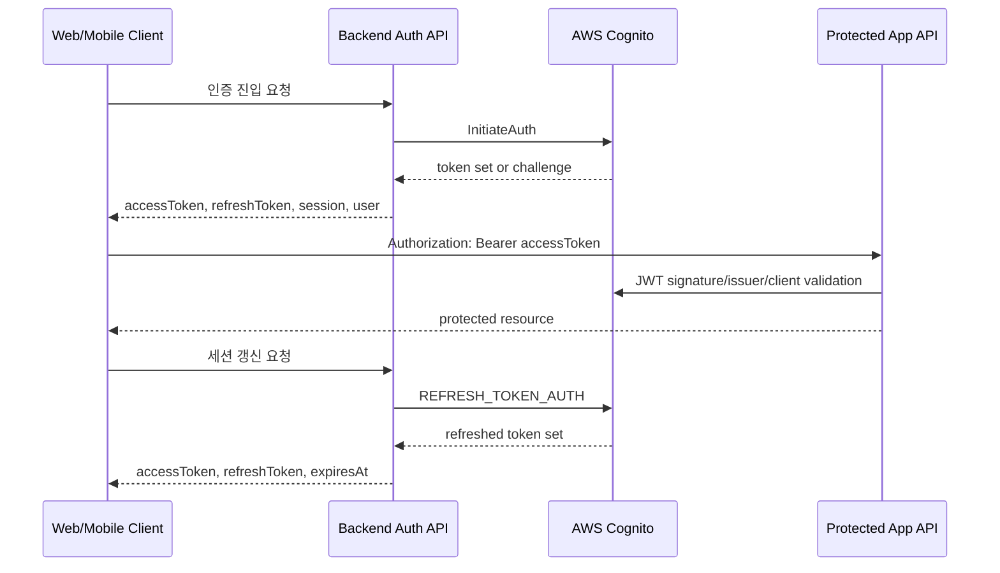
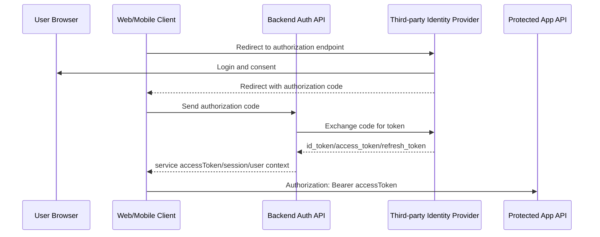

# Cognito로 빠르게 Auth API 만들기: 스타트업식 인증 구현에서 OAuth 경계까지

스타트업에서 인증을 처음 설계할 때 가장 중요한 일은 완성된 인증 플랫폼을 만드는 것이 아닙니다.

먼저 제품이 실제로 동작해야 합니다. 사용자는 로그인할 수 있어야 하고, 비밀번호를 변경할 수 있어야 하며, 보호 API를 호출할 수 있어야 합니다. 이 시점에는 Cognito SDK를 프론트엔드에서 직접 사용하는 방식이 충분히 합리적입니다.

다만 인증을 프론트엔드 SDK 사용에만 묶어두면, 제품이 운영 단계로 들어갈수록 질문이 달라집니다.

로그인은 어디에서 실패했는지, refresh token은 왜 거절되었는지, 웹과 모바일은 같은 인증 계약을 사용하는지, 테넌트와 역할 정보는 어디에서 검증되는지, 인증 흐름은 서비스 로그로 관측 가능한지 확인해야 합니다.

이 글은 Cognito를 적용해 빠르게 API 기반 인증 서비스를 만들기 위한 가이드입니다. 핵심은 Cognito를 단순히 클라이언트 SDK로만 소비하지 않고, 백엔드 Auth API의 provider로 사용하는 것입니다. 인증의 최종 판정은 Cognito가 담당하고, 서비스는 클라이언트와 Cognito 사이에 검증 가능한 API 경계를 세웁니다.

이 접근을 사용하면 자체 인증 서버를 처음부터 만들지 않고도 로그인, 세션 갱신, 비밀번호 변경, 사용자 컨텍스트 조회 같은 인증 API를 빠르게 제공할 수 있습니다. 동시에 이후 OAuth/OIDC 기반 인증 구조로 확장할 수 있는 계약도 남길 수 있습니다.

특히 IoT 서비스에서는 이 경계가 더 중요합니다. IoT 서비스는 대개 단일 앱 안에서 끝나지 않습니다. 장치, 모바일 앱, 운영자 콘솔, 고객지원 도구, 외부 파트너 시스템, 배치 작업, 알림 시스템이 함께 연결됩니다. 이때 인증과 인가의 도메인 자리가 없으면 외부 연동이 추가될 때마다 임시 토큰, 임시 role, 임시 API key, 임시 예외 처리가 늘어납니다.

따라서 인증과 인가를 처음부터 완성된 서비스로 만들 필요는 없지만, 목업 가능한 도메인 경계는 초기에 필요합니다. 로그인 provider가 Cognito이든 OAuth provider이든, 서비스 내부에는 `누가`, `어떤 테넌트에서`, `어떤 역할로`, `어떤 리소스에 접근할 수 있는가`를 표현할 자리가 있어야 합니다. 이 자리가 있어야 외부 연동을 붙이기 전에도 권한 흐름을 테스트하고, 화면과 API를 같은 계약으로 검증할 수 있습니다.

## 빠른 시작은 SDK로 가능하지만, 서비스 API 경계가 필요합니다

초기 제품에서는 인증 자체보다 제품 검증이 더 중요할 때가 많습니다.

Cognito SDK는 이 단계에서 유용합니다. `CognitoUser`, `CognitoSession`, `refreshSession` 같은 객체 모델을 그대로 사용하면 로그인, 신규 비밀번호 챌린지, 세션 복원, 토큰 갱신, 로그아웃을 빠르게 붙일 수 있습니다.

프론트엔드는 Cognito SDK를 직접 호출하고, Cognito가 내려준 token set과 user state를 저장합니다. 백엔드는 Cognito JWT를 검증해 보호 API를 제공합니다. 구현 속도만 보면 이 구조는 나쁘지 않습니다.

다만 이 글의 권장 구조는 클라이언트가 Cognito SDK에 장기적으로 결합되는 방식이 아닙니다. 초기 PoC에서는 SDK 직접 사용이 빠를 수 있지만, API 기반 인증 서비스를 만들 때는 가능한 이른 시점에 Auth API 경계를 두는 편이 좋습니다.

문제는 제품이 운영되기 시작한 뒤에 드러납니다.

- 로그인 실패 원인, 챌린지 상태, refresh 실패 원인을 서비스 로그로 일관되게 수집하기 어렵습니다.
- 웹과 모바일이 같은 인증 정책을 쓰더라도 SDK 사용 방식 차이 때문에 검증 지점이 분산됩니다.
- 클라이언트가 Cognito token set과 Cognito user state를 직접 들고 있어 이후 구조 변경 단위가 커집니다.
- 향후 인증 흐름을 별도 auth boundary로 분리하려 할 때 API 계약이 아니라 SDK 사용 코드가 결합 지점이 됩니다.

기능은 동작하지만, 서비스가 인증 흐름을 충분히 관측하고 검증하기 어렵습니다.

여기서부터 인증은 단순 기능이 아니라 서비스 운영의 경계 문제가 됩니다.

## 구축 기준: 인증 provider는 Cognito로 두고, 서비스 계약을 만듭니다

빠른 인증 서비스를 만들 때 가장 중요하게 볼 것은 서비스 검증 가능성입니다.

인증은 사용자가 서비스를 시작하는 첫 관문입니다. 로그인 실패, 토큰 만료, 권한 불일치, 테넌트 미할당 같은 문제는 사용자 입장에서는 모두 서비스 장애처럼 보입니다.

따라서 인증 흐름은 클라이언트 내부 SDK 로그에 흩어져 있기보다, 서비스 API 경계에서 추적 가능해야 합니다.

구축 원칙은 다음과 같습니다.

- Cognito의 인증과 세션 모델은 유지합니다.
- 최종 클라이언트는 Cognito SDK에 직접 결합되지 않도록 합니다.
- 백엔드 Auth API가 Cognito 호출을 감싸고 응답 계약과 에러 계약을 표준화합니다.
- 보호 API 호출에는 Auth API가 내려준 `accessToken`을 사용합니다.
- Cognito 세부 토큰 필드는 신규 클라이언트의 상태 기준으로 사용하지 않습니다.

이 방식은 새로운 인증 체계를 만드는 것이 아닙니다. Cognito를 provider로 유지하되, 서비스가 제어할 수 있는 API adapter를 앞에 세우는 구조입니다.

여기서 Auth API는 단순히 Cognito 호출을 감싸는 프록시가 아닙니다. 인증 provider와 서비스 도메인 사이에 놓이는 최소한의 인증/인가 모델 자리입니다. 이 자리가 있어야 실제 외부 연동이 붙기 전에도 mock user, mock tenant, mock role, mock grant를 사용해 제품 흐름을 검증할 수 있습니다.

## Auth API는 인증 provider가 아니라 integration boundary입니다

현재 구조는 다음 흐름으로 정리할 수 있습니다.

주요 계약은 다음과 같습니다.

| 계약 | 역할 |
| --- | --- |
| 인증 진입 계약 | 로그인 입력을 받아 provider 인증을 수행하고, 성공 시 표준 세션을 반환합니다 |
| 챌린지 처리 계약 | 신규 비밀번호 설정처럼 provider가 요구하는 추가 인증 단계를 서비스 응답 계약으로 변환합니다 |
| 세션 갱신 계약 | refresh token을 사용해 새 access token을 발급받습니다 |
| 세션 종료 계약 | 클라이언트가 쓰는 표준 토큰을 기준으로 provider의 토큰 세션을 무효화합니다 |
| 사용자 컨텍스트 계약 | 앱이 쓰는 사용자, 테넌트, 역할 컨텍스트를 반환합니다 |
| 권한 카탈로그 계약 | 운영 중 변경 가능한 role, grant, policy 단서를 클라이언트가 해석 가능한 형태로 제공합니다 |

여기서 중요한 점은 사용자 컨텍스트 계약이 raw Cognito attribute map을 그대로 노출하지 않는다는 것입니다. Cognito claim, DB role, tenant context를 앱이 쓰는 공용 user context로 정리합니다.

즉, Cognito는 인증 provider이고 Auth API는 서비스 통합 경계입니다.

## API는 SDK 객체를 대체해야 합니다

클라이언트에서 Cognito SDK를 제거하려면 로그인 요청 하나만으로는 부족합니다. SDK가 클라이언트 안에서 맡던 역할을 서비스 계약으로 옮겨야 합니다.

인증 진입 계약은 다음 기능을 포함합니다.

| 계약 | 현재 역할 |
| --- | --- |
| 로그인 | email/password를 받아 Cognito 인증을 수행합니다 |
| 신규 비밀번호 챌린지 | Cognito `NEW_PASSWORD_REQUIRED`를 서비스 응답 계약으로 완료합니다 |
| 세션 갱신 | refresh token으로 새 access token을 발급합니다 |
| 세션 종료 | 표준 `accessToken`으로 provider의 토큰 세션을 무효화합니다 |
| 가입 | provider 사용자 등록을 수행합니다 |
| 가입 확인 | 가입 확인 코드를 검증합니다 |
| 가입 코드 재전송 | 가입 확인 코드를 다시 발송합니다 |
| 비밀번호 재설정 요청 | 비밀번호 재설정 코드를 요청합니다 |
| 비밀번호 재설정 확정 | 재설정 코드와 새 비밀번호를 검증합니다 |
| 비밀번호 검증 | 민감 작업 전에 현재 비밀번호를 검증합니다 |
| 비밀번호 변경 | 로그인 사용자의 비밀번호를 변경합니다 |
| 계정 식별 보조 | 사용자가 자신의 로그인 식별자를 회복할 수 있게 돕습니다 |

여기서 `Public` 성격의 계약이 있다고 해서 Cognito를 우회하는 것은 아닙니다. 로그인, 회원가입, 비밀번호 검증 같은 요청은 모두 백엔드가 Cognito API를 호출해 최종 판정을 받습니다.

로그인 이후 앱이 화면과 권한 판단에 사용하는 컨텍스트는 별도 계약으로 분리합니다.

| 계약 | 역할 |
| --- | --- |
| 사용자 컨텍스트 조회 | 사용자 식별자, 이메일, 이름, 테넌트, 플랫폼롤, 테넌트롤을 반환합니다 |
| 권한 카탈로그 조회 | 저장소에 있는 동적 role key 목록을 반환합니다 |

권한 카탈로그의 role key는 enum이 아닙니다. 저장소에 있고 운영 중 동적으로 바뀔 수 있는 값입니다. 따라서 클라이언트는 응답된 role code를 고정 enum처럼 컴파일 타임에 박아두면 안 됩니다.

이런 계약들이 있어야 클라이언트가 Cognito SDK의 user/session/challenge 객체를 직접 만들 필요가 없어집니다.

예시 엔드포인트를 둔다면 다음처럼 정리할 수 있습니다. 아래 경로는 실제 구현 경로가 아니라, 인증 경계를 설명하기 위한 예시입니다.

| 예시 엔드포인트 | 계약 | 설명 |
| --- | --- | --- |
| `POST /v1/auth/sign-in` | 인증 진입 | 사용자 입력을 받아 provider 인증을 수행하고 표준 세션을 반환합니다 |
| `POST /v1/auth/challenges/new-password` | 챌린지 처리 | provider가 요구한 신규 비밀번호 챌린지를 완료합니다 |
| `POST /v1/auth/token/refresh` | 세션 갱신 | refresh token으로 새 access token을 발급합니다 |
| `POST /v1/auth/sign-out` | 세션 종료 | 표준 bearer token을 기준으로 provider의 토큰 세션을 무효화합니다 |
| `POST /v1/auth/sign-up` | 가입 | provider 사용자 등록을 수행합니다 |
| `POST /v1/auth/sign-up/confirm` | 가입 확인 | 가입 확인 코드를 검증합니다 |
| `POST /v1/auth/sign-up/resend-confirmation` | 가입 코드 재전송 | 가입 확인 코드를 다시 발송합니다 |
| `POST /v1/auth/password-resets` | 비밀번호 재설정 요청 | 비밀번호 재설정 코드를 요청합니다 |
| `POST /v1/auth/password-resets/confirm` | 비밀번호 재설정 확정 | 재설정 코드와 새 비밀번호를 검증합니다 |
| `POST /v1/auth/password-verifications` | 비밀번호 검증 | 민감 작업 전에 현재 비밀번호를 검증합니다 |
| `PATCH /v1/auth/password` | 비밀번호 변경 | 로그인 사용자의 비밀번호를 변경합니다 |
| `GET /v1/auth/subject` | 사용자 컨텍스트 조회 | 현재 요청 주체의 사용자, 테넌트, 역할 컨텍스트를 반환합니다 |
| `GET /v1/auth/authorization-catalog` | 권한 카탈로그 조회 | 운영 중 변경 가능한 role, grant, policy 단서를 반환합니다 |

여기서 중요한 것은 URL 자체가 아니라 분류 기준입니다. 인증 provider와 직접 대화하는 계약, 앱이 소비하는 세션 계약, 화면과 권한 판단에 필요한 컨텍스트 계약, 운영 중 바뀌는 권한 카탈로그 계약을 분리해야 합니다.

## sign-up은 사용자 등록과 서비스 컨텍스트의 시작점입니다

sign-up은 단순히 Cognito에 사용자를 하나 생성하는 API가 아닙니다. 빠른 인증 서비스를 만들 때 sign-up은 provider 사용자 등록, 확인 코드 검증, 서비스 사용자 컨텍스트 연결을 시작하는 경계입니다.

Cognito를 사용하면 가입 흐름을 빠르게 구성할 수 있습니다. Auth API는 클라이언트로부터 email, password, name 같은 가입 입력을 받고, Cognito의 사용자 등록 API를 호출합니다. Cognito는 사용자 생성과 확인 코드 발송을 담당합니다. 서비스는 이 결과를 그대로 노출하지 않고, 가입 상태를 클라이언트가 이해할 수 있는 응답 계약으로 변환합니다.

가입 흐름은 다음 단계로 분리하는 것이 좋습니다.

| 단계 | 역할 | 서비스 계약에서 중요한 점 |
| --- | --- | --- |
| sign-up 요청 | 사용자를 provider에 등록합니다 | 입력 검증, 중복 계정 처리, 에러 메시지 표준화가 필요합니다 |
| confirmation 요청 | 이메일 또는 SMS 확인 코드를 검증합니다 | 코드 만료, 코드 불일치, 이미 확인된 계정 상태를 일관되게 표현해야 합니다 |
| confirmation 재요청 | 확인 코드를 다시 발송합니다 | 재시도 제한과 사용자 피드백을 서비스 정책으로 관리해야 합니다 |
| 최초 sign-in | 확인된 사용자가 세션을 발급받습니다 | `accessToken`, `refreshToken`, 사용자 컨텍스트를 표준 계약으로 반환해야 합니다 |
| 사용자 컨텍스트 연결 | provider subject를 서비스 사용자 모델과 연결합니다 | Cognito `sub`, email, tenant, role, onboarding state를 서비스 기준으로 정규화해야 합니다 |

여기서 중요한 것은 Cognito의 user status를 화면 상태로 직접 사용하지 않는 것입니다. sign-up 흐름에서는 `UNCONFIRMED`, `CONFIRMED` 같은 provider 상태가 서비스 응답 계약으로 변환되어야 합니다. 클라이언트는 Cognito 상태값이 아니라 `requiresConfirmation`, `canSignIn` 같은 서비스 의미를 소비해야 합니다.

`FORCE_CHANGE_PASSWORD`나 `NEW_PASSWORD_REQUIRED`처럼 임시 비밀번호와 연결된 상태는 sign-up보다는 challenge 처리 계약에서 다루는 편이 명확합니다. 가입 확인과 신규 비밀번호 챌린지를 같은 화면 흐름에서 처리할 수는 있지만, API 계약에서는 사용자 등록 상태와 인증 챌린지 상태를 분리해야 합니다.

이렇게 하면 sign-up도 OAuth/OIDC 확장과 충돌하지 않습니다. OIDC에서는 사용자의 안정적인 식별자로 `sub` claim을 사용합니다. Cognito에서도 사용자별 `sub`를 제공하므로, Auth API는 이 값을 서비스 사용자 식별자와 연결하는 기준으로 사용할 수 있습니다. 단, email은 변경될 수 있는 속성이므로 장기 식별자로 삼기보다 사용자 컨텍스트의 claim으로 다루는 편이 안전합니다.

결국 sign-up 계약은 provider 사용자 등록을 빠르게 제공하면서도, 이후 외부 OIDC provider나 자체 사용자 관리 정책으로 확장할 수 있는 서비스 사용자 경계를 만드는 역할을 합니다.

## 토큰은 OAuth/OIDC 역할에 맞게 분리해야 합니다

인증 API를 만들 때 토큰 이름은 단순한 변수명이 아닙니다. OAuth/OIDC에서 각 토큰은 서로 다른 역할을 갖습니다. 이 역할을 서비스 계약에 그대로 반영해야 이후 Cognito, Hosted UI, 외부 OIDC provider, 자체 authorization server로 확장할 때 의미가 흔들리지 않습니다.

표준 관점에서 토큰은 다음처럼 구분하는 것이 안전합니다.

| 토큰 | 표준 역할 | 서비스에서의 사용 기준 |
| --- | --- | --- |
| `access_token` | resource server가 보호 리소스 접근을 허용할지 판단하는 토큰입니다 | 보호 API 호출의 bearer token으로 사용합니다 |
| `id_token` | OIDC에서 인증 결과와 사용자 identity claim을 표현하는 토큰입니다 | 화면 권한 판단이나 API 인가의 source of truth로 직접 사용하지 않습니다 |
| `refresh_token` | authorization server에서 새 access token을 발급받기 위한 토큰입니다 | resource server로 보내지 않고, 세션 갱신 계약에서만 사용합니다 |
| `expires_in` 또는 `expires_at` | access token의 유효 기간을 표현합니다 | 클라이언트가 access token 갱신 시점을 판단하는 기준으로 사용합니다 |
| `token_type` | bearer token 같은 토큰 사용 방식을 표현합니다 | 보호 API 호출에서는 `Bearer` 사용을 명확히 합니다 |

서비스 응답에서는 JavaScript/TypeScript 관례에 맞춰 `accessToken`, `idToken`, `refreshToken`, `expiresAt`, `tokenType`처럼 camelCase를 사용할 수 있습니다. 다만 의미는 OAuth/OIDC의 `access_token`, `id_token`, `refresh_token`, `expires_in`, `token_type`에 맞춰야 합니다.

이 기준에서 보호 API 호출의 표준 필드는 `accessToken`입니다. 클라이언트는 `Authorization: Bearer <accessToken>` 형태로 보호 API를 호출합니다. `refreshToken`은 새 access token을 받기 위해 Auth API의 세션 갱신 계약에만 전달합니다. `idToken`은 사용자의 identity claim을 담지만, 보호 API 접근 권한을 판단하는 bearer token으로 표준화하지 않습니다.

OAuth에서 access token의 내부 형식은 구현에 따라 달라질 수 있습니다. opaque token일 수도 있고 JWT일 수도 있습니다. Cognito의 access token과 id token은 JWT 형태로 발급되므로, 보호 API는 issuer, signature, audience 또는 client 기준, token use 같은 조건을 검증할 수 있습니다. 반면 refresh token은 resource server가 검증하는 토큰이 아니며, Auth API가 provider의 token endpoint 또는 refresh API에 전달해 새 access token을 받기 위한 입력으로 다루어야 합니다. 이 검증 방식은 Cognito 구현 세부사항이지만, 보호 API가 access token을 소비한다는 역할 분리는 OAuth 모델과 맞습니다.

`idToken`을 버려야 한다는 뜻은 아닙니다. `idToken`은 OIDC에서 사용자의 인증 결과와 identity claim을 담는 핵심 토큰입니다. Cognito 환경에서도 email, name, custom attribute, token use, issuer 같은 정보가 이 토큰 안에 들어갑니다. 따라서 `idToken`의 claim은 사용자 컨텍스트 계약을 구성하는 입력으로 사용할 수 있습니다. 다만 클라이언트 화면이나 API 인가 로직이 `idToken`의 raw claim에 직접 의존하면 provider 교체와 claim normalization이 어려워집니다.

결국 Auth API는 provider가 발급한 토큰을 그대로 노출하는 계층이 아니라, OAuth/OIDC의 토큰 역할을 서비스가 소비할 수 있는 계약으로 정리하는 계층입니다.

## 보호 API는 access token을 소비하는 resource server입니다

보호 API는 `Authorization: Bearer <accessToken>`을 받습니다.

백엔드의 `JwtAuthGuard`와 `JwtStrategy`는 다음 조건을 검증합니다.

- Bearer token이 존재해야 합니다.
- JWT 형식이어야 합니다.
- Cognito issuer가 맞아야 합니다.
- JWKS로 서명 검증이 가능해야 합니다.
- Cognito app client 기준이 맞아야 합니다.
- token use 또는 audience가 보호 API 호출 목적에 맞아야 합니다.

OAuth 기준에서 resource server가 소비해야 하는 토큰은 access token입니다. 따라서 신규 구조의 목표는 보호 API가 `accessToken`만 표준 bearer token으로 받도록 만드는 것입니다.

다만 기존 구현에서 보호 API bearer로 Cognito id token을 사용한 흐름이 있었다면, 적용 과정에서 일시적으로 `id`와 `access`를 모두 허용할 수 있습니다. 이 경우에도 서비스 계약의 목표는 `accessToken`으로 고정해야 합니다. 호환성은 검증 레이어의 과도기 전략이어야 하며, 클라이언트가 장기적으로 의존할 표준 계약이 되어서는 안 됩니다.

## 이 구조가 OAuth/OIDC로 이어지는 이유

이 구조는 OAuth 또는 OpenID Connect 기반 인증 흐름과 개념적으로 닮아 있습니다.

OAuth/OIDC에서는 클라이언트가 authorization server 또는 OpenID Provider로부터 토큰을 받고, resource server는 access token을 검증해 보호 리소스를 제공합니다. 여기서 provider는 Google, Apple, Auth0, Cognito 같은 외부 인증 시스템일 수 있습니다.

현재 구조에서도 Cognito는 인증 provider에 가까운 역할을 합니다. 클라이언트가 직접 Cognito SDK를 사용하지 않더라도, Auth API는 Cognito를 통해 사용자를 검증하고 토큰을 발급받습니다. 보호 API는 bearer token을 검증해 요청을 허용합니다.

Cognito는 OAuth/OIDC의 모든 운영 경험을 완벽하게 제공하는 도구는 아닙니다. 그래도 기본적인 흐름은 포함하고 있습니다. user pool, app client, issuer, JWKS, id token, access token, refresh token, Hosted UI, federated identity provider 같은 개념을 통해 조직이 OAuth/OIDC의 주요 구성 요소를 단계적으로 경험할 수 있습니다.

현재 Auth API 계약을 OAuth/OIDC 표준 개념에 매핑하면 다음과 같습니다. 이 표는 현재 구현이 OAuth/OIDC를 완전히 구현했다는 뜻이 아니라, 각 계약이 나중에 어떤 표준 역할로 이동할 수 있는지를 보여주는 대응 관계입니다.

| OAuth/OIDC 표준 개념 | Cognito 기반 구현에서의 대응 | Auth API 계약에서의 역할 |
| --- | --- | --- |
| Resource Owner | 최종 사용자 | 로그인 입력을 제공하고 자신의 리소스 접근 권한의 주체가 됩니다 |
| Client | Web/Mobile 애플리케이션 | Auth API의 인증 진입, 세션 갱신, 사용자 컨텍스트 계약을 호출합니다 |
| Authorization Server | Cognito User Pool | 사용자를 인증하고 access token, id token, refresh token을 발급합니다 |
| OpenID Provider | Cognito User Pool 또는 Hosted UI | OIDC identity claim을 담은 id token을 발급합니다 |
| Resource Server | 보호 API, 도메인 API | access token을 검증하고 보호 리소스 접근을 허용합니다 |
| Authorization Endpoint | Hosted UI 또는 외부 OIDC provider의 authorization endpoint | 제3자 로그인이나 Hosted UI 확장 시 사용합니다 |
| Token Endpoint | Cognito token endpoint 또는 Cognito auth API | authorization code, password/challenge 결과, refresh token을 token set으로 교환하는 역할에 대응합니다 |
| UserInfo Endpoint | 외부 OIDC provider의 UserInfo endpoint | provider claim을 가져와 사용자 컨텍스트 계약으로 정규화합니다 |
| JWKS | Cognito JWKS | access token과 id token의 서명을 검증하는 키 집합입니다 |
| Issuer | Cognito issuer | 토큰을 발급한 provider를 검증하는 기준입니다 |
| Audience 또는 Client ID | Cognito app client, API audience | 토큰이 어떤 client 또는 resource server를 대상으로 발급되었는지 검증하는 기준입니다 |
| Scope | Cognito scope 또는 서비스 권한 정책 | access token의 권한 범위와 서비스 policy 매핑의 입력이 됩니다 |
| Subject Claim `sub` | Cognito `sub` 또는 외부 provider `sub` | 서비스 사용자 식별자와 연결되는 안정적인 provider subject입니다 |

이 매핑을 두면 Auth API가 단순한 Cognito wrapper가 아니라 표준 인증 모델로 이동하기 위한 adapter라는 점이 분명해집니다. 처음에는 Cognito API를 직접 감싸더라도, 계약의 이름과 책임을 OAuth/OIDC 역할에 맞춰두면 이후 Hosted UI, Google, Apple, Auth0, 자체 authorization server로 이동할 때 변경 범위를 줄일 수 있습니다.

특히 `idToken`은 OIDC로 넘어갈 때 중요한 연결점입니다. OIDC에서 id token은 사용자 identity claim을 표현합니다. Cognito의 `idToken`도 사용자 attribute와 claim을 담고 있으므로, 이 claim을 서비스의 user context로 정규화하는 경험은 이후 OAuth/OIDC provider claim normalization과 자연스럽게 이어집니다. 중요한 점은 `idToken`을 보호 API 호출용 토큰으로 표준화하지 않고, 사용자 컨텍스트를 구성하는 입력으로 다루는 것입니다.

이 점은 스타트업 조직에 유리합니다. 처음부터 Google, Apple, Auth0, 자체 authorization server를 모두 고려한 인증 플랫폼을 만들 필요는 없습니다. Cognito로 사용자 인증과 토큰 검증을 먼저 운영하면서, 서비스 내부에는 Auth API와 user context 계약을 세워둡니다. 그러면 조직은 Cognito의 한계 안에서 제품을 검증하면서도, 나중에 OAuth/OIDC provider 확장으로 넘어갈 언어와 구조를 미리 익히게 됩니다.

여기에 AuthGuard와 API Gateway의 인가 관리자 구조를 함께 두면 확장 경로가 더 분명해집니다. Cognito는 사용자 인증과 토큰 발급을 맡고, Auth API는 서비스가 소비할 세션과 사용자 컨텍스트 계약을 만듭니다. AuthGuard는 각 API 요청에서 bearer token과 user context를 검증하는 애플리케이션 내부 경계가 됩니다. API Gateway 또는 별도 authorization manager는 라우트, 테넌트, 역할, 권한 정책을 더 바깥 경계에서 판단하는 자리로 확장될 수 있습니다.

이 구조는 한 번에 완성된 인증/인가 플랫폼을 요구하지 않습니다. 처음에는 Cognito와 AuthGuard만으로 보호 API를 운영하고, 이후 Auth API가 user context를 표준화합니다. 그 다음 API Gateway나 authorization manager가 route-level policy, tenant-level policy, partner integration policy를 점진적으로 가져갈 수 있습니다. 그래서 인증 provider, 애플리케이션 guard, gateway policy, authorization domain을 단계적으로 분리할 수 있습니다.

다만 일반적인 OAuth authorization code flow와 완전히 같지는 않습니다.

- 브라우저 리다이렉트 기반 authorization code flow가 아니라, 백엔드가 Cognito password/challenge/refresh API를 프록시합니다.
- 현재는 자체 서비스의 web/mobile app client를 대상으로 한 1st-party 인증에 가깝습니다.
- 제3자 소셜 로그인처럼 외부 사용자 동의 화면을 중심으로 동작하지 않습니다.

그래도 중요한 변화가 있습니다. 클라이언트는 더 이상 provider SDK에 직접 결합되지 않습니다. 클라이언트는 Auth API의 토큰 계약과 사용자 컨텍스트 계약을 소비합니다.

이것이 OAuth/OIDC로 넘어갈 수 있는 구조적 출발점입니다.

## 제3자 OAuth 인증은 다음 단계의 확장입니다

OAuth 기반 제3자 인증을 본격적으로 도입한다면 일반적으로 authorization code flow를 검토하게 됩니다.

현재 Auth API 구조와 비교하면 다음과 같습니다.

| 항목 | 현재 Auth API | OAuth 제3자 인증 |
| --- | --- | --- |
| 로그인 UI | 서비스 자체 로그인 폼 | provider 로그인/동의 화면 |
| 사용자 비밀번호 | Auth API가 받아 Cognito에 전달 | 서비스가 직접 받지 않음 |
| provider | Cognito User Pool | Google, Apple, Cognito Hosted UI, Auth0 등 |
| token 획득 | Cognito password/challenge/refresh API proxy | authorization code token exchange |
| 보호 API 호출 토큰 | `accessToken` | 동일하게 유지 가능 |
| identity claim | Cognito `idToken` claim을 사용자 컨텍스트로 정규화 | provider `id_token` 또는 UserInfo claim을 사용자 컨텍스트로 정규화 |
| 사용자 컨텍스트 | 서비스 사용자 컨텍스트로 표준화 | provider claim을 서비스 사용자 컨텍스트로 정규화 |

초기 구축에서 바로 OAuth code flow를 선택하지 않는 이유는 명확합니다. 우선순위가 제3자 로그인 도입이 아니라, Cognito 기반 인증을 서비스가 검증 가능한 API 경계로 제공하는 것이기 때문입니다.

그럼에도 이 구조는 OAuth 확장을 막지 않습니다. 오히려 다음 이유로 유리합니다.

- 클라이언트는 이미 provider SDK가 아니라 Auth API만 의존합니다.
- 보호 API 호출 토큰이 `accessToken`으로 고정되어 있습니다.
- provider별 `id_token` 또는 UserInfo claim은 사용자 컨텍스트 계약에서 공용 user context로 변환할 수 있습니다.
- 보호 API는 provider가 아니라 access token 검증 결과와 user context를 소비합니다.
- Auth API 내부에 `COGNITO` provider adapter를 두고, 나중에 `GOOGLE`, `APPLE`, `OIDC` adapter를 추가하는 방식으로 확장할 수 있습니다.

따라서 현재 구조는 OAuth를 이미 구현한 상태라기보다, OAuth와 유사한 인증 소비 경계를 먼저 만든 상태에 가깝습니다.

## 단계적 적용이 가능해야 스타트업식 개발과 충돌하지 않습니다

스타트업식 개발에서 중요한 것은 처음부터 완성된 구조를 만드는 것이 아닙니다. 중요한 것은 지금 필요한 기능을 빠르게 검증하되, 다음 구조로 넘어갈 경계를 남기는 것입니다.

이 방식은 한 번에 모든 인증 코드를 갈아엎는 접근이 아닙니다. 초기에는 Cognito SDK 직접 사용으로 기능을 먼저 검증하고, 이후 Cognito의 토큰 의미를 유지한 채 Auth API 중심으로 옮길 수 있습니다.

여기서 중요한 것은 목업을 버리는 것이 아니라, 목업할 수 있는 경계를 먼저 만드는 것입니다. 인증과 인가를 목업할 수 없으면 프론트 화면, 운영 콘솔, 외부 연동 API는 실제 provider가 완성될 때까지 기다려야 합니다. 반대로 `user context`, `tenant context`, `role`, `grant`의 계약이 있으면 Cognito 연동이 완성되기 전에도 서비스 흐름을 검증할 수 있습니다.

단계적 적용 중에는 다음 조건이 중요합니다.

- 같은 Cognito user pool과 app client에서 발급된 refresh token은 Auth API의 refresh 흐름에서 처리할 수 있어야 합니다.
- Auth API가 반환하는 refresh token은 provider가 발급한 원래 의미를 유지해야 하며, 서비스 전용 임의 토큰처럼 재해석하지 않아야 합니다.
- 기존 보호 API의 Cognito JWT 검증 구조는 유지합니다.
- 클라이언트는 점진적으로 SDK session source of truth를 버리고 API session source of truth로 이동합니다.

이 덕분에 서버 인증 로직, 프론트 인증 저장소, 모바일 인증 모듈을 한 번에 모두 교체하지 않아도 됩니다. 먼저 Auth API를 도입하고, 그 다음 프론트 SDK 사용을 제거하고, 이후 모바일 SDK 제거를 진행할 수 있습니다.

좋은 적용 구조는 이상적인 최종 구조를 한 번에 강요하지 않습니다. 현재 제품이 움직이는 상태를 유지하면서, 결합 지점을 조금씩 API 계약으로 바꿉니다.

## 나중에 서비스로 분리할 수 있는 경계

Auth API를 도입하면 인증 경계가 SDK 호출 코드가 아니라 서비스 계약으로 드러납니다.

이것은 향후 마이크로서비스 분리에도 의미가 있습니다.

IoT 서비스에서는 이 경계가 외부 연동의 기준이 되기도 합니다. 외부 파트너 API, 설치/운영 대행 시스템, 고객지원 도구, 장치 provisioning 작업은 모두 같은 사용자를 바라보지 않습니다. 어떤 호출은 사람이 수행하고, 어떤 호출은 장치가 수행하며, 어떤 호출은 시스템 간 배치 작업이 수행합니다. 이 차이를 모두 Cognito SDK 사용 코드 안에 묻어두면 인가 모델이 생기지 않습니다.

현재는 monorepo backend 안에 Auth API가 있더라도, 나중에는 다음과 같은 분리가 가능합니다.

- `auth-service`: 인증 진입, 세션 갱신, 세션 종료, 챌린지 처리
- `user-context-service`: 사용자, 테넌트, 역할 컨텍스트 제공
- `authorization-service`: role, grant, policy 조회
- 각 domain service: bearer token을 검증하고 필요한 context만 사용

물론 지금 당장 마이크로서비스로 나누는 것이 목표는 아닙니다. 성급한 분리는 운영 복잡도를 키울 수 있습니다. 하지만 API 계약을 먼저 세워두면, 나중에 분리할 때 SDK 사용 지점이 아니라 계약 경계를 기준으로 이동할 수 있습니다.

지금은 monolith 안에서 안정적으로 검증하고, 필요해졌을 때 경계를 서비스 단위로 들어낼 수 있습니다.

## 주의할 점

이 구조에도 주의할 점은 있습니다.

- Auth API가 Cognito를 감싼다고 해서 refresh token 보관 위험이 사라지는 것은 아닙니다.
- access token과 id token의 의미가 섞이면 오히려 더 위험해집니다.
- 보호 API 호출의 표준 필드는 `accessToken`으로 고정하고, `idToken`은 identity claim 입력으로만 다루어야 합니다.
- 사용자 컨텍스트 계약은 raw Cognito attributes를 그대로 노출하지 말고 앱 사용자 컨텍스트만 반환해야 합니다.
- Auth API가 별도 서버 세션 저장소를 만들지 않는다는 원칙을 유지해야 합니다.
- Cognito challenge 지원 범위는 명시해야 합니다. 현재 핵심은 `NEW_PASSWORD_REQUIRED`입니다.

특히 token naming은 중요합니다. 이 구조의 핵심은 Cognito token을 전부 숨기는 것이 아니라, OAuth/OIDC의 토큰 역할에 맞춰 클라이언트가 어떤 필드를 어떤 목적으로 써야 하는지 고정하는 것에 가깝습니다.

보호 API 호출의 표준 필드는 `accessToken`입니다. `idToken`은 identity claim 입력이고, `refreshToken`은 세션 갱신 입력입니다. 이 세 역할이 섞이지 않아야 이후 provider가 바뀌어도 서비스 계약이 유지됩니다.

## 결론

Cognito를 적용하면 자체 인증 서버를 처음부터 만들지 않아도 빠르게 API 기반 인증 서비스를 제공할 수 있습니다. 이때 중요한 것은 Cognito를 그대로 노출하는 것이 아니라, 서비스가 소비할 수 있는 Auth API 계약으로 감싸는 것입니다.

Cognito 인증과 세션 모델은 유지하되, 클라이언트와 Cognito 사이에 Auth API 경계를 세우면 다음 효과가 생깁니다.

- 인증 흐름을 서비스 로그와 에러 계약으로 검증할 수 있습니다.
- 웹과 모바일이 같은 API 계약을 사용합니다.
- SDK 제거를 순차적으로 진행할 수 있습니다.
- 향후 auth service 또는 authorization service 분리 가능성이 생깁니다.
- OAuth/OIDC와 유사한 token-consuming 구조로 이동할 수 있습니다.

따라서 이 구조는 Cognito 제거가 아니라 Cognito 활용 방식의 재배치입니다.

인증의 최종 판정은 Cognito가 담당합니다. 서비스는 Auth API를 통해 그 인증 흐름을 더 잘 관측하고 통제합니다. 그리고 그 경계는 나중에 OAuth/OIDC 기반 인증 서비스로 이동할 수 있는 출발점이 됩니다.
