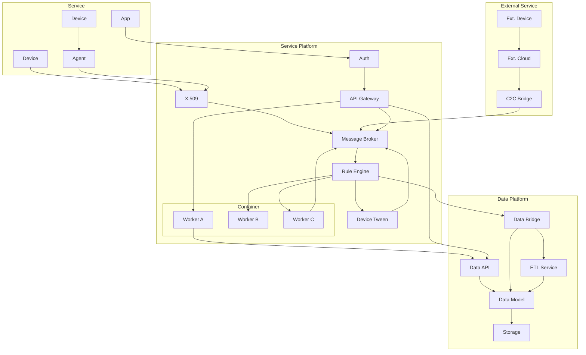

> This article was translated from the original Korean source. The English version was regenerated from the latest Korean document.

---

# Message-Based Architecture and Operations-Centric Design

## 1. The Problem and the Architectural Fork in the Road

In an end-to-end service structure, devices, apps, authentication systems, and data platforms must be connected as a single operating flow. But as connectivity increases, resilience and maintainability tend to drop, while sensitivity to change rises sharply.

The initial system was built around REST-based API calls, and it kept running into the same structural problems:

- Failures cascaded across the broader service
- The structure was close to a monolith, which made service additions and changes difficult
- Operators had limited visibility into the information needed for investigation and recovery

Because of those limits, I concluded that continuing to maintain the existing structure was less effective than moving to an asynchronous, message-centered architecture.

## 2. Why a Message-Based Design Was the Better Choice

A message-based structure connects services indirectly through messages rather than through direct service-to-service calls. Each component can remain more independent while still participating in the same business flow.

I chose this structure for three main reasons:

- The business cared more about integrity than strict real-time behavior
- Loose coupling between components improves failure isolation
- Operators gain better traceability when something goes wrong

In practice, a message-centered architecture also made it easier to integrate monitoring and visualization tools such as APM and Grafana, which improved both live monitoring and response speed during incidents.

## 3. Design Strategy and Team Adoption

This design came from practical operating experience and earlier technical background. One major influence was prior familiarity with message-oriented architecture in ROS (Robot Operating System). ROS is built around a `Publisher`-`Subscriber` model, and that environment naturally emphasizes distributed interaction and resilience across multiple components.

That background mattered because it shaped more than implementation habits. It helped form a DevOps-oriented perspective in which development and operations are considered together from the start. In this project, operational feasibility and incident response efficiency were treated as core design metrics from the beginning.

The team did not accept the direction immediately. For developers or operators who were not used to message-based systems, the structure could feel more complicated than the previous REST-centered model.

To build alignment, I explained the design through concrete operational scenarios:

- **Reduced operating cost**: Managed services such as AWS Kinesis lowered both infrastructure overhead and staffing burden
- **Faster troubleshooting**: Trace ID-based log search and message-list visibility made operator analysis much faster
- **Better scalability**: Queue-based consumers could scale horizontally as service load grew

Using those examples, I repeatedly compared the new design with the previous REST-centered structure and built internal agreement around the practical value of message-based architecture.

> This design was not simply about rearranging message paths. It was an attempt to combine operational resilience, flexible scalability, and business-flow-centered structuring into one coherent architecture.

## 4. Namespace-Based Layering and Design Philosophy

> Note: This structure intentionally did not define a `data_service` layer. At the time, the role and responsibility of that layer were still unclear, so it was left open on purpose while preserving the possibility of later integration into a broader `data_platform`.

- `3rd_party.`: external system integration
- `device.`: user-facing access and device-control interface
- `service_platform.`: authentication, gateway, messaging, and business-logic layer
- `data_core.`: data-processing layer for log collection, storage, ETL, and analysis

This namespace split was more than a directory layout. It also worked as a way to tag, group, and reason about functions. That made it easier to trace functional layers and understand the system flow clearly.

But more important than the naming structure itself was whether the namespace system could serve as a shared language inside the team. Consistent naming and clear semantic boundaries made the relationships between system components easier to read and improved communication between developers and operators.

## 5. Architecture Diagram

The diagram below shows the system hierarchy and message flow. It illustrates, from a structural point of view, how user requests and external events enter and move through the system.

## 6. Core Architectural Elements

> Note: Kafka was considered at first, but the final decision was to use AWS Kinesis-based managed services because infrastructure management efficiency and staffing cost mattered more in this context.

### Message Processing Flow

- Asynchronous event flow was built through MQTT and Amazon Kinesis
- Services were connected through subscription-based message consumption rather than direct dependency chains

### Domain-Oriented Layer Separation

- Roles such as authentication, gateway, and messaging were separated inside `service_platform`
- Product-domain workloads were placed after the API gateway in container units, which made deletion and replacement easier

### Data Flow and Post-Processing

- `data_core` handled the flow from collection to ETL to statistics and analysis
- The longer-term plan was to expand toward a `data_platform` model that could later absorb `data_service`

## 7. Operational Results

- **Improved observability**: Integration with APM, trace IDs, and Grafana enabled real-time monitoring and much faster root-cause tracing at the flow level. Work that previously took hours could often be narrowed down within minutes.
- **Improved resilience**: Recovery and reprocessing paths were designed in advance, allowing problems to stay localized instead of spreading through the whole service.
- **Easier maintenance**: Message tracing, logging, and message-list visibility gave operators better access and helped operators and developers discuss problems using the same operational frame of reference.
- **A stronger DevOps foundation**: Because both operators and developers could understand the system through the same message flow, the architecture helped establish a more practical DevOps collaboration model.

This strategy delivered both stability and flexibility in production and made it easier to diagnose failures quickly while limiting blast radius.

## 8. Design Insights and Philosophy

- A message-based structure is not just a communication mechanism. It is a strategic structure for balancing operational efficiency and system scalability. Because the message flow was also interpretable by operators, it naturally embedded a DevOps communication model into the architecture itself.
- Namespace separation is a linguistic design tool for clearer communication and clearer structural interpretation. It goes beyond naming style and helps teams define functions in a shared language.
- Architecture is not only about implementing technology. It is about interpreting business requirements and structuring them into a system that people can build, operate, and evolve together.

## 9. Key Message

> "Good message design ultimately becomes good operational design."
>
> "Systems grow complex through connections, and they become simpler through messages."
