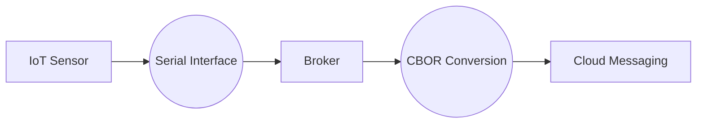
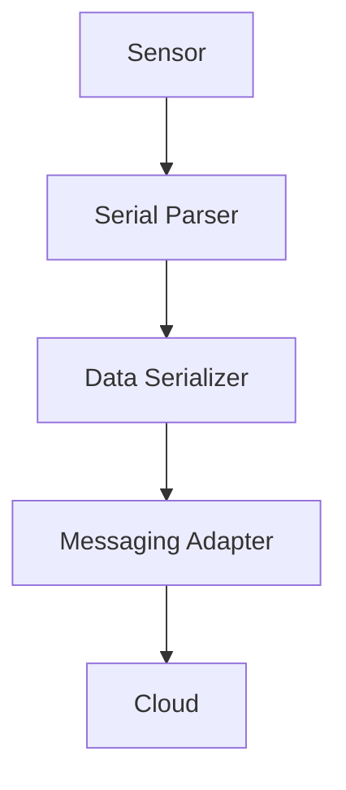

> `gpt-4-turbo` has translated this article into English.

--

## **1. Messaging and Asynchronous Structures in IoT Environments**

- **Data linkage issues between IoT and the cloud**
- **Cloud environments transitioning to Microservice Architecture (MSA)**
  - Switch from traditional synchronous API-based to **asynchronous messaging-centric structures**
- **Limitations in Embedded Environments: Overhead and Limited Computing Resources**
  - Serial (UART, SPI, I2C) based data processing methods
  - Inefficiencies due to Polling-centric synchronous processing structures

---

## **2. Broker Strategies to Reduce Messaging Overhead**

- **Challenges of Implementing Asynchronous Messaging in Embedded Environments**
  - Traditional synchronous processing methods lead to **increased computational demand and real-time data loss**
  - Network instability (LPWAN, LoRa, Wi-Fi, BLE) causing message integrity issues
- **Need for Messaging Optimization Using Brokers**
  - Suitable for cloud MSA through **transition to asynchronous messaging (Sync → Async conversion)**
  - Reduced computational load from message serialization (Serialize) and deserialization (Deserialize)
- **Role of Brokers in Embedded Systems**
  - **Asynchronous processing using message queues in low-power devices**
  - **Conversion of serial data into message format for linkage with the cloud**

---

## **3. Linking Serial Data and Messaging Systems**

- **Serial communications (UART, SPI, I2C) are key interfaces in embedded systems**
- **Efficient conversion of serial data into messaging format is necessary**
- **Application of lightweight serialization methods to reduce overhead**
  - Utilizing **CBOR, MessagePack, Protobuf, FlatBuffers** instead of JSON
- **Need for broker and SDK structure for Serial → Message conversion**

### Example Data Flow

---

## **4. Lightweight Messaging SDK Design Based on Brokers**

- **Role of the SDK: Converting serial data into a messaging structure**
- **Application of RTOS-based Event-Driven Architecture**
  - Elimination of Polling methods → **Asynchronous event-based messaging processing**
  - Use of Task Queue, Event Queue for **low-power optimization**
- **Integration with Lightweight Messaging Protocols**
  - Utilizing MQTT-SN, CoAP, Zenoh, Micro DDS

**SDK Layer Structure**

| **Component**        | **Function**         |
| --------------------- | --------------------- |
| **Serial Parser**    | Convert serial data to packets   |
| **Data Serializer**  | Serialization based on CBOR, Protobuf |
| **Messaging Adapter** | Transmits over MQTT, CoAP, Zenoh |

---

## **5. Integration with Cloud and Microservice Environments**

- **Standardization of interfaces between embedded environments and the cloud**
- **Scalability through messaging brokers**
- **Linkage strategies with Serverless and Event-Based Architectures**

**Example IoT Messaging Flow**

---

## **6. Conclusion and Future Directions**

- **Instead of directly implementing asynchronous messaging in embedded systems, utilize brokers**
- **Essential SDK structure for linking serial data to cloud messaging**
- **Optimization needed by combining RTOS-based event-driven structure with lightweight serialization methods**