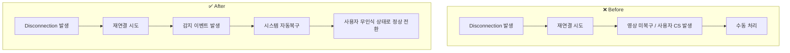

> `gpt-4-turbo` has translated this article into English.

### 1. Problem Background: Recurring Failures and Accumulating Technical Debt

- At the onset of integration, **real-time video transmission functionality** was consistently experiencing monthly failures.
- The existing system relied on manual responses during failures, with **unclear root cause identification**.
- The related logic remained as legacy, and although the issues were recognized, they continued to be neglected as technical debt.

---

### 2. Problem Analysis: Identifying Structural Causes

- Through log and monitoring analysis, confirmed that **services failed to recover after reconnection attempts**.
- Failures were triggered during the **network reconnection processes of devices** in unstable field network environments.
- It was challenging to improve the infrastructure itself (building structure, public networks, restricted field equipment).
- The problem was not merely 'network instability', but the **failure to recover after reconnections**.

---

### 3. Solution Strategy: Transition to a Recoverable System

| Strategy Element | Description |
| --- | --- |
| Core Direction | If network failures cannot be eliminated, let's design for **Resilience** |
| Watchdog Logic | Transition the camera detection events occurring on bridge servers to **watchdog handling** |
| Automatic Recovery | Process to automatically restore service status upon successful reconnection attempts |
| CS Reduction Goal | Remove existing manual responses and transition to a structure where the system self-recovers **before user inconvenience** arises |

---

### 4. Implementation Results

- Numerous instances of service disruptions automatically recovered without downtime
- **CS cases received: Reduced from over 3 per month to fewer than 0.2**
- Resolved the issue by shifting from infrastructure-based causes to application recovery design
- Fundamentally resolved the technical debt related to **“absence of handling for abnormal situations”** within legacy code

---

### 5. Retrospection and Insights

- This experience was not merely about handling failures or improving functionalities,
    
    but an architectural case that **structurally defined technical debt and resolved it through system transition**
    
- In IoT environments, where changing the field is not possible, **acknowledging constraints and designing for resilience is the most realistic strategy**
- Realized that **determining what needs to be changed when nothing can be changed** is a crucial role of an architect

---

### Example of Visual Data Organization

### ▸ Before-After Flowchart (Handling Structure during Network Failures)

### ▸ Incident Count Chart

| --- | --- |
| Timeframe | Monthly Incident Reports |
| Before Improvement | (Average) 3 or more |
| After Improvement | 0.2 or fewer |