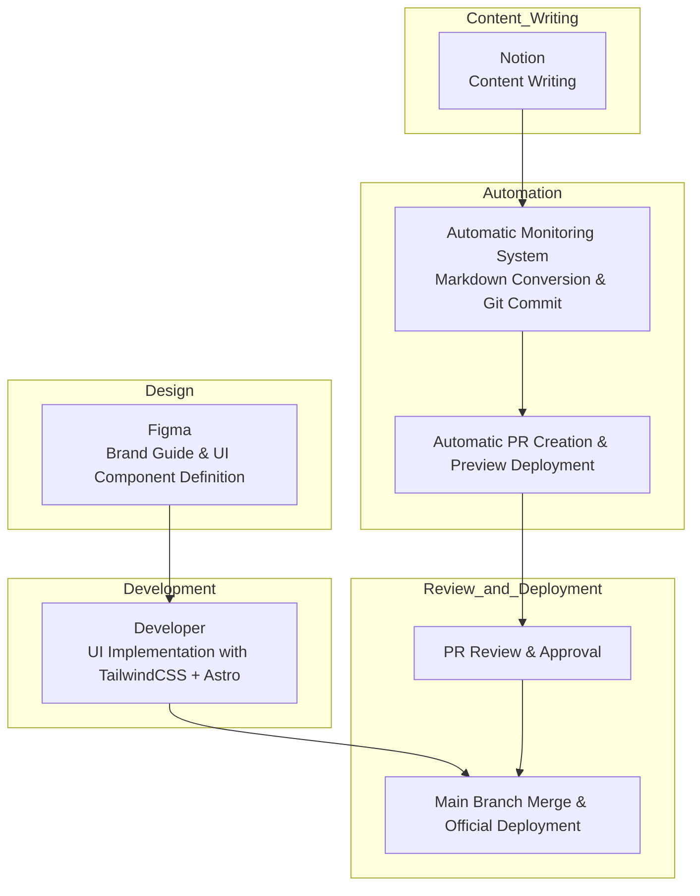

> `gpt-4-turbo` has translated this article into English.
---

# "Low-Cost, Flexibility, and Speed-Focused Structuring Strategy"

---

# 1. Document Overview

## Purpose of the Document

This document is a practical guide that outlines the **construction strategy and collaboration standards** for quickly designing, developing, and operating a brand website.

It structures the entire flow from design, content, development to deployment **around roles**,

and provides standards for creating an environment that allows **low-cost, high flexibility, and rapid iterative execution**.

Our team aims for **deletable structures, codified content, and automated collaboration** to quickly experiment, rapidly improve, and agilely manage interactions between users and products.

This document defines an executable structure that can be applied in practice based on such a philosophy.

## Why This Document Is Needed

A startup's brand website goes beyond a simple introduction page,
- It is the starting point of the customer experience,
- It is the center of content marketing,
- It serves as a window showing **what technologies and standards the brand uses to both external and internal teams**.

Therefore, beyond just creating a visually appealing interface,

it is crucial to establish a structure and process that **allows the entire team to collaborate quickly**.

Traditional WordPress or static page approaches have the following issues:
- Development resources are needed whenever content modifications are made
- Design customization is difficult or overly dependent
- Deployment procedures are opaque or non-standardized

This document solves the above issues and enables the following:
- **Separation of roles between design and content**
- **Content management with minimized developer resources**
- **Automated deployment and review procedures**
- **Deletable technical configurations and DX-based scalability**

## Target Audience and Usage

This document is written assuming the following members will utilize it together:

| Target | Role |
| --- | --- |
| Designers | Brand guide and UI design, visual QA |
| Developers | Component construction, automation implementation, deployment system management |
| Content Operators | Content writing and review, participation in PR request and approval flow |
| Product/Marketing Leaders | Release approval, content prioritization, structure improvement feedback |

**How to Use**:
- Use as a **reference template and standards document** when launching a new brand or page
- Use as **onboarding material** for new hires or freelance collaboration
- Use as a **decision-making document** when establishing or changing internal development standards
- Use as a **document for settling operational processes** for repeatable content operation

## Maintenance and Update Plan

This document is **not a fixed rule but a living document**.

Updates will occur when the following changes:
- Structural changes such as Notion → CMS
- Changes in automation processes or tool replacements
- When team members' role distributions change
- When expansion strategies are executed or new implementations are made

---

# 2. Operational Strategy Overview

## Declaration: We build quickly, change quickly, and are not dependent on technology.

The brand page is the face of our product and,

at the same time, a representative product revealing **the internal team's collaboration method and technical culture**.

Through the operation of the brand page, we aim to realize the following:
- **Speed**: Respond with minimal resources from request to deployment.
- **Autonomy**: Content should be made, operated, and deployed by non-developers.
- **Separation**: Design, content, development, and deployment have clearly divided roles but are organically connected.
- **Flexibility**: No tool is an absolute standard. It should be changeable and discardable at any time.
- **Visibility**: All changes are recorded, shared, and approved through PR and automated flows.

This structure is not just a combination of tools,

but a **DX-based strategy designed for a small, agile team to quickly experiment and validate**.

## Core Operational Principles

| Principle | Description |
| --- | --- |
| **Deletable Structure** | We use TailwindCSS and Notion, but they are designed to be replaceable at any time. |
| **Separated Collaboration Structure** | Content, design, and development are structured to be well connected without interfering with each other. |
| **Automated Repetition Execution** | The entire process from PR, Preview, QA, approval, to deployment is organized into a repeatable and automatable flow. |
| **Design System-Based Development** | Defined components in Figma are implemented into a structured UI based on TailwindCSS. |
| **Content is Treated Like Code** | Notion-based writing → Git PR → Approval → Deployment flow maintains the quality and record of content management. |
| **Maintainable Collaboration Flow** | The operational team can improve and maintain the site without developer intervention by separating roles. |

## Why We Ditched WordPress

Traditional WordPress-based operations have repeatedly caused the following issues:
- **Developer resources needed** for content modifications, or slow operational speed due to unstable editing experiences
- Changing designs means being **tied to plugin/theme restrictions**
- Customizing is **complex or difficult to maintain**
- **No deployment history, approval flow, or quality control**

To solve these problems, we adopt the following structure:
- Based on a **static site framework (Astro)**, we configure a fast and predictable deployment structure,
- **Markdown + Notion-based content structure** for freedom in writing and management,
- **Code the design system with TailwindCSS**, and implement the UI in a maintainable manner.
- The entire workflow is managed from Git-based PR → Preview → QA → Approval → Deployment,
**so that all team members can understand and follow the collaboration flow**.

## This Strategy is DX

This structure is not just a web development methodology,

but **a task to structure our way of working and make it sustainable**.
- **Design is organized into systems**,
- **Content is treated like code**,
- **Deployment is automated and repeatable**,
- **Roles are separated, but the flow is connected**.

Through this structure, we create the following culture:

> "A site that can be changed without development,
> a structure that does not collapse even if changed,
> a system that can be rebuilt even if it collapses"

---

# 3. Overview of the Entire System Structure

This chapter outlines the flow and components of the entire system that makes up the brand page.

The key is that design, content, development, and deployment are organically connected within a single pipeline, while maintaining the maintainability and flexibility of collaboration by separating each responsibility.

## 3.1 System Configuration Flow

1. Designers define brand guides and UI components through Figma.
2. Developers implement these designs as UI components based on Astro using TailwindCSS.
3. Content operators write content in Notion, which is detected by an automated monitoring system and converted to Markdown.
4. The converted Markdown is committed to a Git repository, creating a PR and automatically deploying a Preview.
5. The PR undergoes a review and approval process, merges into the main branch, and deployment proceeds.

This structure separates design changes, content updates, and deployments so that each can be performed independently, while all change histories and approval records are managed based on Git.

## 3.2 Key Technology Components

Here are the core technology stacks used in the system configuration:

- Astro: A static site generator providing fast builds and a component-centric structure.
- TailwindCSS: Used to reproduce the design system in code and implement structured styles.
- Notion: A tool for writing and managing content. Directly used by operators.
- Notion-to-Markdown Converter: Automatically converts Notion content to Markdown.
- GitHub: A version control and collaboration tool used for managing PR-based approvals and reviews.
- Vercel: An automatic deployment platform managing separate Preview and Production environments.
- Slack: A collaboration communication tool for deployment requests and approval notifications.

Additional tools such as testing utilities for content verification, search functionalities, and translation systems might be added as the system expands.

## 3.3 Structural Separation of Content, Style, and Deployment

The system maximizes operational flexibility by separating the following three axes:

1. **Content Separation**
   
    Content is not embedded in code. Operators write content in Notion, and through an automated process, it is converted into Markdown files and managed along with Git-based change history.
    
2. **Style Separation**
   
    Styles are implemented based on TailwindCSS, and each component follows the standards defined in the design system, not dependent on specific pages or content. The structure remains easy to replace with other style systems in the future.
    
3. **Deployment Separation**
   
    Deployment is automated based on GitHub PR merges, and only reflects in Production after approval in the Preview environment. Deployment itself does not occur without the consent of the coder or approver.
    

This structure offers the following effects:

- Developers can focus on UI and automation processes,
- Operators can independently perform content modifications and releases,
- Designers can concentrate on maintaining the consistency of the brand experience through QA.

This structure is designed to maintain the core collaboration method even if CMS or style frameworks change in the future.

---

# 4. Role Allocation and Collaboration Standards

To enhance the efficiency and sustainability of operating the brand page, the roles of all participants must be separated and clearly defined.

Each role has its unique responsibilities, and they are connected through an automated collaboration flow. This structure reduces confusion and promotes parallel processing of tasks and clear decision-making.

## 4.1 Designer

**Responsibilities**

- Define the brand guide (colors, fonts, component shapes, margins, etc.)
- Design UI at the page and component level
- Provide visual specifications through Figma
- Check visual quality in the Preview state and provide QA feedback

**Deliverables**

- Design system document (components and style guides defined in Figma)
- Page-specific layout proposals
- UI component state definitions (default, hover, focus, etc.)

**Collaboration Standards**

- Collaboration with developers is based on component-level specifications
- Visual QA is conducted in the Preview environment, providing feedback based on PR
- Work is separated from content structure, focusing on design elements

## 4.2 Developer

**Responsibilities**

- Implement UI components based on Astro + Tailwind
- Design system-based structure design and reusable component composition
- Design automation structure for content (Notion conversion → Git PR automation)
- Compose automation flows for Preview and Production deployment
- Review and release management according to PR approval criteria

**Deliverables**

- Component code, layout templates
- Automation scripts (Notion to Markdown, Git integration, Slack notifications, etc.)
- GitHub Actions or CI configuration files
- Test and verification scripts (optional)

**Collaboration Standards**

- Clear correspondence table and feedback collection during Figma → Tailwind conversion
- Maintain environment that allows preview check at PR creation
- Approve content change PRs after verifying content structure and build status

## 4.3 Content Operator

**Responsibilities**

- Write content based on Notion
- Check automatic PR creation when content changes and request deployment approval via Slack
- Review the actual rendering state in the Preview environment
- Deliver QA-completed content to approvers

**Deliverables**

- Notion content document (including categories, tags, and dates)
- Slack deployment request messages and change summaries
- Content release logs (author, reason for change, application date, etc.)

**Collaboration Standards**

- Written content should be structured according to the template, considering automatic PR creation and preventing build errors
- Separate visual review and deployment requests based on the Preview link
- Consult with developers and make modifications or rollbacks in case of technical errors

## 4.4 Approver (Leader or Reviewer)

**Responsibilities**

- Decide on content or style changes based on Preview review results
- Approve PRs and confirm releases on Slack or GitHub
- Make decisions on emergency deployments or rollbacks

**Deliverables**

- Approval logs or feedback in comments
- Record of approval decisions for changes
- Post-deployment feedback (if necessary)

**Collaboration Standards**

- Confirm deployment timing through communication with content operators
- Base approval decisions on Preview and withhold approval in case of QA issues or errors
- Apply repetitive approval criteria systematically as guidelines

## 4.5 Summary of Interconnections Between Roles

| Role | Main Collaboration Partners | Connection Points |
| --- | --- | --- |
| Designer | Developer | UI Specification → Component Implementation |
| Developer | Designer, Operator | Component Implementation / Content Automation / PR Approval |
| Operator | Developer, Approver | Content Writing → PR Request → Deployment Approval Request |
| Approver | Operator, Developer | Preview Check → Deployment Approval → Release Decision |

Through this structure, each member can focus on their area, and all change histories and approval records are documented through Git and Slack.

This role division is also effective in connecting with external designers or freelance content writers.

---

# 5. Content Operation and Deployment Process

This chapter integratively explains the automated flow from content creation to deployment, detailing the tasks and responsibilities at each stage.

This structure is based on the philosophy of treating content like code, organizing the entire collaboration cycle of PR, review, approval, and release within an automated flow.

## 5.1 Overview of the Entire Automated Flow

Content operation is organized as follows:

1. Content operators write new content or modify existing content in Notion.
2. The Notion Observer detects these changes and converts them into Markdown format.
3. The converted Markdown file is committed to a Git repository, along with a separate branch and Pull Request creation.
4. Slack shares PR creation notifications and Preview links, and the approval flow starts with a deployment request button.
5. Developers review the PR's static rendering results and check for errors or layout issues.
6. The approver approves the PR and merges it, automatically deploying it to the Production environment.

This process is fully automated and designed as a single, repeatable process.

## 5.2 Key Roles and Responsibilities

| Stage | Responsible Party | Task Description |
| --- | --- | --- |
| Content Writing | Content Operator | Input content based on Notion |
| Change Detection and Conversion | Automation System | Notion → Markdown Conversion, Git Commit |
| PR Creation and Notification | Automation System | Branch Creation, PR Opening, Slack Message Transmission |
| Static Rendering Review | Developer | Check PR Build, Confirm Rendering Accuracy |
| Approval and Deployment | Approver | PR Approval and Merge, Production Release Approval |

## 5.3 System Components and Technology Stack

- Notion: Content writing and modification
- Notion Observer: API-based Polling or Change Detection Script
- Markdown Converter: `notion-to-md` or custom conversion logic
- GitHub: Repository and automatic PR creation, commit history management
- GitHub Actions: PR Creation → Preview Deployment, Merge → Production Deployment
- Vercel: Static website hosting and Preview environment provision
- Slack: Deployment request notifications and approval request UI configuration (Block Kit usable)

## 5.4 Detailed Automation Flow

### 1. Notion Change Detection

- Content is written on designated pages or databases within Notion
- Change detection is either periodically checked by a monitoring script or detected in real-time if Webhook support is available

### 2. Markdown Conversion and PR Creation

- Pages are converted into Markdown files according to internal templates
- Files are committed to the content directory within the Git repository (`/content/posts/`, etc.)
- A new branch is automatically created, and a PR is opened
- Example commit message: `feat: update blog "DX Strategy Presentation"`
- Example PR title: `[Content] Add DX Strategy Presentation Document`

### 3. Slack Notification and Approval Request

- When a PR is created, a notification is sent to Slack
- The message includes a Preview link, change summary, and approval button
- Operators and approvers can directly check in Slack or GitHub

### 4. Preview and Testing

- PRs are automatically deployed for Preview via GitHub Actions or Vercel
- Developers review the rendering results, layout integrity, and Markdown parsing errors
- Content structure modification requests can be made if necessary

### 5. Approval and Production Deployment

- If the Preview shows no issues, the approver approves the PR on GitHub
- Once merged, it is automatically reflected in the Production branch
- The final site is deployed via Vercel

## 5.5 Maintenance and Expansion Strategy

- If a CMS replacement is necessary, only the Notion API needs to be replaced to maintain the same structure
- Slack-based approval requests can be maintained as a basis for future ChatOps expansion
- Future integration of automated tests such as Lighthouse, HTML validator, Playwright at the PR stage to verify content
- Multi-language support, automatic template generation, category branching can also be expanded within the same structure

This structure standardizes the entire flow from content creation by the operator, review by the developer, to rapid deployment.

All changes are documented, releases are based on approvals, and team collaboration is clearly connected through automated flows.

---

# 6. Construction and Maintenance Schedule Report

This chapter outlines the expected schedule for the initial construction of the brand page system, the plan for personnel input, and the resource structure for ongoing maintenance.

The goal is to realize a structure that secures maximum operational flexibility with minimal resources.

## 6.1 Initial Construction Schedule

Below is an expected schedule based on a typical brand page MVP.

Each stage has potential for parallelism, and content/design/automation can be independently scheduled.

| Stage | Duration | Main Tasks |
| --- | --- | --- |
| Requirement Definition and Role Setting | 1 day | Define document-based collaboration model, designate responsible parties |
| Design System Acquisition | 2~3 days | Define UI components based on Figma |
| UI Component Development | 2~4 days | Construct UI based on Astro + Tailwind |
| Notion Automation Configuration | 2~3 days | Notion Detection → Markdown Conversion → PR Automation Scripts |
| GitHub Actions and Vercel Setup | 1~2 days | Configure Preview / Production Deployment |
| Content Template Definition and Initial Writing | 1~2 days | Define Markdown structure, write initial content |
| QA and Structure Organization | 1 day | QA based on Preview, troubleshoot and finalize release criteria |

**Total Estimated Duration**: 8~14 days (may vary based on design sources and operational environment)

## 6.2 Personnel Input Plan

| Role | Estimated Required Personnel | Input Period | Remarks |
| --- | --- | --- | --- |
| Designer | 1 person | ~3 days | Transition to QA focus after design system establishment |
| Developer | 1 person | ~7 days | UI composition + automation structure design/implementation |
| Content Operator | 1 person | ~2 days | Define content structure, conduct writing tests |
| Technical Leader or Approver | 1 person | ~1 day | Establish approval criteria and confirm deployment |

**Total Personnel Basis**: MVP level implementation possible with a small team of 2-3 people

## 6.3 Operational Maintenance Strategy

The brand page is maintained based on the following