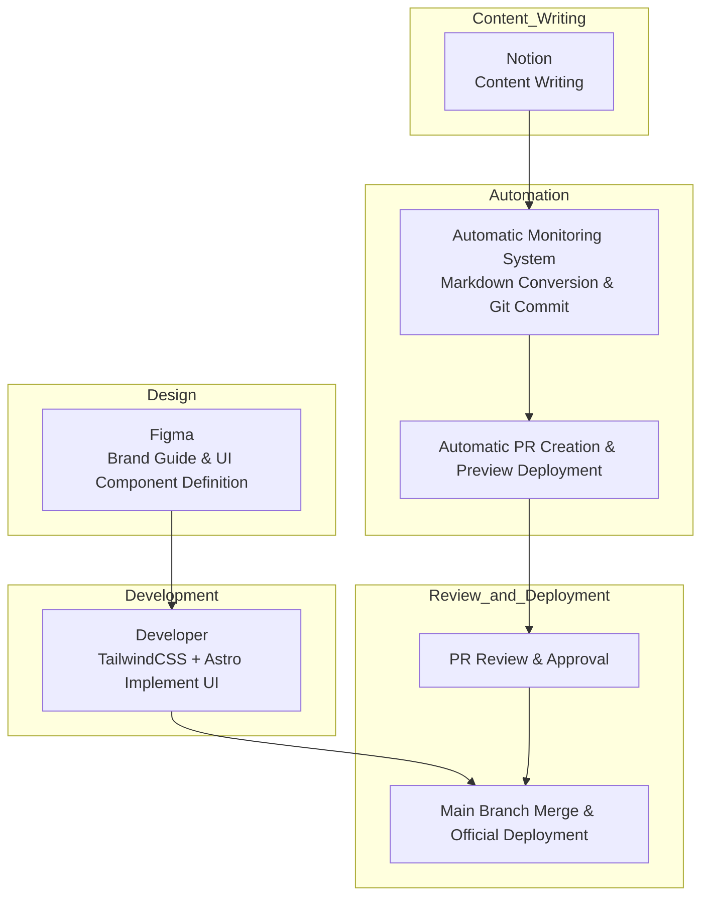

> `gpt-4-turbo` has translated this article into English.

---

# Separating Design and Content, Operating with DX
> "Low-Cost, Flexibility, and Speed-Focused Structuring Strategy"

---

# 1. Document Overview

## Purpose of the Document

This document is a practical guide outlining the **construction strategy and collaboration standards** for quickly designing, developing, and operating a brand website.

It structures the entire flow from design, content, development, to deployment **role-centrically**,

providing standards to create an environment that allows **low-cost, high-flexibility, and rapid iterative execution**.

Our team aims for **expiry-ready structures, codified content, and automated collaboration** to quickly experiment, improve, and agilely manage interactions between users and products.

This document defines an executable structure applicable in practice based on such philosophy.

## Why This Document Is Needed

A startup's brand website goes beyond a simple introduction page, serving as:

- the starting point of the customer experience,
- the center of content marketing, and
- a window showing both internal and external teams **what technologies and standards the brand operates with**.

Therefore, it's important to establish a structure and process that allows the **entire team to collaborate quickly**, beyond just a visually appealing interface.

Traditional WordPress or static page approaches have the following issues:

- Development resources are required when modifying content
- Design customization is difficult or overly dependent
- Deployment procedures are opaque or non-standardized

This document solves the above issues and enables the following:

- **Role separation between design and content**
- **Minimized developer resources in content management**
- **Automated deployment and review procedures**
- **Expiry-ready technical configuration and DX-based scalability**

## Target Audience and Usage

This document is written with the following participants in mind:

| Target             | Role                                              |
| ------------------ | ------------------------------------------------- |
| Designers          | Brand guide and UI design, visual QA              |
| Developers         | Component construction, automation implementation, deployment system management |
| Content Operators  | Content writing and proofing, participate in PR request and approval flow |
| Product/Marketing Leaders | Release approval, content prioritization, structure improvement feedback |

**Usage**:

- Use as a **reference template and standard document** when launching new brands or pages
- Use as **onboarding material** for new hires or external collaborations
- Use as a **decision-making document** when establishing or changing internal development standards
- Use as a **document to establish operational processes** for repeatable content workflows

## Maintenance and Update Plan

This document is **not a fixed rule but a living document**.

It will be updated when the following occurs as actual collaboration and automation processes are applied and feedback is incorporated:

- Structural changes such as Notion → CMS change
- Changes in automation processes or tool replacements
- When team members' role allocations change
- When expansion strategies are implemented or new introductions are made

---

# 2. Operational Strategy Overview

## Declaration: We build quickly, change quickly, and are not dependent on technology.

The brand page is the face of our product and

simultaneously, a representative product showing the **collaboration method and technical culture of the internal team**.

Through the operation of the brand page, we aim to realize the following:

- **Speed**: Respond with minimal resources from request to deployment.
- **Autonomy**: Content should be created, operated, and deployed by non-developers.
- **Separation**: Design, content, development, and deployment roles are clearly divided but organically connected.
- **Flexibility**: No tool should be an absolute standard. It should always be changeable and disposable.
- **Visibility**: All changes are recorded, shared, and approved through PR and automated workflows.

This structure is not just a combination of tools,

**but a DX-based strategy designed for small, agile teams to quickly experiment and validate**.

## Core Operational Principles

| Principle                            | Description                                                                                   |
| ------------------------------------ | --------------------------------------------------------------------------------------------- |
| **Expiry-Ready Structure**           | We use TailwindCSS and Notion but design it in a structure that can be replaced at any time. |
| **Separated Collaboration Structure**| Content, design, and development are structured to connect well without interfering with each other.              |
| **Automated Repetitive Execution**   | The entire process from PR, Preview, QA, approval, to deployment is configured as a repeatable and automatable flow. |
| **Design System-Based Development** | Components defined in Figma are implemented as structured UI based on TailwindCSS.            |
| **Content is Treated Like Code**     | Content quality and records are maintained through a flow from Notion-based writing → Git PR → approval → deployment.   |
| **Maintainable Collaboration Flow**  | The operational team can improve and maintain the site without developer intervention by separating roles.        |

## Why We Abandoned WordPress

The previous WordPress-based operation repeatedly caused the following problems:

- **Developer resources required** for content modifications or unstable editing experience slowing down operations
- Changes in design were **tied to plugin/theme restrictions**
- Customizing was **complex or hard to maintain**
- **Lack of deployment history, approval flow, and quality management**

To solve these problems, we adopt the following structure:

- **Static site framework (Astro)** based to configure a fast and predictable deployment structure,
- **Markdown + Notion-based content structure** to ensure freedom in writing and management,
- **Codify the design system with TailwindCSS**, implementing the UI in a maintainable way.
- The entire workflow is managed from Git-based PR → Preview → QA → approval → deployment,
  **ensuring that all team members understand and follow the collaborative flow.**

## This Strategy is DX

This structure is not just a methodology for website development,

**but a way to structure how we work and make it sustainable**.

- **Design is organized as a system**,
- **Content is treated like code**,
- **Deployment is automated and repeatable**,
- **Roles are separated, but the flow is connected**.

We create the following culture through this structure:

> “A site that can be changed without development,
> A structure that doesn’t collapse when changed,
> A system that can be rebuilt even if it collapses”

---

# 3. Complete System Structure Overview

This chapter outlines the overall flow and components of the brand page structure.

The key is that design, content, development, and deployment are organically linked within a single pipeline, yet each maintains its responsibility, enhancing maintainability and collaboration flexibility.

## 3.1 System Configuration Flow

1. Designers define the brand guide and UI components through Figma.
2. Developers implement those designs as Astro-based UI components using TailwindCSS.
3. Content operators write content in Notion, and an automated monitoring system detects it and converts it into Markdown.
4. The converted Markdown is committed to the Git repository, a PR is created, and an automatic Preview deployment is executed.
5. The PR goes through a review and approval process, is merged into the main branch, and deployment proceeds.

This structure separates design changes, content updates, and deployment so that each can be performed independently while maintaining change history and approval records based on Git.

## 3.2 Technical Components

Here are the key technology stacks used in the system configuration:

- Astro: Static site generator providing fast builds and component-centric structures.
- TailwindCSS: Used to reproduce the design system in code and implement structured styles.
- Notion: Content writing and management tool used directly by operators.
- Notion-to-Markdown Converter: Automatically converts Notion content into Markdown.
- GitHub: Version control and collaboration tool, used for PR-based approval and review management.
- Vercel: Automatic deployment platform managing separate Preview and Production environments.
- Slack: Collaboration communication tool for deployment requests and approval notifications.

Additional tools such as testing tools for content verification, search functionality, and translation systems may be added in the future.

## 3.3 Structural Separation of Content, Style, and Deployment

This system maximizes operational flexibility by separating the following three axes:

1. **Content Separation**

   Content is not embedded in the code. Operators write content in Notion, and through an automated process, it is converted into Markdown files and managed along with Git-based change history.

2. **Style Separation**

   Style is implemented based on TailwindCSS, and each component follows the standards defined in the design system, not being dependent on specific pages or content. The structure also facilitates easy replacement of Tailwind or other style systems in the future.

3. **Deployment Separation**

   Deployment is automated based on Git PR merging, and content and style are reviewed in the Preview environment before being reflected in Production only upon approval. Deployment itself does not occur without the consent of the code author or approver.

This structure provides the following effects:

- Developers can focus on UI and automation processes,
- Operators can independently perform content modifications and releases,
- Designers can focus solely on maintaining the consistency of the brand experience through QA.

This structure is designed to maintain the core collaboration method even if the CMS or style framework changes in the future.

---

# 4. Role Distribution and Collaboration Standards

To enhance the efficiency and sustainability of brand page operations, each participant's role must be separated and clearly defined.

Each role has its own responsibilities, and they are connected through an automated collaboration flow. This structure reduces confusion and induces parallel processing of tasks and clarification of decision-making.

## 4.1 Designer

**Responsibilities**

- Define brand guides (colors, fonts, component shapes, margins)
- Design UI at the page and component level
- Provide visual specifications through Figma
- Check visual quality and provide QA feedback in the Preview state

**Deliverables**

- Design system document (components and style guides defined in Figma)
- Page-by-page layout proposals
- State definitions of UI components (default, hover, focus, etc.)

**Collaboration Standards**

- Collaborate with developers based on component unit specifications
- Conduct visual QA in the Preview environment and provide feedback based on PR
- Work separately from content structure and focus on design elements

## 4.2 Developer

**Responsibilities**

- Implement UI components based on Astro + Tailwind
- Design system-based structure design and reusable component composition
- Design content automation structure (Notion conversion → Git PR automation)
- Compose automation flows for Preview and Production deployment
- Manage review and release according to PR approval criteria

**Deliverables**

- Component code, layout templates
- Automation scripts (Notion to Markdown, Git integration, Slack notifications, etc.)
- GitHub Actions or CI configuration files
- Test and verification scripts (optional)

**Collaboration Standards**

- Write a clear correspondence table and gather feedback during Figma → Tailwind conversion
- Maintain an environment where Preview can be confirmed when creating a PR
- Approve content change PRs after verifying content structure and build status

## 4.3 Content Operator

**Responsibilities**

- Write content based on Notion
- Confirm automatic PR creation when requesting content changes and request deployment approval in Slack
- Review the actual rendering state in the Preview environment
- Deliver QA-completed content to the approver

**Deliverables**

- Notion content documents (including categories, tags, and writing dates)
- Slack deployment request messages and change summaries
- Content release logs (author, reason for change, application date, etc.)

**Collaboration Standards**

- Written content must be structured according to template standards, considering automatic PR creation and preventing build errors
- Separate visual review and deployment requests based on the Preview link
- Consult with developers in case of technical errors to correct or roll back

## 4.4 Approver (Leader or Reviewer)

**Responsibilities**

- Decide whether to approve content or style changes based on Preview review results
- Approve PRs and confirm releases on Slack or GitHub
- Make decisions on emergency deployments or rollbacks

**Deliverables**

- Approval logs or feedback in comments
- Approval decision records for changes
- Post-deployment feedback (if necessary)

**Collaboration Standards**

- Confirm deployment timing through communication with the content operator
- Base approval decisions on Preview, and hold approval in case of QA issues or errors
- Systematically apply repetitive approval criteria by guideline

## 4.5 Summary of Interconnections Between Roles

| Role     | Main Collaboration Targets   | Connection Points                          |
| ---------| ---------------------------- | ------------------------------------------ |
| Designer | Developer                    | UI Specifications → Component Implementation |
| Developer| Designer, Operator           | Component Implementation / Content Automation / PR Approval |
| Operator | Developer, Approver          | Content Writing → PR Request → Deployment Approval Request |
| Approver | Operator, Developer          | Preview Check → Deployment Approval → Release Decision |

Through this structure, each member can focus on their area, and all change histories and approval records are documented through Git and Slack.

This role distribution is also a valid standard for connecting with external designers or freelance content writers.

---

# 5. Content Operation and Deployment Process

This chapter integratively explains the automated flow from content creation to deployment, detailing the tasks and responsible parties at each stage.

This structure is based on the philosophy of treating content like code, and it configures the entire collaboration cycle of PR, review, approval, and release within an automated flow.

## 5.1 Overall Automation Flow Overview

Content operations are composed of the following automated flow:

1. The content operator writes new content or modifies existing content in Notion.
2. The Notion Observer detects the change and converts it into Markdown format.
3. The converted Markdown file is committed to the Git repository, and a Pull Request is created along with a separate branch.
4. Slack shares a PR creation notification and Preview link, and the approval flow begins through the deployment request button.
5. The developer reviews the static rendering result of the PR and checks for errors or layout issues.
6. The approver approves the PR, merges it, and it is automatically deployed to the Production environment.

This process is fully automated and designed as a repeatable single process.

## 5.2 Key Roles and Responsibilities

| Stage              | Responsible Party | Task Description                          |
| ------------------ | ----------------- | ----------------------------------------- |
| Content Writing    | Content Operator  | Notion-based content input                |
| Change Detection and Conversion | Automation System | Notion → Markdown conversion, Git commit |
| PR Creation and Notification | Automation System | Branch creation, open PR, send Slack message |
| Static Rendering Review | Developer       | Check PR build, rendering status          |
| Approval and Deployment | Approver        | Approve PR and merge, Production release  |

## 5.3 System Components and Technology Stack

- Notion: Content writing and modification
- Notion Observer: API-based polling or change detection script
- Markdown Converter: `notion-to-md` or proprietary conversion logic
- GitHub: Repository and automatic PR creation, commit history management
- GitHub Actions: PR creation → Preview deployment, merging → Production deployment
- Vercel: Static website hosting and Preview environment provision
- Slack: Deployment request notification and approval request UI setup (using Block Kit)

## 5.4 Detailed Automation Flow

### 1. Notion Change Detection

- Content is written on designated pages or databases within Notion
- Change detection is either periodically checked by monitoring scripts or detected in real-time if Webhook support is available

### 2. Markdown Conversion and PR Creation

- Pages are converted into Markdown files based on an internal template
- Files are committed to the content directory (`/content/posts/` etc.) within the Git repository
- A new branch is automatically created, and a PR is opened
- Example commit message: `feat: update blog "DX Strategy Announcement"`
- Example PR title: `[Content] Add DX Strategy Announcement Document`

### 3. Slack Notification and Approval Request

- When a PR is created, a notification is sent to Slack
- The message includes a Preview link, change summary, and approval button
- Operators and approvers can directly check in Slack or GitHub

### 4. Preview and Testing

- PR is automatically deployed for Preview via GitHub Actions or Vercel
- Developers review rendering results, layout integrity, Markdown parsing errors, etc.
- Content structure modification requests are possible if necessary

### 5. Approval and Production Deployment

- If Preview is error-free, the approver approves the PR on GitHub
- Upon merging, it is automatically reflected in the Production branch
- Deployment is completed on the final site via Vercel

## 5.5 Maintenance and Expansion Strategy

- If CMS is replaced, only the Notion API needs to be substituted to maintain the same structure
- Slack-based approval requests are maintained as a basis for future ChatOps expansion
- Future Lighthouse, HTML validator, Playwright, etc., automated tests can be connected to verify content at the PR stage
- Multilingual support, automatic template generation, category branching, etc., can also be expanded under the same structure

This structure standardizes the entire flow where the operator can easily write content, and after the developer's review, it is quickly deployed.

All changes are recorded, and releases are based on approval, with the team's collaboration clearly connected through an automated flow.

---

# 6. Construction and Maintenance Schedule Report

This chapter outlines the expected schedule for the initial construction of the brand page system, the manpower deployment plan, and the resource structure for ongoing maintenance.

The goal is to realize a structure that secures maximum operational flexibility with minimal resources.

## 6.1 Initial Construction Schedule

Below is the estimated schedule based on a typical brand page MVP.

Each stage has the potential for parallelism, and content/design/automation can be independently scheduled.

| Stage                           | Duration | Main Tasks                                      |
| --------------------------------| -------- | ----------------------------------------------- |
| Requirements Definition and Role Setting | 1 day   | Define document-based collaboration model, assign responsibility holders |
| Design System Procurement       | 2-3 days | Define UI components based on Figma             |
| UI Component Development        | 2-4 days | Construct UI based on Astro + Tailwind          |
| Notion Automation Configuration | 2-3 days | Configure Notion detection → Markdown conversion → PR automation scripts |
| GitHub Actions and Vercel Setup | 1-2 days | Configure Preview / Production deployment       |
| Content Template Definition and Initial Writing | 1-2 days | Define Markdown structure, write initial content |
| QA and Structure Organization   | 1 day    | QA based on Preview, troubleshoot and finalize release criteria |

**Total estimated duration**: 8-14 days (may vary depending on design sources and operational environment)

## 6.2 Manpower Deployment Plan

| Role               | Estimated Required Personnel | Deployment Duration | Remarks                          |
| ------------------ | ---------------------------- | ------------------- | ---------------------------------|
| Designer           | 1 person                     | ~3 days             | Shift focus to QA after establishing the design system |
| Developer          | 1 person                     | ~7 days             | UI composition +