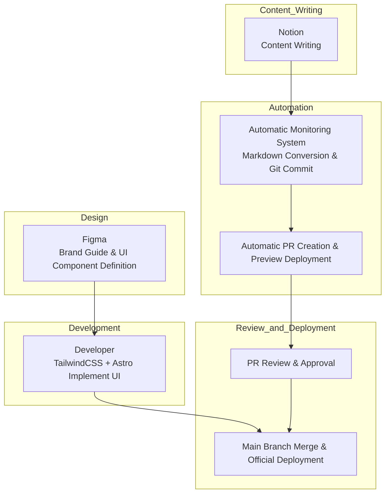
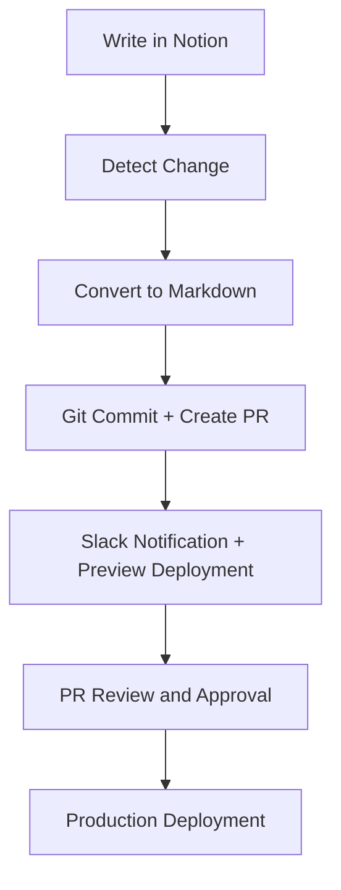
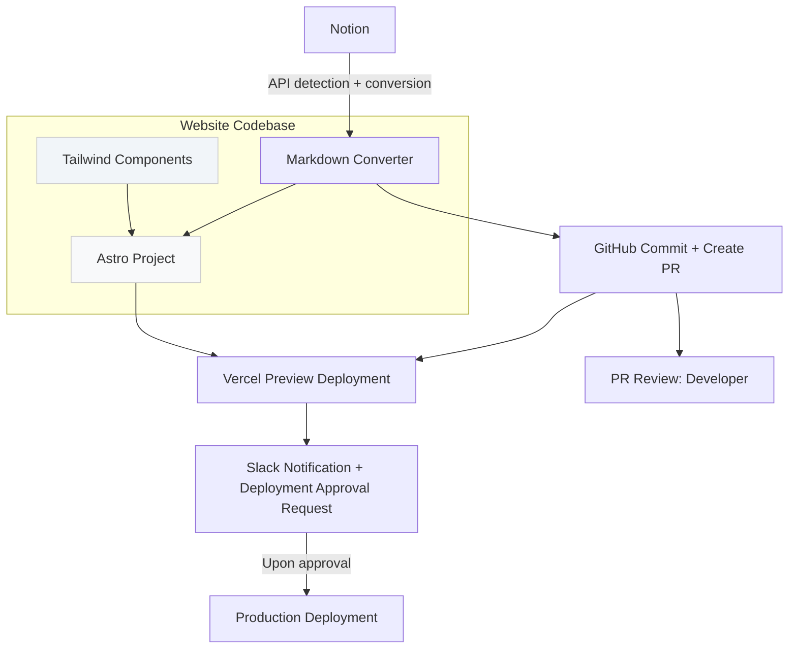

> This article was translated from the original Korean source. The English version was regenerated from the latest Korean document.

---

# Separate Design and Content, Operate with DX
> "A structural strategy centered on low cost, flexibility, and speed"

---

# 1. Document Overview

## Purpose of the Document

This document is a practical guide to the **implementation strategy and collaboration standards** for quickly designing, building, and operating a brand website.

It structures the full flow from design and content to development and deployment **around clearly separated roles**,

and provides standards for an environment that supports **low cost, high flexibility, and rapid iteration**.

Our team aims for **expiry-ready structures, content managed like code, and automated collaboration** so we can experiment quickly, improve quickly, and respond to interactions between users and products with agility.

This document defines a practical operating structure grounded in that philosophy.

## Why This Document Is Needed

A startup's brand website goes beyond a simple introduction page, serving as:

- the starting point of the customer experience,
- the center of content marketing, and
- a window showing both internal and external teams **what technologies and standards the brand operates with**.

For that reason, what matters is not only a polished interface, but also a **structure and process that let the whole team collaborate quickly**.

Traditional WordPress or static page approaches have the following issues:

- Development resources are required when modifying content
- Design customization is difficult or overly dependent
- Deployment procedures are opaque or non-standardized

This document solves the above issues and enables the following:

- **Role separation between design and content**
- **Minimized developer resources in content management**
- **Automated deployment and review procedures**
- **An expiry-ready technical foundation and DX-oriented scalability**

## Target Audience and Usage

This document is written with the following participants in mind:

| Target             | Role                                              |
| ------------------ | ------------------------------------------------- |
| Designers          | Brand guide and UI design, visual QA              |
| Developers         | Component construction, automation implementation, deployment system management |
| Content Operators  | Content writing and proofing, participate in PR request and approval flow |
| Product/Marketing Leaders | Release approval, content prioritization, structure improvement feedback |

**Usage**:

- Use as a **reference template and standard document** when launching new brands or pages
- Use as **onboarding material** for new hires or external collaborations
- Use as a **decision-making document** when establishing or changing internal development standards
- Use as a **document to establish operational processes** for repeatable content workflows

## Maintenance and Update Plan

This document is **not a fixed rule but a living document**.

It will be updated when the following occurs as actual collaboration and automation processes are applied and feedback is incorporated:

- Structural changes such as Notion → CMS change
- Changes in automation processes or tool replacements
- When team members' role allocations change
- When expansion strategies are implemented or new introductions are made

---

# 2. Operational Strategy Overview

## Declaration: We build quickly, change quickly, and are not dependent on technology.

The brand page is the face of our product and,

at the same time, a visible artifact of the **team's collaboration model and technical culture**.

Through the operation of the brand page, we aim to realize the following:

- **Speed**: Respond with minimal resources from request to deployment.
- **Autonomy**: Non-developers should be able to create, manage, and publish content on their own.
- **Separation**: Design, content, development, and deployment roles are clearly divided but organically connected.
- **Flexibility**: No tool is absolute. Anything should remain replaceable.
- **Visibility**: All changes are recorded, shared, and approved through PR and automated workflows.

This structure is not just a combination of tools,

**but a DX-based strategy designed for small, agile teams to quickly experiment and validate**.

## Core Operational Principles

| Principle                            | Description                                                                                   |
| ------------------------------------ | --------------------------------------------------------------------------------------------- |
| **Expiry-Ready Structure**           | We use TailwindCSS and Notion but design it in a structure that can be replaced at any time. |
| **Separated Collaboration Structure**| Content, design, and development are structured to connect well without interfering with each other.              |
| **Automated Repetitive Execution**   | The entire process from PR, Preview, QA, approval, to deployment is configured as a repeatable and automatable flow. |
| **Design System-Based Development** | Components defined in Figma are implemented as structured UI based on TailwindCSS.            |
| **Content is Treated Like Code**     | Content quality and records are maintained through a flow from Notion-based writing → Git PR → approval → deployment.   |
| **Maintainable Collaboration Flow**  | The operational team can improve and maintain the site without developer intervention by separating roles.        |

## Why We Abandoned WordPress

The previous WordPress-based operation repeatedly caused the following problems:

- **Developer resources required** for content modifications or unstable editing experience slowing down operations
- Changes in design were **tied to plugin/theme restrictions**
- Customizing was **complex or hard to maintain**
- **Lack of deployment history, approval flow, and quality management**

To solve these problems, we adopt the following structure:

- **Static site framework (Astro)** based to configure a fast and predictable deployment structure,
- **Markdown + Notion-based content structure** to ensure freedom in writing and management,
- **Codify the design system with TailwindCSS**, implementing the UI in a maintainable way.
- The entire workflow is managed from Git-based PR → Preview → QA → approval → deployment,
  **ensuring that all team members understand and follow the collaborative flow.**

## This Strategy Is DX

This structure is not just a methodology for website development,

**but a way to structure how we work and make it sustainable**.

- **Design is organized as a system**,
- **Content is treated like code**,
- **Deployment is automated and repeatable**,
- **Roles are separated, but the flow is connected**.

We create the following culture through this structure:

> "A site that can be changed without development,  
> a structure that does not collapse when changed,  
> and a system that can be rebuilt even if it does."

---

# 3. Overall System Architecture

This section outlines the end-to-end flow and major components of the brand site system.

The key idea is that design, content, development, and deployment are connected through a single pipeline while their responsibilities remain clearly separated. That separation improves both maintainability and collaboration flexibility.

## 3.1 System Configuration Flow


```mermaid
flowchart TD
  subgraph Design
    Figma[Figma<br/>Brand Guide & UI Component Definition]
  end

  subgraph Development
    Tailwind[Developer<br/>TailwindCSS + Astro Implement UI]
  end

  subgraph Content_Writing
    Notion[Notion<br/>Content Writing]
  end

  subgraph Automation
    Watcher[Automatic Monitoring System<br/>Markdown Conversion & Git Commit]
    PR[Automatic PR Creation & Preview Deployment]
  end

  subgraph Review_and_Deployment
    Review[PR Review & Approval]
    Merge[Main Branch Merge & Official Deployment]
  end

  Figma --> Tailwind --> Merge
  Notion --> Watcher --> PR --> Review --> Merge
```

1. Designers define the brand guide and UI components through Figma.
2. Developers implement those designs as Astro-based UI components using TailwindCSS.
3. Content operators write content in Notion, and an automated monitoring system detects it and converts it into Markdown.
4. The converted Markdown is committed to the Git repository, a PR is created, and an automatic Preview deployment is executed.
5. The PR goes through a review and approval process, is merged into the main branch, and deployment proceeds.

This structure separates design changes, content updates, and deployment so each can proceed independently while all change history and approval records remain managed through Git.

## 3.2 Technical Components

The following technologies form the core of the system:

- Astro: Static site generator providing fast builds and component-centric structures.
- TailwindCSS: Used to reproduce the design system in code and implement structured styles.
- Notion: Content writing and management tool used directly by operators.
- Notion-to-Markdown Converter: Automatically converts Notion content into Markdown.
- GitHub: Version control and collaboration tool, used for PR-based approval and review management.
- Vercel: Automatic deployment platform managing separate Preview and Production environments.
- Slack: Collaboration communication tool for deployment requests and approval notifications.

Additional tooling such as content validation tests, search features, and translation systems can be added later as the platform expands.

## 3.3 Structural Separation of Content, Style, and Deployment

This system maximizes operational flexibility by separating three axes:

1. **Content Separation**

   Content is not embedded directly in the codebase. Operators write in Notion, and an automated process converts that content into Markdown files managed with Git-based history.

2. **Style Separation**

   Styling is implemented with TailwindCSS, and each component follows standards defined in the design system rather than being tied to specific pages or content. The structure also makes it easier to replace Tailwind or another styling system later.

3. **Deployment Separation**

   Deployment is automated around Git PR merges. Content and styling are reviewed in a Preview environment and reach Production only after approval. Deployment does not happen without an explicit approval step.

This structure provides the following effects:

- Developers can focus on UI and automation,
- Operators can independently handle content changes and releases,
- Designers can focus on QA for brand consistency.

This structure is designed to maintain the core collaboration method even if the CMS or style framework changes in the future.

---

# 4. Role Distribution and Collaboration Standards

To enhance the efficiency and sustainability of brand page operations, each participant's role must be separated and clearly defined.

Each role has its own responsibilities, and they are connected through an automated collaboration flow. This structure reduces confusion and induces parallel processing of tasks and clarification of decision-making.

## 4.1 Designer

**Responsibilities**

- Define brand guides (colors, fonts, component shapes, margins)
- Design UI at the page and component level
- Provide visual specifications through Figma
- Check visual quality and provide QA feedback in the Preview state

**Deliverables**

- Design system document (components and style guides defined in Figma)
- Page-by-page layout proposals
- State definitions of UI components (default, hover, focus, etc.)

**Collaboration Standards**

- Collaborate with developers based on component unit specifications
- Conduct visual QA in the Preview environment and provide feedback based on PR
- Work separately from content structure and focus on design elements

## 4.2 Developer

**Responsibilities**

- Implement UI components based on Astro + Tailwind
- Design system-based structure design and reusable component composition
- Design content automation structure (Notion conversion → Git PR automation)
- Compose automation flows for Preview and Production deployment
- Manage review and release according to PR approval criteria

**Deliverables**

- Component code, layout templates
- Automation scripts (Notion to Markdown, Git integration, Slack notifications, etc.)
- GitHub Actions or CI configuration files
- Test and verification scripts (optional)

**Collaboration Standards**

- Write a clear correspondence table and gather feedback during Figma → Tailwind conversion
- Maintain an environment where Preview can be confirmed when creating a PR
- Approve content change PRs after verifying content structure and build status

## 4.3 Content Operator

**Responsibilities**

- Write content based on Notion
- Confirm automatic PR creation when requesting content changes and request deployment approval in Slack
- Review the actual rendering state in the Preview environment
- Deliver QA-completed content to the approver

**Deliverables**

- Notion content documents (including categories, tags, and writing dates)
- Slack deployment request messages and change summaries
- Content release logs (author, reason for change, application date, etc.)

**Collaboration Standards**

- Written content must be structured according to template standards, considering automatic PR creation and preventing build errors
- Separate visual review and deployment requests based on the Preview link
- Consult with developers in case of technical errors to correct or roll back

## 4.4 Approver (Leader or Reviewer)

**Responsibilities**

- Decide whether to approve content or style changes based on Preview review results
- Approve PRs and confirm releases on Slack or GitHub
- Make decisions on emergency deployments or rollbacks

**Deliverables**

- Approval logs or feedback in comments
- Approval decision records for changes
- Post-deployment feedback (if necessary)

**Collaboration Standards**

- Confirm deployment timing through communication with the content operator
- Base approval decisions on Preview, and hold approval in case of QA issues or errors
- Systematically apply repetitive approval criteria by guideline

## 4.5 Summary of Interconnections Between Roles

| Role     | Main Collaboration Targets   | Connection Points                          |
| ---------| ---------------------------- | ------------------------------------------ |
| Designer | Developer                    | UI Specifications → Component Implementation |
| Developer| Designer, Operator           | Component Implementation / Content Automation / PR Approval |
| Operator | Developer, Approver          | Content Writing → PR Request → Deployment Approval Request |
| Approver | Operator, Developer          | Preview Check → Deployment Approval → Release Decision |

Through this structure, each member can focus on their area, and all change histories and approval records are documented through Git and Slack.

This role distribution is also a valid standard for connecting with external designers or freelance content writers.

---

# 5. Content Operation and Deployment Process

This chapter integratively explains the automated flow from content creation to deployment, detailing the tasks and responsible parties at each stage.

This structure is based on the philosophy of treating content like code, and it configures the entire collaboration cycle of PR, review, approval, and release within an automated flow.

## 5.1 Overall Automation Flow Overview

Content operations are composed of the following automated flow:

1. The content operator writes new content or modifies existing content in Notion.
2. The Notion Observer detects the change and converts it into Markdown format.
3. The converted Markdown file is committed to the Git repository, and a Pull Request is created along with a separate branch.
4. Slack shares a PR creation notification and Preview link, and the approval flow begins through the deployment request button.
5. The developer reviews the static rendering result of the PR and checks for errors or layout issues.
6. The approver approves the PR, merges it, and it is automatically deployed to the Production environment.

This process is fully automated and designed as a repeatable single process.

## 5.2 Key Roles and Responsibilities

| Stage              | Responsible Party | Task Description                          |
| ------------------ | ----------------- | ----------------------------------------- |
| Content Writing    | Content Operator  | Notion-based content input                |
| Change Detection and Conversion | Automation System | Notion → Markdown conversion, Git commit |
| PR Creation and Notification | Automation System | Branch creation, open PR, send Slack message |
| Static Rendering Review | Developer       | Check PR build, rendering status          |
| Approval and Deployment | Approver        | Approve PR and merge, Production release  |

## 5.3 System Components and Technology Stack

- Notion: Content writing and modification
- Notion Observer: API-based polling or change detection script
- Markdown Converter: `notion-to-md` or proprietary conversion logic
- GitHub: Repository and automatic PR creation, commit history management
- GitHub Actions: PR creation → Preview deployment, merging → Production deployment
- Vercel: Static website hosting and Preview environment provision
- Slack: Deployment request notification and approval request UI setup (using Block Kit)

## 5.4 Detailed Automation Flow

### 1. Notion Change Detection

- Content is written on designated pages or databases within Notion
- Change detection is either periodically checked by monitoring scripts or detected in real-time if Webhook support is available

### 2. Markdown Conversion and PR Creation

- Pages are converted into Markdown files based on an internal template
- Files are committed to the content directory (`/content/posts/` etc.) within the Git repository
- A new branch is automatically created, and a PR is opened
- Example commit message: `feat: update blog "DX Strategy Announcement"`
- Example PR title: `[Content] Add DX Strategy Announcement Document`

### 3. Slack Notification and Approval Request

- When a PR is created, a notification is sent to Slack
- The message includes a Preview link, change summary, and approval button
- Operators and approvers can directly check in Slack or GitHub

### 4. Preview and Testing

- PR is automatically deployed for Preview via GitHub Actions or Vercel
- Developers review rendering results, layout integrity, Markdown parsing errors, etc.
- Content structure modification requests are possible if necessary

### 5. Approval and Production Deployment

- If Preview is error-free, the approver approves the PR on GitHub
- Upon merging, it is automatically reflected in the Production branch
- Deployment is completed on the final site via Vercel

## 5.5 Maintenance and Expansion Strategy

- If CMS is replaced, only the Notion API needs to be substituted to maintain the same structure
- Slack-based approval requests are maintained as a basis for future ChatOps expansion
- Future Lighthouse, HTML validator, Playwright, etc., automated tests can be connected to verify content at the PR stage
- Multilingual support, automatic template generation, category branching, etc., can also be expanded under the same structure

This structure standardizes the entire flow where the operator can easily write content, and after the developer's review, it is quickly deployed.

All changes are recorded, and releases are based on approval, with the team's collaboration clearly connected through an automated flow.

---

# 6. Construction and Maintenance Schedule Report

This chapter outlines the expected schedule for the initial construction of the brand page system, the manpower deployment plan, and the resource structure for ongoing maintenance.

The goal is to realize a structure that secures maximum operational flexibility with minimal resources.

## 6.1 Initial Construction Schedule

Below is the estimated schedule based on a typical brand page MVP.

Each stage has the potential for parallelism, and content/design/automation can be independently scheduled.

| Stage                           | Duration | Main Tasks                                      |
| --------------------------------| -------- | ----------------------------------------------- |
| Requirements Definition and Role Setting | 1 day   | Define document-based collaboration model, assign responsibility holders |
| Design System Procurement       | 2-3 days | Define UI components based on Figma             |
| UI Component Development        | 2-4 days | Construct UI based on Astro + Tailwind          |
| Notion Automation Configuration | 2-3 days | Configure Notion detection → Markdown conversion → PR automation scripts |
| GitHub Actions and Vercel Setup | 1-2 days | Configure Preview / Production deployment       |
| Content Template Definition and Initial Writing | 1-2 days | Define Markdown structure, write initial content |
| QA and Structure Organization   | 1 day    | QA based on Preview, troubleshoot and finalize release criteria |

**Total estimated duration**: 8-14 days (may vary depending on design sources and operational environment)

## 6.2 Manpower Deployment Plan

| Role               | Estimated Required Personnel | Deployment Duration | Remarks                          |
| ------------------ | ---------------------------- | ------------------- | ---------------------------------|
| Designer           | 1 person                     | ~3 days             | Shift focus to QA after establishing the design system |
| Developer          | 1 person                     | ~7 days             | UI composition plus automation design and implementation |
| Content Operator   | 1 person                     | ~2 days             | Define the content structure and run writing tests |
| Technical Lead or Approver | 1 person              | ~1 day              | Establish approval criteria and finalize deployment |

**Total staffing**: An MVP-level implementation is possible with a small team of around 2 to 3 people.

## 6.3 Operational Maintenance Strategy

The brand site is maintained under the following principles:

- Content changes remain operator-led, with PRs generated without requiring developer intervention
- PR-based change history allows approvers and leaders to track release history at all times
- Because the structure is based on a static site, almost no server management or security-response overhead is required
- Replaceable tools such as Tailwind and Notion are kept in an expiry-ready structure, reducing technical risk when a swap is needed

### Recommended Operating Cadence

| Work Type                 | Cadence                | Owner                          |
| ------------------------- | ---------------------- | ------------------------------ |
| Content updates           | As needed              | Content operator               |
| Style or design updates   | Quarterly or as needed | Designer + developer           |
| Automation system checks  | Once per month         | Developer                      |
| Structural improvement or expansion | As needed      | Technical lead or team decision |

## 6.4 Expected Cost Structure

| Item    | Tool/Service            | Cost Basis        | Notes                                       |
| ------- | ----------------------- | ----------------- | ------------------------------------------- |
| Domain  | External domain registrar | KRW 10,000-30,000/year | Standard domain cost                    |
| Hosting | Vercel Free             | Free              | Includes core deployment features and Preview |
| Notion  | Free plan               | Free              | May become paid depending on team size       |
| GitHub  | Free                    | Free              | Based on personal or organization account    |
| Slack   | Free plan               | Free              | Message limits apply, but acceptable for alerts |

At initial adoption, a **temporary concentration of development effort** is required for automation design, collaboration setup, and template construction.

Because of that, **initial cost can be 2 to 3 times higher than normal operations in labor terms**.

However, as the table shows, the actual ongoing system cost is extremely low, and long-term maintenance cost remains highly stable because of static deployment and automation-driven collaboration.

**Even if the initial cost rises, it is not at a level that should negatively affect the decision when weighed against operational stability, maintenance efficiency, and collaboration clarity.**

## 6.5 Maintenance Resource Summary

- An **operator-centered structure** removes the need for developer resources when content changes
- The automation system can operate long-term with minimal developer maintenance
- If issues occur, Git history and PR review records make root-cause tracing possible
- Documented standards make handoff to contractors or new team members straightforward

---

# 7. Onboarding Summary Guide

The brand site system is not just a static website.

It is a collaboration framework that includes content authoring, design implementation, approval flow, and automated deployment.

This section summarizes the working flow, tool usage, and checklists by role so that each participant can quickly understand the system and become productive.

## 7.1 Designer Onboarding Guide

**Goal**

- Provide clear standards so that designs delivered through Figma connect cleanly to development, and participate naturally in QA.

**What to Understand**

- Component-based structure grounded in a design system
- How UI states are defined inside Figma
- The QA feedback flow in the PR Preview environment

**Starting Checklist**

- [ ] Understand the brand guide: color, typography, and spacing rules
- [ ] Include component state definitions in Figma
- [ ] Confirm consistency between component names and file structure
- [ ] Know where to deliver QA feedback during Preview review: GitHub or Slack

## 7.2 Developer Onboarding Guide

**Goal**

- Take ownership of component implementation and automation maintenance, while understanding how to extend the structure without losing flexibility.

**What to Understand**

- The Astro + Tailwind architecture
- Component abstraction and reuse strategy
- The Notion → Markdown → Git PR automation flow
- PR review and Preview environment structure

**Starting Checklist**

- [ ] Understand the repository structure: components, layouts, and content are separated
- [ ] Learn the Tailwind tokenization approach
- [ ] Check the location and structure of automation scripts
- [ ] Understand the GitHub Actions or Vercel configuration model
- [ ] Clarify role expectations and check points at PR approval time

## 7.3 Content Operator Onboarding Guide

**Goal**

- Write content in Notion and handle Preview review and release requests independently.

**What to Understand**

- The content template structure: title, tags, date, and similar fields
- The automatic PR creation and Slack notification flow after changes
- How to review Preview links and when to request approval

**Starting Checklist**

- [ ] Review the Notion content template and understand how to write against it
- [ ] Know the trigger or cadence that turns changes into PRs
- [ ] Understand the deployment request button or approval flow in Slack
- [ ] Review example messages for summarizing QA feedback

## 7.4 Approver Onboarding Guide

**Goal**

- As the final approver, verify content and deployment outcomes and decide whether a release should proceed.

**What to Understand**

- The full flow: PR creation → Preview → approval → deployment
- The checklist to review at the PR level
- How to handle urgent rollbacks or approval holds

**Starting Checklist**

- [ ] Know how to review PRs and access Preview links
- [ ] Understand the approval criteria: content quality, design issues, and similar checks
- [ ] Know how to respond when a deployment request arrives in Slack
- [ ] Understand the procedure for approving or commenting on a PR

## 7.5 Common Documents and Paths

- GitHub repository URL: `<your-repo-url>`
- Figma design system link: `<your-figma-link>`
- Notion content database path: `<your-notion-db>`
- Slack channel: `#brand-content`
- Example markdown content template: `/templates/post-template.md`
- Automation log locations: `.github/workflows/`, `/logs/`

---

# 8. Future Expansion Strategy

The current brand site structure was designed to support fast operation at low cost.

At the same time, it is structurally prepared to respond flexibly to future changes such as the following.

This section describes likely change scenarios and the strategies for handling them, while showing how an expiry-ready structure and replaceable technology choices can be preserved over time.

## 8.1 TailwindCSS Replacement Strategy

TailwindCSS is effective for fast UI implementation, but it can create challenges around customization complexity or maintaining style consistency across the team.

With that in mind, Tailwind can be removed or replaced when conditions like the following are met:

- The design system has matured enough to be managed through CSS-token-based styling
- Existing Tailwind abstractions have already been encapsulated at the component level
- The team needs to migrate styling into its own design framework

**Alternatives**

- CSS Modules or SCSS-based stylesheets
- CSS-in-JS frameworks such as Vanilla Extract or Stitches
- Integration with custom UI kits such as `shadcn/ui` or Radix UI

**Transition Strategy**

- Avoid global overuse of Tailwind classes and confine them to component internals
- Organize design tokens as CSS variables so they can be reused in future style systems
- Separate style layers from logic and content layers so only the styling layer needs to change

## 8.2 CMS Replacement Strategy (Notion → Headless CMS)

Notion is fast to adopt and inexpensive at the beginning,

but it can become limiting for rich content types, multilingual support, or workflow automation.

When that happens, a CMS replacement becomes necessary, and the following preparations should already be in place:

- Content is already normalized into Markdown files and managed in Git
- Content layouts are abstracted into template structures
- The Notion converter can be replaced with an external CMS API or Markdown export mechanism

**Possible CMS Alternatives**

- Contentful, Sanity, Strapi, Hygraph, and other GraphQL-based headless CMS platforms
- Git-based CMS tools such as Netlify CMS or TinaCMS

**Transition Strategy**

- Replace the existing Notion watcher with a webhook from the new CMS
- Replace the Markdown generation script with CMS API results
- Keep the content schema stable, including JSON fields, slug, tags, and publish date, so the UI can remain unchanged

## 8.3 Advancing Content Automation

Markdown conversion and PR generation from Notion are already automated, but the following improvements can increase quality and extensibility:

- Connect automated tests at PR time, such as Lighthouse, HTML validation, and missing-image checks
- In Slack, go beyond a deployment approval button and automatically print a content-change summary at approval time
- Add automatic Preview labels and tags based on content classification
- Build dashboards that aggregate content by category, tag, and author

## 8.4 Multilingual and Multi-Brand Support

If multiple brands or multiple languages need to be supported, the following structure becomes necessary:

- Separate content folders by brand or language: `/content/en/`, `/content/kr/`, `/content/brand-a/`
- Split layout components and templates by brand and language
- Handle slug logic and URL structure with brand and language as first-class inputs

This can be introduced into the current system without major difficulty.

In practice, much of it can be handled through folder structure and routing configuration alone.

## 8.5 Collaboration Automation Expansion (ChatOps-Based)

- Slack deployment request messages can expand beyond "approve deployment" to include release-log viewing, test-result viewing, and rollback requests
- Approvers or operators can perform release transitions directly through the Slack interface
- Over time, this can evolve into a **ChatOps-based approval system**, where PR approval leads to GitHub comments and then to automated deployment approval

---

# 9. Appendix

This section contains supporting materials that help teams apply the system structure and operating process described above in real work.

All examples are presented in a basic form and are meant to be customized for the actual organization.

## 9.1 Example Folder Structure

```tree
.
├── content
│   ├── posts
│   │   └── 2024-03-dx-principles.md
│   ├── brand
│   │   └── brand-a
│   └── pages
├── components
│   ├── layout
│   ├── ui
│   └── markdown
├── public
├── styles
│   └── tokens.css
├── scripts
│   ├── notion-observer.js
│   └── md-generator.js
└── .github
    └── workflows
        └── deploy.yml
```

## 9.2 Markdown Content Template

```markdown
---
title: "Brand DX Strategy"
slug: "dx-strategy"
date: "2025-04-03"
tags: ["DX", "Operations", "Brand"]
author: "Brand Team"
description: "An overview of the brand DX strategy and operating system structure we use."
---

## Overview

This document explains our team's brand operating strategy and technical design...
```

## 9.3 Example Slack Message Structure (Block Kit)

```json
{
  "blocks": [
    {
      "type": "section",
      "text": {
        "type": "mrkdwn",
        "text": "*A new content PR has been created.*\n<https://github.com/org/repo/pull/123|View PR>"
      }
    },
    {
      "type": "context",
      "elements": [
        {
          "type": "plain_text",
          "text": "Author: Marketing Team | Tags: Brand, Operations",
          "emoji": true
        }
      ]
    },
    {
      "type": "actions",
      "elements": [
        {
          "type": "button",
          "text": { "type": "plain_text", "text": "View Preview" },
          "url": "https://preview-url.vercel.app"
        },
        {
          "type": "button",
          "style": "primary",
          "text": { "type": "plain_text", "text": "Approve Deployment" },
          "value": "approve_deploy"
        }
      ]
    }
  ]
}
```

## 9.4 Commit Message Guide

- Add content: `feat: add content "Brand DX Strategy"`
- Update content: `fix: update content "dx-principles.md"`
- Update styling: `style: refine layout spacing for hero section`
- Update automation: `chore: update notion parser for new format`

## 9.5 Mermaid Workflow Diagram


```mermaid
graph TD
A[Write in Notion] --> B[Detect Change]
B --> C[Convert to Markdown]
C --> D[Git Commit + Create PR]
D --> E[Slack Notification + Preview Deployment]
E --> F[PR Review and Approval]
F --> G[Production Deployment]
```

## 9.6 Reference Links

- Astro documentation: https://docs.astro.build
- TailwindCSS documentation: https://tailwindcss.com/docs
- Notion API: https://developers.notion.com/
- GitHub Actions docs: https://docs.github.com/en/actions
- Vercel docs: https://vercel.com/docs
- Mermaid.js: https://mermaid.js.org/

## 9.7 Technology Stack and Selection Rationale

The table below explains the role of each major technology used in the system and why it was selected.

| Component         | Role                        | Why It Was Chosen                                                                                   |
| ----------------- | --------------------------- | --------------------------------------------------------------------------------------------------- |
| **Astro**         | Static site generator (SSG) | Fast build speed, optimized for static content, strong Markdown integration, and flexible CSR/SSR expansion |
| **TailwindCSS**   | Design system implementation | Utility-class styling for rapid UI composition, a natural way to express the design system in code, and an easy path to abstraction and replacement |
| **Notion API**    | Content authoring interface | An editor accessible to non-developers, support for structured content databases, and easy API-based automation |
| **GitHub**        | Collaboration and version control | PR-based review and approval flow, content treated like code, and automated release approval history |
| **Vercel**        | Deployment and Preview environment | Automatic Git-integrated deployment, generated Preview URLs, and simple setup optimized for static sites |

These tools operate independently in their own domains,

but they are **organically connected inside a single flow for collaboration automation and content operations**.

## 9.8 System Relationship Diagram

The following diagram visualizes the placement of each technology and how they interact across the full flow.


```mermaid
flowchart TD
    A[Notion] -->|API detection + conversion| B[Markdown Converter]
    B --> C[GitHub Commit + Create PR]
    C --> D[Vercel Preview Deployment]
    D --> E[Slack Notification + Deployment Approval Request]
    E -->|Upon approval| F[Production Deployment]
    C --> G[PR Review: Developer]
    subgraph Website Codebase
        H[Astro Project]
        I[Tailwind Components]
        B --> H
        I --> H
    end
    H --> D

    style H fill:#f8f9fa,stroke:#ccc
    style I fill:#f1f5f9,stroke:#ccc
```

## 9.9 Integrated Interpretation of the Technical Structure

- **Notion** is the starting point for content authoring, and automatic conversion to **Markdown** moves content into Git without developer intervention
- **GitHub** manages content history and connects PR-level collaboration to Preview deployment
- **Astro** is the core system that generates the static site, and **TailwindCSS** is used to build a quickly styled UI on top of it
- **Vercel** handles deployment and integrates automatically with GitHub to support both Preview environments and Production releases
- The overall change flow is delivered to the team through **Slack**, which forms an automated pipeline from notification to approval to deployment

This structure was designed so that each component remains **fully detachable**,

and replacement or extension of an individual element does not break the overall flow.

---

The appendix above is intended to help with practical implementation and onboarding.

All content should be customized to the actual operating environment, and it is best maintained with automation and reuse in mind wherever possible.
