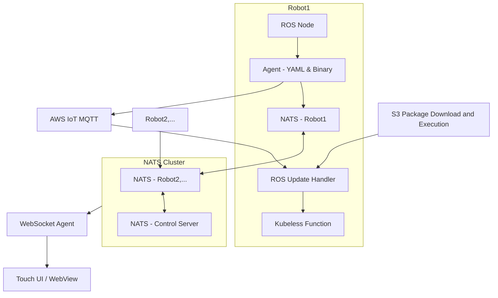

> `gpt-4-turbo` has translated this article into English.

---

Here is the English translation of the provided Markdown document, preserving all the original Markdown formatting:

---

This is a design case aimed at implementing cloud-level development experiences and control flows even in on-premise environments.  
The key is not just transferring the technology stack, but **reproducing the entire developer experience in the cloud**.

---

# Design Philosophy

I believe that the essence of design is not replicating technology, but **transplanting familiar flows into new environments**.  
That is, developers and operators should be able to **maintain the same development and operational experience regardless of the environment**.

This design aimed to create a structure where **"the flow itself can be maintained"** even in environments where direct use of cloud technologies is not possible.

---

# Problem Definition and Operational Constraints

This project faced the challenge of operating multiple autonomous robots within a **secured closed network environment**.  
The original system was completely optimized for the cloud with components like AWS Lambda and WebSocket, but the actual operational environment lacked internet access, which imposed the following constraints:

## Environmental Constraints

- **Isolated network environment** with no external internet connection
- No direct use of cloud services (e.g., AWS MQTT, S3, Lambda, etc.)
- All robots must **process and visualize messages on-site**
- Operation of 6 ROS-based robots simultaneously, each requiring **independent UI and state control flows**

---

# Overall Architecture Structure

The entire system was configured to reflect sensor and state messages from ROS-based robots in real-time on the control server and UI through a NATS-based cluster messaging structure.  
Additionally, the serverless event processing flow (Lambda style) was implemented by porting it to a **Kubeless-based FaaS structure**.

## Architecture Diagram

Structure Summary:
- Distributed messaging structure using NATS cluster
- Real-time integration with robot touch UI and control UI via WebSocket Agent
- On-premise serverless deployment flow implemented with Kubeless + S3
- Each robot processes messages individually and simultaneously interacts via cluster messaging

---

# Key Design Elements and Implementation

The core of this project was to implement a structure that secures **real-time responsiveness and operational flexibility at cloud-level in a restricted on-premise environment**.  
The design was centered around the following five areas:

## 1. Messaging Processing Structure

- Direct embedding of **NATS broker instances** in each robot for immediate local message processing
- Distributed message routing with the control server via NATS cluster configuration
- Standardization of ROS messages into **YAML conversion and binary serialization** for a lightweight transmission format
- Structure included camera frame message processing, but was excluded from actual deployment due to operational environment constraints

## 2. UI Integration Structure

- Each robot equipped with **touch monitor + WebView UI** for on-site control
- **WebSocket Agent** receives NATS messages for real-time reflection
- Same structure provided for operator's **Web UI on the control server**
- UI was bifurcated between field and control, but message structure remained consistent

## 3. Automated Deployment Flow

- Robots receive **deployment triggers** via AWS IoT MQTT messages
- ROS node detects this and calls ROS Service to **relay deployment requests**
- Kubeless Function **downloads and executes S3 package** to deploy the app
- Deployment flow of Lambda **ported to Kubeless**, applied experimentally to some features

## 4. Fault Detection and Monitoring

- **State machine-based condition assessment** logic for fault detection (e.g., speed reduction, sensor non-response)
- Real-time alerts pushed via MQTT messages
- Metric collection with Prometheus and visualization with Grafana also implemented experimentally
- Operation still primarily manual analysis based on logs

## 5. Operation and Maintenance Strategy

- All robots **remotely registered through a tunneling server**
- Operators directly access inside of the robots via tunneling, checking logs and performing operations
- **Manual deployment structure using Helm** maintained concurrently
- Kubeless functions managed via CLI or YAML definition method

This design allowed us to secure a structure that consistently works for **real-time control, remote deployment, and fault response** even on-premise.

---

# Technology Selection and Design Rationale

During the design process, considering the environmental constraints that prevented the use of existing cloud-based technologies, we reviewed and selected **technological alternatives that could operate on-premise with similar functionalities**.  
Here are the rationales for major technology elements:

| Item | Choice or Transition | Design Rationale |
|------|---------------------|------------------|
| **Kafka → NATS** | ✅ Chose NATS (Excluded Kafka) | Kafka has strengths in high throughput, but issues with Python client latency and installation complexity were concerns. In contrast, NATS is lightweight and performs stably in Python environments, advantageous for real-time responses. |
| **Lambda → Kubeless** | ✅ Adopted Kubeless (On-premise) | Used Kubeless to replicate Lambda's serverless architecture on-premise. Being Kubernetes-native allows for local execution and deployment via Helm, making it a viable alternative. |
| **MQTT Trigger-Based Automation** | ✅ Partially Applied | Configured on-premise robots to receive cloud MQTT event messages and operate internally via ROS and Kubeless. Not applied to entire app deployment, experimentally introduced for core functions. |
| **Prometheus + Grafana** | ⚪ Experimentally Applied | Configured some nodes with Prometheus collectors and attempted Grafana integration for visualization of message throughput and state metrics. Not essential for operation but considered for scalability and diagnostics. |
| **Video Stream Messaging** | ❌ Excluded from Operational Deployment | Initially designed to handle video frame messages via NATS, but excluded from actual operational structure due to bandwidth and real-time issues in a closed network environment. |

This approach of **selecting technologically adapted alternatives and redesigning structures** allowed us to maintain the original cloud-based development flow seamlessly on-premise.

---

# Design Outcomes and Insights

This design was not merely about changing technologies, but a structural experiment and tuning process to **bridge the gap between the operational environment and technological structure**.  
The overall results can be summarized from three perspectives:

## 1. Balance Between Real-Time Responsiveness and Structural Stability

- Designed a high-frequency message processing structure including camera images, but adjusted traffic flexibly through message filtering, serialization, and namespace configuration considering real-world constraints.
- **Maintained essential real-time responsiveness while securing system stability**.

## 2. Coexistence Strategy of Automation and Manual Operation

- Serverless-based automatic deployment via MQTT → ROS → Kubeless flow was technically valid, but **some apps were concurrently maintained with manual deployment methods for operational stability**.
- Automated flows were limited to repeatable updates to apply **risk diversification strategies**.

## 3. Designing Compromise Points Between Design Intent and Reality Constraints

- Powerful cloud technologies like Lambda and Kafka could not be introduced, but the structure was replicated with on-premise alternatives like Kubeless and NATS.
- Throughout the process, **maintaining the consistency of the flow and the user experience was prioritized**.

> This project is not just a simple combination of robot systems, messaging structures, and cloud technologies, but a **philosophical realization of structural design aimed at maintaining the original development experience even within constraints**.

---

# In Conclusion

This case was not about a technical problem but about **how to design the flow**.  
The reason we could implement the development experience and operational structure, which seemed only possible in cloud environments, on-premise at almost the same level was because "we didn't just replicate technology, we transplanted the experience."

## The Role of a Designer

In my view, a designer's role is not just about bringing in new technology.  
A true designer is someone who **designs familiar flows to work in new environments**.  
That is, even if the structure changes, **making sure the user's experience does not change**, that's the power of design.

## Future Possibilities

This structure is not confined to a single project.  
- Expansion to other indoor robot services
- Potential for reuse in multi-site interconnections
- Design basis for cloud-on-premise hybrid structures

Design is always a compromise with reality, but the way of that compromise should be such that **it is imperceptible to the user**. That is what we should aim for in structural perfection.