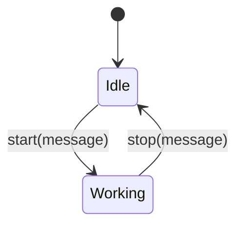
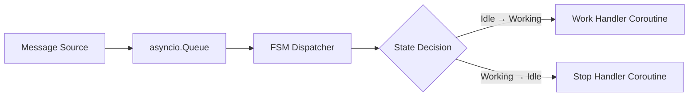
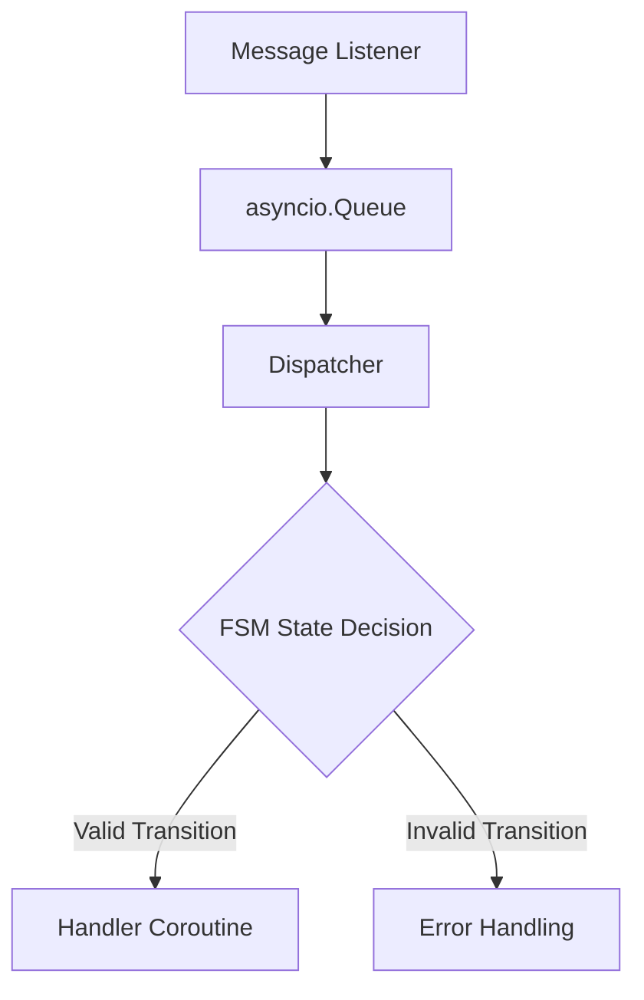
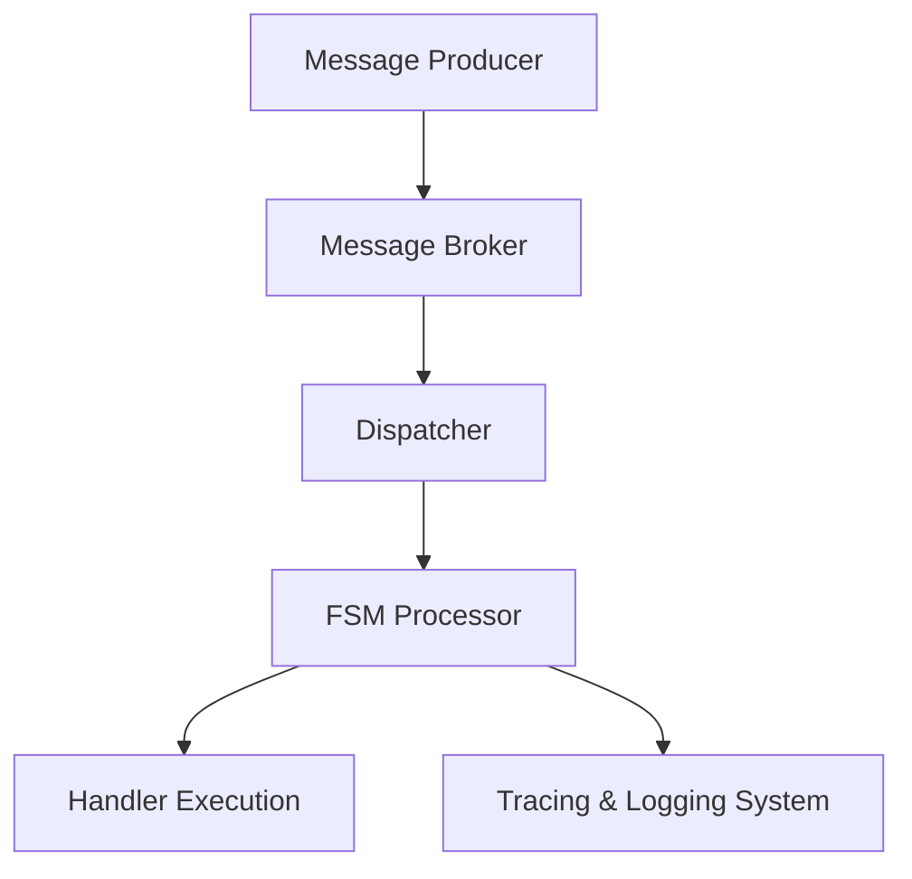

> `gpt-4-turbo` has translated this article into English.

---

# Designing a Python System for Asynchronous Messaging and MSA

---

# 1. Overview

This document is based on practical experience in developing an AI-based robotic control system and operating handlers in a Function as a Service (FaaS) model.

In real-world systems, especially those dealing with robots or AI services, frequent state changes and routine external response delays are common. In such environments, the intertwining of communication flow, state management, and processing logic can lead to the following issues:

- Maintenance is compromised due to tangled communication, state, and processing logic.
- State transitions scattered throughout the code make testing difficult.
- Increased complexity due to duplicated delay and retry processing logic.

This document aims to solve these problems by explaining how to design an asynchronous message architecture based on Python’s `asyncio`.

The focus is on **structuring complex systems and building scalable architectures** using message-based flows, FSM (Finite State Machine) for state transition management, and queues for separating communication and processing.

---

# 2. Understanding Message-driven Architecture

## 2.1 Problems with State-centric Structures

State-centric systems can encounter several issues:

- Inadequate handling of asynchronous processes: Sequential flows assume no response delays.
- Complex state transitions: Distributed conditional statements obscure the flow of state transitions.
- Strong coupling of logic: Communication, state, and processing logic are tightly coupled, making changes fragile.

## 2.2 Message-driven Processing Model

The message-driven processing approach includes:

- Abstracting all external inputs into a single message object.
- Using queues to temporarily store messages and handle them sequentially/asynchronously.
- Managing state transitions with an FSM, while delegating actual business processing to separate handler coroutines.

## 2.3 FSM-based Transition Model

The FSM-based model adheres to the following principles:

- Defines clear states and transitions.
- State transitions are triggered by events (messages).
- Separates state transitions from processing logic to enhance predictability.

Message-based FSM model diagram:



## 2.4 Compatibility of async/await with Message-driven Processing

Python’s `async/await` syntax is highly suitable for message-based architectures:

- Non-blocking I/O processing: Handles external communications and hardware interfaces asynchronously.
- Maintains message order: Controls message sequence through queues, enabling parallel processing.
- Naturally implements timeouts, retries, and error handling.

In conclusion, the `asyncio`-based structure combined with an FSM + message-driven model offers both flexibility and robustness needed for real-world systems.

---

# 3. Introduction to Key Python Asynchronous Components

Python’s asynchronous programming revolves around `asyncio`, offering various core components for effective use. These can maintain a structural code while managing complex message flows.

## 3.1 Coroutine

Coroutines are fundamental units in Python asynchronous programming:

- Defined using the `async def` keyword.
- Calls other asynchronous functions with the `await` keyword.
- Allows context switching during asynchronous operations.

```python
async def fetch_data():
    await asyncio.sleep(1)
    return "data"

async def main():
    result = await fetch_data()
    print(result)

asyncio.run(main())
```

## 3.2 Basic asyncio API

`asyncio` is a standard library for executing and managing coroutines and task scheduling.

Key functions include:

- `asyncio.run()`: Executes the entry point of an asynchronous program.
- `asyncio.gather()`: Executes multiple coroutines simultaneously and collects the results.
- `asyncio.sleep()`: Pauses asynchronously for a specified time.

```python
import asyncio

async def task(name, delay):
    await asyncio.sleep(delay)
    print(f"Task {name} done")

async def main():
    await asyncio.gather(
        task("A", 1),
        task("B", 2)
    )

asyncio.run(main())
```

## 3.3 Using asyncio.Queue for Message Buffering

`asyncio.Queue` provides a structure for safely transferring messages between multiple producers and consumers.

Features:

- FIFO (First-In-First-Out) method.
- Asynchronously uses `put` and `get` methods.

```python
import asyncio

queue = asyncio.Queue()

async def producer():
    for i in range(5):
        await queue.put(f"message {i}")
        print(f"Produced: message {i}")

async def consumer():
    while True:
        message = await queue.get()
        print(f"Consumed: {message}")
        queue.task_done()

async def main():
    consumer_task = asyncio.create_task(consumer())
    await producer()
    await queue.join()
    consumer_task.cancel()

asyncio.run(main())
```

## 3.4 Handling External Synchronous API Calls with run_in_executor

CPU-bound tasks or external synchronous API calls can be managed in separate threads or processes using `asyncio`’s `run_in_executor`.

Usage examples:

- External HTTP API calls.
- Database queries.
- Hardware control interfaces.

```python
import asyncio
import time

def blocking_io():
    time.sleep(2)
    return "blocking result"

async def main():
    loop = asyncio.get_event_loop()
    result = await loop.run_in_executor(None, blocking_io)
    print(result)

asyncio.run(main())
```

---

# 4. Basic Message Handling Structure Design

Message-based asynchronous systems follow this basic processing flow:

1. **Message Reception**: Asynchronously receive messages from external inputs (WebSocket, TCP, etc.).
2. **Queue Storage**: Store received messages immediately in `asyncio.Queue`.
3. **Dispatcher Consumption**: A separate Dispatcher consumes the Queue and passes messages to the FSM.
4. **FSM Processing**: Branches messages based on the current state and calls the appropriate handler coroutine.
5. **Handler Execution**: Performs business logic in the handler.

## 4.1 System Flow Diagram



## 4.2 Message Reception → Queue → FSM Branching → Handler Processing

The structure is summarized as follows:

- Message receivers simply load messages into the Queue.
- The Dispatcher retrieves messages from the Queue and passes them to the FSM.
- The FSM determines the handler based on the current state and message type.

```python
import asyncio

# Message queue
queue = asyncio.Queue()

# Message reception (e.g., WebSocket, TCP, etc.)
async def message_listener():
    while True:
        msg = await receive_message()  # Asynchronous reception
        await queue.put(msg)

# State-based FSM
class StateMachine:
    def __init__(self):
        self.state = "idle"

    async def handle(self, msg):
        if self.state == "idle" and msg.type == "start":
            self.state = "working"
            await self.do_work()
        elif self.state == "working" and msg.type == "stop":
            self.state = "idle"
            await self.stop_work()

    async def do_work(self):
        print("Starting work.")

    async def stop_work(self):
        print("Stopping work.")

# Dispatcher
async def dispatcher(fsm):
    while True:
        msg = await queue.get()
        await fsm.handle(msg)
        queue.task_done()

# Main loop
async def main():
    fsm = StateMachine()
    await asyncio.gather(
        message_listener(),
        dispatcher(fsm)
    )

asyncio.run(main())
```

## 4.3 Code Structure Summary

| Component            | Description                                           |
|----------------------|-------------------------------------------------------|
| `message_listener()` | Asynchronously receives messages from external systems and stores them in the Queue |
| `asyncio.Queue`      | Safely buffers and sequentially consumes messages |
| `StateMachine`       | Branches messages and calls handlers based on the state |
| `dispatcher()`       | Retrieves messages from the Queue and delivers them to the FSM |
| `main()`             | Executes all asynchronous tasks in parallel |

---

# 5. Bad vs Good Practices

Complex systems often encounter structural issues due to intertwined communication, state, and processing logic.

This section compares commonly encountered bad structures (anti-patterns) with recommended architectural patterns.

## 5.1 Examples of Bad Structures (Anti-patterns)

Characteristics:

- Communication, state, and processing logic are mixed within a single function or module.
- State changes and message processing are not clearly separated.
- Retry, timeout, and exception handling are duplicated across the code.
- Testing and debugging are extremely challenging.

Example code:

```python
async def handle_request():
    msg = await receive_message()

    if msg.type == "start":
        await start_work()
    elif msg.type == "stop":
        await stop_work()
    else:
        print("Unknown message")

    if error_detected():
        await retry()
```

Issues:

- Message reception, state branching, task processing, and error handling are mixed in one function.
- The function size increases exponentially with each new message type.
- State tracking and exception recovery are complicated.

## 5.2 Recommended Structure

Characteristics:

- Clearly separates **Reception → Queue → FSM → Handler** stages.
- FSM is responsible only for state transitions.
- Handlers perform only business logic.
- Error handling and retries are managed separately.

Recommended structure flowchart:



Recommended code example:

```python
async def dispatcher(fsm):
    while True, msg = await queue.get()
        await fsm.handle(msg)
        queue.task_done()

class StateMachine:
    async def handle(self, msg):
        handler = self.route(msg)
        if handler:
            await handler(msg)
        else:
            await handle_error(msg)

    def route(self, msg):
        # Select handler based on state and type
        ...

    async def handle_error(self, msg):
        print(f"Unhandled message: {msg}")
```

## 5.3 Comparison from a Testing/Debugging Perspective

| Item            | Bad Structure                          | Recommended Structure                     |
|-----------------|----------------------------------------|-------------------------------------------|
| Testability     | Mixed reception/state/logic makes testing difficult. | Separate FSM/handler testing is possible. |
| State Tracking  | Complex branching makes flow tracking difficult. | State transition logs enable flow tracking. |
| Exception Handling | Duplicated exception handling across the code. | Global error handling is possible. |
| Maintainability | Small changes require extensive modifications. | Independent component changes are possible. |

# Summary

- Clearly distinguish between reception, Queue, FSM, and handlers.
- FSM should only handle state transitions, delegating actual business logic to handlers.
- Error and exception situations should be controllably managed at the FSM level.

---

# 6. Advanced Scalability Strategies

Small systems may suffice with `asyncio.Queue`, but larger systems often require:

- Shared message handling across multiple service instances.
- Recovery without message loss in case of failures.
- Dynamic management of state transition policies.

Here are some advanced scalability strategies.

## 6.1 Separating and Externalizing FSM Logic

Separating FSM (State Machine) logic into a separate module offers several benefits:

- Allows policy changes without code modifications.
- Manages different versions of FSM policies.
- Facilitates testing and simulation.

Library example:

```python
from transitions import Machine

class Worker:
    pass

worker = Worker()
machine = Machine(model=worker, states=["idle", "working"], initial="idle")
machine.add_transition(trigger="start", source="idle", dest="working")
machine.add_transition(trigger="stop", source="working", dest="idle")
```

## 6.2 Introducing an External Message Broker

`asyncio.Queue` operates within a process. To share messages between services, introducing an external broker is necessary.

Key options include:

- **Kafka**: Strong in large-scale stream processing.
- **NATS**: Optimized for lightweight messaging.
- **RabbitMQ**: Supports various routing patterns.

Structure comparison:

| Item        | asyncio.Queue | Kafka/NATS/RabbitMQ |
|-------------|---------------|---------------------|
| Scope       | Within process | Across networks     |
| Durability  | Memory-based, may lose data | Disk-based, reprocessable |
| Scalability | Limited       | Horizontally scalable |

External broker integration example (NATS):

```python
import asyncio
from nats.aio.client import Client as NATS

async def run():
    nc = NATS()
    await nc.connect(servers=["nats://localhost:4222"])

    async def message_handler(msg):
        data = msg.data.decode()
        await queue.put(data)

    await nc.subscribe("robot.events", cb=message_handler)

asyncio.run(run())
```

## 6.3 Containerizing and Versioning FSM

Containerizing the FSM itself allows the following configurations:

- Operate version-specific FSM containers (`fsm-v1`, `fsm-v2`).
- Route based on message metadata.
- Independently perform rolling updates on specific FSM versions.

FSM routing example:

```python
async def fsm_router(msg):
    version = msg.get("version", "v1")
    if version == "v1":
        await call_fsm_service("http://fsm-v1/api/fsm", msg)
    elif version == "v2":
        await call_fsm_service("http://fsm-v2/api/fsm", msg)

async def call_fsm_service(url, msg):
    import aiohttp
    async with aiohttp.ClientSession() as session:
        async with session.post(url, json=msg) as resp:
            return await resp.json()
```

## 6.4 Message Tracing and Monitoring Systems

Large-scale systems require the ability to trace message flows.

Essential strategies:

- Add `trace_id`, `correlation_id` to all messages.
- Log state transitions.
- Integrate with centralized logging systems (e.g., Elasticsearch, Loki).

Structure diagram:



---

# 7. Best Practices Checklist for Practical Application

When applying message-based asynchronous architecture to actual projects, it’s crucial to check the structural quality using the following checklist.

## 7.1 Design Phase

- [ ] Have you abstracted the system's main events into messages?
- [ ] Have you standardized the message format (`trace_id`, `type`, `payload`)?
- [ ] Have you clearly defined the FSM's states and transition conditions?
- [ ] Have you separated each handler to only contain business logic?

## 7.2 Development Phase

- [ ] Are message receivers, Queue, FSM, and handlers clearly separated?
- [ ] Are external integrations (blocking tasks) handled using `run_in_executor` or separate threads?
- [ ] Have you established common logic for handling errors/exceptions?
- [ ] Is testing configured to be possible at the FSM and message levels?

## 7.3 Operation/Expansion Phase

- [ ] Have you considered introducing an external message broker based on system size?
- [ ] Have you modularized or containerized the FSM logic?
- [ ] Have you configured message tracing to track flows?
- [ ] Are you collecting monitoring metrics (processing numbers, failure rates, etc.)?

---

# 8. References

The concepts and techniques discussed in this document are based on the following resources.

## 8.1 Official Documentation

- [Python asyncio — Official Documentation](https://docs.python.org/3/library/asyncio.html)
- [asyncio Queue — Python Official Guide](https://docs.python.org/3/library/asyncio-queue.html)
- [transitions — FSM Python Library](https://github.com/pytransitions/transitions)

## 8.2 Advanced Learning Materials

- [Async IO in Python: A Complete Walkthrough - RealPython](https://realpython.com/async-io-python/)
- [Writing a Simple Python Async Message Queue Server - Bytepawn](https://bytepawn.com/writing-a-simple-python-async-message-queue-server.html)
- [Asynchronous Messaging, Part 1: Basic Distributed Architecture - Stephen Cleary](https://blog.stephencleary.com/2021/01/asynchronous-messaging-1-basic-distributed-architecture.html)

## 8.3 Related Keywords

- Python Coroutine / Async Programming
- Event-driven Architecture
- FSM (Finite State Machine)
- Message Broker (Kafka, NATS, RabbitMQ)
- Distributed Messaging System
- Tracing & Observability