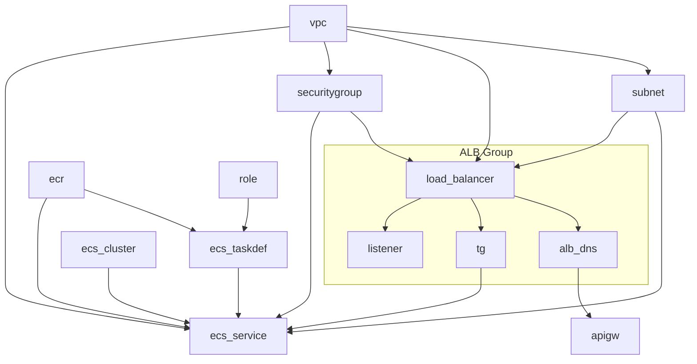

> `gpt-4-turbo` has translated this article into English.

---

This article is a retrospective on the structure and design process of the [`aws-devops-example`](https://github.com/devchan64/aws-devops-example) project.  
It aims to share practical examples of automating the deployment of infrastructure and applications, with a focus on CloudFormation and GitHub Actions.

---

## Why Did We Start This Project?

Modern service operations require more than just writing good code.  
The project was planned against the following background:

- **Overcoming the limits of manual deployment**:  
  → Manual deployment processes are repetitive, error-prone, and lack reproducibility.

- **Aim for small configurations and clear structures**:  
  → Instead of cramming all resources into one template, we wanted to clearly separate networks, security, services, and APIs.

- **Become familiar with CloudFormation**:  
  → Before using Terraform or Pulumi, we aimed to thoroughly understand the AWS native approach.

---

## What Experiences Did We Want to Incorporate?

This document is not merely a list of results.  
Instead, we aim to organize practical experiences from **the following three perspectives**:

1. **Structure**: How resources were segmented and connected
2. **Automation**: What triggers and flows were used for deployment
3. **Failures and Lessons**: What worked well and what prompted a reevaluation

---

In the following sections, we will sequentially explain everything from design goals to overall configuration, resource separation methods, deployment flow, and trials and errors.

---

## Design Goals

This project was started with the goal of going beyond a simple "deployment automation example" to achieve  
**"structured infrastructure design and executable automation"**.

---

### 1. Infrastructure as Code

- All AWS resources are defined using CloudFormation templates.
- From VPC, Subnet, Security Group to ECS, ALB, and API Gateway, they are managed in separated YAML files.
- Deployments are executed directly via **GitHub Actions without manual clicks**.

---

### 2. Clear Stack Separation and Change Flexibility (Modular & Mutable Stacks)

- Placing all resources in one giant template makes scaling difficult and changes risky.
- Therefore, we designed the system by separating the stack based on functionality to **limit the scope of changes**.

Example:

- VPC/Subnet/Security is relatively static, so it's **separated into a fixed stack**.
- ECS TaskDefinition, ALB Listener, etc., are **managed separately as they may change frequently**.

This structure provides the following flexibility:

- When adding a new service, only the ECS-related stack needs to be expanded.
- Modifying ALB routing rules does not affect the network stack.
- Specific stacks can be executed individually using `workflow_dispatch`, **securing both stability and the ability to experiment**.

This stack separation not only divides components but also focuses on structuring resources based on "changeability" in actual operational environments.

---

### 3. Declarative Git-based Deployment (GitOps)

- All deployments are automated through GitHub Actions.
- Infrastructure is deployed through `git push` or `workflow_dispatch` events without manual CLI commands.
- The deployment flow is configured as follows:

```text
Code Commit → GitHub Actions → CloudFormation → AWS Resource Creation
```

### 4. Minimum Structure, Clear Flow

- Even within ECS-based services, we start from the smallest units:

  - Task Definition
  - IAM Role
  - ECS Cluster
  - ALB Listener and Target Group

- We choose concretization over abstraction to let you directly experience the roles of each resource.

## Architecture Overview

This project is configured on AWS following this flow:

- Setting up network resources like VPC, Subnet, SecurityGroup
- Deploying ECS services connected to ALB
- Integration of API Gateway with ALB
- Deployment automation with GitHub Actions

---

### Overall Flow Summary (Mermaid)



---

### Detailed Infrastructure Layer Structure (D2)

```d2
direction: down

Infra: {
  label: "AWS Infrastructure"

  INET: "Internet"

  Traffic: {
    label: "Traffic Management"
    Route53: "Route 53"
  }

  CDN: {
    label: "CDN"
    CloudFront: "CloudFront"
  }

  API: {
    label: "API Gateway"
    APIGateway: "API Gateway"
  }

  NetworkLayer: {
    label: "Network Layer"

    VPC: {
      label: "VPC Network"

      IGW: "Internet Gateway"
      RouteTable: "Route Table"
      SecurityGroup: "Security Group"

      IGW -> RouteTable
      RouteTable -> SecurityGroup

      Subnets: {
        label: "Subnets"
        Subnet1: "Subnet 1"
        Subnet2: "Subnet 2"
        Subnet3: "Subnet 3"
      }

      LoadBalancers: {
        label: "Load Balancers"

        LB1: {
          label: "Load Balancer 1"
          Listener1: "ELB Listener 1"
          TargetGroup1: "Target Group 1"
          Listener1 -> TargetGroup1
        }

        LB2: {
          label: "Load Balancer 2"
          Listener2: "ELB Listener 2"
          TargetGroup2: "Target Group 2"
          Listener2 -> TargetGroup2
        }

        LB3: {
          label: "Load Balancer 3"
          Listener3: "ELB Listener 3"
          TargetGroup3: "Target Group 3"
          Listener3 -> TargetGroup3
        }
      }

      SecurityGroup -> Subnets
      LoadBalancers.LB1.TargetGroup1 -> Subnets.Subnet1
      LoadBalancers.LB2.TargetGroup2 -> Subnets.Subnet2
      LoadBalancers.LB3.TargetGroup3 -> Subnets.Subnet3
    }
  }

  Application: {
    label: "Application Layer"

    ECS: {
      label: "ECS Cluster"

      SRV1: {
        label: "ECS Service 1"
        Task1: "ECS Task 1"
        Frontend: "Frontend"
        Task1 -> Frontend
      }

      SRV2: {
        label: "ECS Service 2"
        Task2: "ECS Task 2"
        API: "API Service"
        Task2 -> API
      }

      SRV3: {
        label: "ECS Service 3"
        Task3: "ECS Task 3"
        Data: "Data Service"
        Task3 -> Data
      }
    }
  }

  NetworkLayer.VPC.Subnets.Subnet1 -> Application.ECS.SRV1.Task1
  NetworkLayer.VPC.Subnets.Subnet2 -> Application.ECS.SRV2.Task2
  NetworkLayer.VPC.Subnets.Subnet3 -> Application.ECS.SRV3.Task3

  DATA: {
    label: "Data Platform"

    IoT: {
      IoTCore: "IoT Core"
      IoTRules: "IoT Rules"
      IoTCore -> IoTRules
    }

    CW: "Cloud Watch"
    IoT.IoTRules -> CW

    Storage: {
      S3: "S3 Bucket"
      DynamoDB
    }
  }

  AUTH: {
    label: "Authentication"
    CognitoUserPool: "Cognito User Pool"
    CognitoIdentityPool: "Cognito Identity Pool"
  }

  Application -> DATA
  Application -> AUTH

  INET -> Traffic.Route53 -> CDN.CloudFront -> API.APIGateway -> NetworkLayer.VPC.LoadBalancers
  INET -> NetworkLayer.VPC.IGW
}
```

---

## Resource Stack Breakdown

This project is structured into four main stacks, each divided by functionality:

1. **Network Stack**: Infrastructure such as VPC, Subnet, SecurityGroup
2. **Application Stack**: ECS Cluster, Task Definition, Service, IAM Role
3. **Load Balancer Stack**: ALB, Listener, Target Group
4. **API Gateway Stack**: Configuration of API Gateway connected to ALB

---

### 4.1 Network Stack

**Included Templates**:

- `vpc.yaml`
- `subnet.yaml`
- `security.yaml`

**Key Resources**:

- VPC (specified CIDR block)
- Three Public Subnets (each in a different AZ)
- Internet Gateway + Route Table
- Security Group (separable for ALB, ECS)

**Design Points**:

- Subnets are designed in threes considering future service expansion.
- Security Group is rule-based, reusable for ALB and ECS.

---

### 4.2 Application Stack

**Included Templates**:

- `ecs-cluster.yaml`
- `ecs-taskdef-hello.yaml`
- `ecs-service-hello.yaml`
- `ecs-role.yaml`

**Key Resources**:

- ECS Cluster (Fargate-based)
- ECS Task Definition (using `hello` image)
- ECS Service (connected to ALB TargetGroup)
- IAM Role (includes ECR Pull, CloudWatch Logs permissions)

**Design Points**:

- `hello` Task is composed of a single container, suitable for testing.
- Task Role and Execution Role are clearly separated.
- Service is connected externally via ALB TargetGroup.

---

### 4.3 Load Balancer Stack

**Included Templates**:

- `alb-with-tg.yaml`

**Key Resources**:

- Application Load Balancer (ALB)
- Listener (HTTP port 80)
- Target Group (destination for ECS Service)

**Design Points**:

- Listener can be expanded with multiple path-based rules in the future.
- Target Group dynamically connects with the ECS Service, including health check settings.
- ALB interacts with the front-end API Gateway.

---

### 4.4 API Gateway Stack

**Included Templates**:

- `apigw.yaml`

**Key Resources**:

- REST API Gateway
- VPC Link
- Integration settings targeting ALB Listener

**Design Points**:

- Configuration connecting ALB with API Gateway is a frequently used pattern in practice.
- The structure flows from API Gateway → VPC Link → ALB → ECS.
- The actual public endpoint is managed by API Gateway.

---

This separation provides both deployment unit flexibility and ease of maintenance.  
When modifying specific resources, there's no need to redeploy the entire structure; instead, the relevant stack can be selectively executed in GitHub Actions.

---

## GitHub Actions-based Deployment Automation (CI/CD)

This project is designed to deploy infrastructure without manual CLI commands,  
centering around **a completely automated deployment flow with GitHub Actions**.

---

### Workflow Configuration

Each stack is managed with a separate GitHub Actions workflow file, following these rules:

| Stack        | Workflow File       | Trigger Condition                        |
| ------------ | ------------------- | ---------------------------------------- |
| VPC          | `vpc-stack.yml`     | `workflow_dispatch`, or Push             |
| ALB          | `alb-stack.yml`     | Automatically runs after VPC stack completion |
| ECS          | `ecs-stack.yml`     | Automatically runs after ALB stack completion |
| API Gateway  | `apigw-stack.yml`   | Manually run or possible connection after ECS completion |

---

### Trigger Structure (Dependency Connection)

Workflows are set to automatically execute in the following order:

```text
vpc-stack
   ↓ (on success)
alb-stack
   ↓
ecs-stack
   ↓
apigw-stack (optional connection)
```

This structure allows:

- Selective re-execution of failed stacks
- Independent testing/modification of each stack
- Visual confirmation of execution status in the GitHub Actions UI

---

### Environment Variables and Secret Management

All AWS credentials and parameters are stored in GitHub repository Secrets and referenced within Actions.

Example:

```yaml
env:
  AWS_REGION: ${{ secrets.AWS_REGION }}
  AWS_ACCOUNT_ID: ${{ secrets.AWS_ACCOUNT_ID }}
```

Secrets items:

- AWS_ACCESS_KEY_ID
- AWS_SECRET_ACCESS_KEY
- AWS_REGION
- AWS_ACCOUNT_ID

---

### Manual Execution (workflow_dispatch)

For the development environment, workflow_dispatch is set up to allow manual execution of the entire stack.

- Stack-specific experimentation possible
- Deployment tests possible without code modifications
- Deployment possible without merging into the main branch

This structure allows for GitOps operations that do not depend on local development environments and control infrastructure solely through version-managed YAML files.

---

## Deployment Flow Summary

This project employs GitHub Actions and CloudFormation to  
**fully automate the flow from infrastructure setup to application execution**.

---

### Overall Flow

```text
Push code to GitHub
       ↓
Execute GitHub Actions workflow
       ↓
Create/Update CloudFormation stack
       ↓
Deploy in order: VPC → ALB → ECS → API Gateway
       ↓
Check ECS Task running status and connect to ALB
       ↓
Finally, access the service via the API Gateway Endpoint
```

---

### Actual Flow Example

1. A user pushes code changes to the main branch.
2. GitHub Actions runs .github/workflows/vpc-stack.yml.
3. Subsequent workflows like alb-stack.yml, ecs-stack.yml are executed in sequence based on workflow_run conditions.
4. The ECS Task is registered with the Target Group and connected, with ALB distributing the traffic.
5. Finally, API Gateway connects to ALB to receive external requests.

---

### Post-Deployment Verification

- Access the URL of the hello ECS Task to check service response.
- Verify that external requests are processed correctly through the ALB DNS or API Gateway URL.
- Monitor status through CloudWatch Logs and ALB health check logs.

---

### In Summary

This structure is characterized by:

- Explicitness: The deployment flow is clearly delineated in code.
- Automation: Sequential execution without user intervention.
- Scalability: Additional stacks are easily connected.
- Rollback capability: Recovery based on CloudFormation's change history.

---

## Trials and Improvements (What Went Wrong & Fixed)

Throughout the project, we encountered various trials and errors, not just from coding but also due to **dependencies and timing issues among AWS resources and permission problems**.  
This section outlines some of the significant cases.

---

1. GitHub Actions Trigger Sequence Issues
   **Problem**: The workflow_run trigger did not function as expected.
   **Cause**: Mismatch in previous workflow names or missing conclusion conditions.
   **Solution**:

```yaml
on:
  workflow_run:
    workflows: ["vpc-stack"]
    types:
      - completed
```

The name must match exactly for the subsequent workflow to execute.

---

### 2. CloudFormation Wait Delays Due to ECS Service and TargetGroup Health Checks

**Problem**: During CloudFormation stack creation, the ECS service creation step was delayed for **several minutes waiting for the TargetGroup's health check results**.

**Cause**: The ECS Service needs at least one Task to be healthy before moving to "CREATE_COMPLETE" status.

**Impact**:

- Even though the Task started, the initial deployment seemed stalled because the stack did not complete, causing the Actions workflow to appear frozen.
- If health check failures are repeated, the stack creation itself rolls back.

**Solution**:

- Validate the alignment of Task Definition container ports, ALB listener ports, and target ports.
- If the service requires initialization time, add a **readiness check logic to the ECS Task's entrypoint**.

```yaml
HealthCheckPath: "/health"
Matcher:
  HttpCode: "200"
```

---

### 3. ECS TaskDefinition Not Updated After ECR Deployment (Using `latest` Tag)

**Problem**: Even after pushing a new image to ECR, the ECS service **continued to run with the previous image**.

**Cause**:  
Even if the `image` field in ECS's TaskDefinition specifies the `:latest` tag,  
CloudFormation considers there to be no change if the `repository:latest` URI remains the same, thus **not creating a new revision** → deployment omission.

**Temporary Solution**: Use `force-new-deployment`

Added the following script to the CI workflow (`push-ecr-hello`),  
configuring **forced redeployment of the ECS service after ECR image push**:

```bash
aws ecs update-service \
  --cluster dev-ecs-cluster \
  --service dev-ecs-service-hello \
  --force-new-deployment \
  --region $AWS_REGION
```

- Continue using the :latest tag for the image URI,
- but command the ECS service to start a new Task forcibly.
- Although the TaskDefinition revision does not change, ECS pulls and runs the new container.

**Future Improvement Direction**: Immutable Tag Strategy
This method requires forced restarts for each deployment and,
since it is not tracked by CloudFormation, further improvements are needed:

- Use unique version tags for images, such as git sha or build number.

  - Example: myapp:20250613-a1b2c3

- Automate the sequence from tag → image push → TaskDefinition registration in CI.
- Enable deployment through TaskDefinition revision creation alone, without force-new-deployment.

**Example Strategy**:

```yaml
image: ${AWS_ACCOUNT_ID}.dkr.ecr.${AWS_REGION}.amazonaws.com/dev-hello:${{ github.sha }}
```

**Lesson**:
The latest is convenient for local testing,
but precise version tracking and change detection are challenging in production deployments.
Ideally, we should adopt an immutable tag strategy in the CI/CD pipeline.

---

### Next Steps

#### 1. Expansion to Multi-Service/Multi-Environment Configuration

- Currently, the structure is centered around a single service, single environment (`dev`).
- We plan to expand to the following structure:
  - Separate production environment (`dev`, `prod`)
  - Multi-container ECS Task
  - ALB Listener Rule branching (path-based routing)

#### 2. Integration with Monitoring and Notifications

- The current structure is only connected to CloudWatch logs.
- Next, we can add the following features:
  - Slack notifications in case of ECS health check abnormalities
  - Notification propagation from GitHub Actions → SNS → notifications upon successful/failure of deployment

---

### In Conclusion

We hope this article provides helpful insights for those with similar goals.