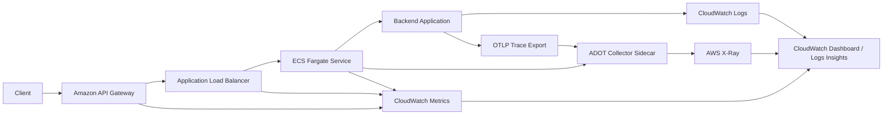

> `gpt-4-turbo` has translated this article into English.

---

# Enhancing Observability with CloudWatch and Introducing OpenTelemetry and ADOT

When improving observability in a cloud environment, the first issue encountered is not "what and how much to log." The more fundamental issue arises when there is a failure to distinguish between observability responsibilities of the infrastructure and the application, leading to increased operational complexity and costs.

This article reorganizes the observability framework in an AWS-based backend, detailing how we connected infrastructure monitoring centered around CloudWatch with internal tracing based on OpenTelemetry.

## Problem Definition

The initial state presented four major problems:

- Logs were being captured in CloudWatch but were not organized in a structure useful for operations.
- The request correlation ID was inconsistent across responses, server logs, and trace information.
- Logs for normal requests, SQL queries, and repeated successes had the potential to increase costs.
- Considering a future transition to container orchestration, a vendor-neutral tracing standard was necessary.

The critical decision here was not "let's log more" but rather "let's divide the observability responsibilities between infrastructure and application."

## Separation of Observability Responsibilities

The principles set for this improvement were simple:

- Use AWS-provided metrics and logs for the state of infrastructure components like API Gateway, ALB, ECS, and RDS.
- Focus application-level observability on internal request flows, business context, causes of exceptions, and tracking external dependencies.
- Use logs as investigative tools and design alarms to be as metric-centric as possible.

Based on these principles, there is no need to recreate infrastructure-level metrics like request counts or latency within application logs. Conversely, business failure causes or internal bottlenecks cannot be determined by infrastructure metrics alone.

## Overall Architecture

The restructured observability framework is as follows:

The key points are two-fold:

- Infrastructure monitoring is handled by CloudWatch.
- Internal application tracing is created using OpenTelemetry and sent to AWS X-Ray via the ADOT Collector.

This structure allows for joint use of CloudWatch and X-Ray within the AWS operational experience, while placing application instrumentation on the OpenTelemetry standard.

## Enhancing Infrastructure Observability with CloudWatch

The first steps included enhancing AWS infrastructure observability points:

- Enabled API Gateway access logs
- Activated detailed metrics for API Gateway
- Added CloudWatch dashboards
- Linked ECS log groups with service metrics

The goal here was to ensure that application logs do not replace the visibility of infrastructure status.

For example, metrics like request counts, 4xx/5xx rates, and edge latency are more accurately known by API Gateway and ALB. Duplicating these metrics in application logs would destabilize operational benchmarks.

## Log Policy: Lower Defaults and Expand Only for Investigation

Strengthening observability does not mean logging more extensively. Costs for CloudWatch Logs generally increase more from logs of normal requests and repeated successes than from error logs.

Therefore, the log policy was adjusted as follows:

- Default log level set to `warn`
- Logs for normal request completions are disabled by default
- SQL query logs are disabled by default
- Only during outages, increase the log level and sampling

This approach clearly has its benefits:

- Reduces costs during normal operations.
- Expands necessary scope only during investigations.
- Reduces the issue of application logs overshadowing operational signals.

Furthermore, we eliminated logs for repeated successes and large payload logs, structuring failure logs to only include identifiers and context. Cost optimization focused more on the form and frequency of logs than on log levels.

## Request Correlation and Structured Logging

The next step involved aligning request correlation IDs.

In actual operations, it's more crucial to know "in which request, under what context, and during which dependency call did a failure occur" rather than just knowing "an error occurred." To achieve this, we maintained:

- A common correlation ID for each request
- Shared tracing keys between exception responses and server logs
- Structured formats for request logs, exception logs, and service logs

This setup allows for querying server logs based on the same request in CloudWatch Logs Insights and simplifies integration when distributed tracing is later implemented.

## Why Choose OpenTelemetry

We chose OpenTelemetry as the standard for internal tracing not simply because it's the latest standard, but because we did not want to tie our observability data to a specific APM product's SDK.

Choosing OpenTelemetry offers several advantages:

- Maintains a vendor-neutral standard for tracing.
- Eases the transition to different backends from X-Ray if needed in the future.
- Retains maximum instrumentation code even after transitioning to container orchestration.

In this phase, we did not attempt to solve logging, metrics, and tracing all at once. Instead, we started with tracing to ensure the actual request flow was visible.

## Why Choose ADOT Collector Sidecar

After integrating OpenTelemetry, we considered directly transmitting to X-Ray from the application. However, it was ultimately deemed more appropriate to use the ADOT Collector as a sidecar for these reasons:

- The application only needs to know OTLP, and the platform can handle AWS transmission responsibilities.
- Sampling, exporter changes, and subsequent expansions can be controlled at the Collector level.
- Even though our current setup is nearly monolithic, this pattern is easier to maintain as services are decomposed in the future.

Setting up the initial structure as a sidecar was for similar reasons. Connecting the application and Collector within the same task as a local endpoint ensures low startup costs and allows for expansion to a separate Collector service if needed later.

## First Checks in OpenTelemetry PoC

Before full deployment, we first confirmed "does it really work?"

Questions addressed in the PoC included:

- Does OTel auto-instrumentation work properly in the current Node.js runtime and package management environment?
- Are spans created for database connections and external calls?
- Can we link the current log's trace ID with the OTel trace ID?

The purpose of the PoC was more about risk mitigation than adding features. Introducing observability often encounters more issues with runtime environments, package interpretations, and deployment structures than with code.

## Lessons Learned During Deployment

### 1. Observability does not end with replacing loggers

Actual operational observability only comes together when the following are aligned:

- Log policy
- Correlation ID
- Standardization of exceptions
- Tracing instrumentation
- Collection pipeline
- Infrastructure templates

Changing the logger library is just the beginning.

### 2. Costs are more sensitive to the form of logs than to log levels

The most effective way to reduce costs is not by reducing error logs, but by minimizing:

- Logs of all normal requests
- Constant activation of SQL query logs
- Success logs in repetitive loops
- Large request/response payload logs

To reduce costs while maintaining operability, it's more effective to aggregate or sample success logs while retaining failure logs.

### 3. Infrastructure and application observability must be separated

AWS handles infrastructure metrics well. Applications handle internal contexts well. Clearly defining this boundary avoids redundant metrics and excessive logging.

### 4. The success of OpenTelemetry depends on platform readiness

OTel isn't just a few lines of application code; it requires a ready platform. To create real value in operations, everything from Collector deployment, IAM permissions, exporter paths, to dashboard integration must be prepared by the platform.

## Current Stage Outcomes

Through this initiative, we have achieved the following:

- Enhanced CloudWatch-centric infrastructure observability points.
- Refined our log policy from a cost perspective.
- Organized request correlation and structured exception logs.
- Laid the foundation for internal tracing based on OpenTelemetry.
- Established a foundation for AWS X-Ray integration through the ADOT Collector sidecar.

It's not over yet. However, we are now ready to move from "should we log more?" to "which actual request flows are creating bottlenecks?"

## Next Steps

The future tasks are relatively clear:

- Validate trace quality in actual operational environments.
- Adjust the scope of automatic instrumentation to reduce noise.
- Shift business failure signals from logs to metrics.
- Reevaluate the Collector deployment strategy during the transition to container orchestration.

Observability isn't a one-time setup; it's a platform capability that continues to be refined based on operational experience. This work has reestablished the starting point on CloudWatch and OpenTelemetry.