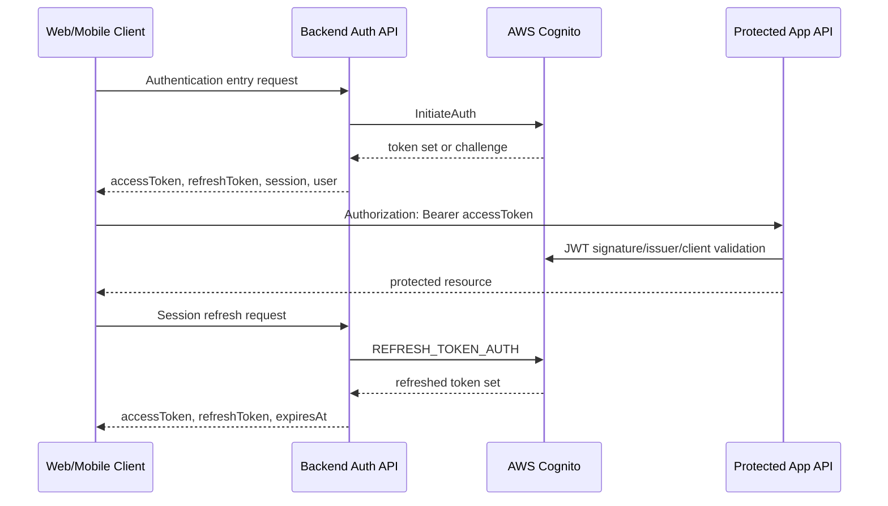
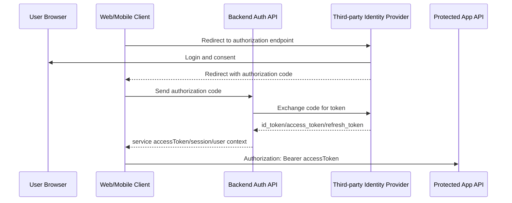

> `gpt-5` has translated this article into English.

---

# Building Auth APIs Quickly with Cognito: From Startup-Style Authentication to OAuth Boundaries

When designing authentication for a startup product, the most important task is not to build a complete authentication platform from the beginning.

The product must work first. Users must be able to sign in, change their passwords, and call protected APIs. At this stage, it is often reasonable for the frontend to use the Cognito SDK directly.

However, if authentication remains tied only to frontend SDK usage, the questions change once the product enters operation.

The team must be able to understand where sign-in failed, why a refresh token was rejected, whether web and mobile use the same authentication contract, where tenant and role information is verified, and whether the authentication flow is observable through service logs.

This article is a guide for building an API-based authentication service quickly with Cognito. The core idea is not to consume Cognito only as a client SDK, but to use it as the provider behind a backend Auth API. Cognito makes the final authentication decision, while the service establishes a verifiable API boundary between the client and Cognito.

With this approach, a team can provide authentication APIs such as sign-in, session refresh, password change, and user context retrieval without building a custom authentication server from scratch. At the same time, it can preserve a contract that can later expand into an OAuth/OIDC-based authentication structure.

This boundary is especially important in IoT services. IoT services usually do not end inside a single application. Devices, mobile apps, operator consoles, customer support tools, external partner systems, batch jobs, and notification systems are connected together. Without a domain position for authentication and authorization, every external integration tends to introduce temporary tokens, temporary roles, temporary API keys, and temporary exceptions.

Therefore, authentication and authorization do not have to be built as complete services from the beginning, but a mockable domain boundary is needed early. Whether the sign-in provider is Cognito or another OAuth provider, the service must have a place to express who is accessing which resource, in which tenant, and with which role. With that place in the model, teams can test authorization flows before external integrations are attached, and they can validate screens and APIs through the same contract.

## A Fast Start Is Possible with the SDK, but a Service API Boundary Is Still Needed

In an early product, validating the product is often more important than authentication itself.

The Cognito SDK is useful at this stage. By using object models such as `CognitoUser`, `CognitoSession`, and `refreshSession` as they are, a team can quickly implement sign-in, new-password challenges, session restoration, token refresh, and sign-out.

The frontend calls the Cognito SDK directly and stores the token set and user state returned by Cognito. The backend validates Cognito JWTs and provides protected APIs. From an implementation-speed perspective, this structure is not necessarily bad.

However, the structure recommended in this article is not one where the client remains coupled to the Cognito SDK long-term. Direct SDK usage may be fast for an initial PoC, but when building an API-based authentication service, it is better to introduce an Auth API boundary as early as possible.

The problem becomes visible after the product starts operating.

- It is difficult to collect sign-in failure causes, challenge states, and refresh failure causes consistently through service logs.
- Even when web and mobile use the same authentication policy, validation points are scattered because SDK usage differs by client.
- The client directly holds the Cognito token set and Cognito user state, which increases the unit of change when the structure changes later.
- When the authentication flow is later separated into an auth boundary, the coupling point becomes SDK usage code rather than an API contract.

The feature works, but the service cannot observe and validate the authentication flow well enough.

From this point, authentication is no longer just a feature. It becomes a boundary problem in service operations.

## Construction Principle: Keep Cognito as the Authentication Provider and Create a Service Contract

When building a fast authentication service, the most important criterion is service verifiability.

Authentication is the first gateway through which a user enters the service. From the user's perspective, sign-in failures, token expiration, permission mismatches, and missing tenant assignments all look like service failures.

Therefore, authentication flows should be traceable at the service API boundary, rather than scattered inside client-side SDK logs.

The construction principles are as follows.

- Keep Cognito's authentication and session model.
- Do not let final clients remain directly coupled to the Cognito SDK.
- Let the backend Auth API wrap Cognito calls and standardize response and error contracts.
- Use the `accessToken` returned by the Auth API for protected API calls.
- Do not use Cognito's detailed token fields as the state standard for new clients.

This approach does not create a new authentication system. It keeps Cognito as the provider while placing an API adapter in front of it that the service can control.

Here, the Auth API is not merely a proxy that wraps Cognito calls. It is the minimal authentication and authorization model positioned between the authentication provider and the service domain. This position allows the product flow to be verified with mock users, mock tenants, mock roles, and mock grants even before real external integrations are attached.

## The Auth API Is Not an Authentication Provider; It Is an Integration Boundary

The current structure can be summarized as the following flow.

The main contracts are as follows.

| Contract | Role |
| --- | --- |
| Authentication entry contract | Receives sign-in input, performs provider authentication, and returns a standard session on success |
| Challenge handling contract | Converts additional authentication steps required by the provider, such as setting a new password, into service response contracts |
| Session refresh contract | Uses a refresh token to obtain a new access token |
| Session termination contract | Invalidates the provider's token session based on the standard token used by the client |
| User context contract | Returns the user, tenant, and role context used by the application |
| Authorization catalog contract | Provides operationally changeable role, grant, and policy hints in a form that clients can interpret |

The important point is that the user context contract does not expose the raw Cognito attribute map as-is. Cognito claims, database roles, and tenant context are normalized into a shared user context used by the application.

In other words, Cognito is the authentication provider, and the Auth API is the service integration boundary.

## APIs Must Replace SDK Objects

Removing the Cognito SDK from the client requires more than a single sign-in request. The roles that the SDK used to perform inside the client must be moved into service contracts.

The authentication entry contract includes the following functions.

| Contract | Current Role |
| --- | --- |
| Sign-in | Receives email/password and performs Cognito authentication |
| New-password challenge | Completes Cognito `NEW_PASSWORD_REQUIRED` through a service response contract |
| Session refresh | Issues a new access token using a refresh token |
| Session termination | Invalidates the provider's token session using a standard `accessToken` |
| Sign-up | Performs provider user registration |
| Sign-up confirmation | Verifies a sign-up confirmation code |
| Resend sign-up code | Resends a sign-up confirmation code |
| Password reset request | Requests a password reset code |
| Password reset confirmation | Verifies the reset code and new password |
| Password verification | Verifies the current password before sensitive operations |
| Password change | Changes the password of a signed-in user |
| Account identification assistance | Helps users recover their sign-in identifier |

The existence of `Public`-style contracts does not mean Cognito is bypassed. Requests such as sign-in, sign-up, and password verification are all finally decided by the backend calling Cognito APIs.

After sign-in, the context used by the application for screens and permission decisions is separated into another contract.

| Contract | Role |
| --- | --- |
| User context retrieval | Returns user identifier, email, name, tenant, platform role, and tenant role |
| Authorization catalog retrieval | Returns the dynamic role key list stored in the repository |

The role key in the authorization catalog is not an enum. It is a value stored in the repository and can change dynamically during operation. Therefore, clients should not embed returned role codes as fixed compile-time enums.

These contracts are what allow clients to stop creating Cognito SDK user/session/challenge objects directly.

Example endpoints can be organized as follows. The paths below are not actual implementation paths; they are examples for explaining the authentication boundary.

| Example Endpoint | Contract | Description |
| --- | --- | --- |
| `POST /v1/auth/sign-in` | Authentication entry | Receives user input, performs provider authentication, and returns a standard session |
| `POST /v1/auth/challenges/new-password` | Challenge handling | Completes the new-password challenge required by the provider |
| `POST /v1/auth/token/refresh` | Session refresh | Issues a new access token using a refresh token |
| `POST /v1/auth/sign-out` | Session termination | Invalidates the provider's token session based on a standard bearer token |
| `POST /v1/auth/sign-up` | Sign-up | Performs provider user registration |
| `POST /v1/auth/sign-up/confirm` | Sign-up confirmation | Verifies a sign-up confirmation code |
| `POST /v1/auth/sign-up/resend-confirmation` | Resend sign-up code | Resends a sign-up confirmation code |
| `POST /v1/auth/password-resets` | Password reset request | Requests a password reset code |
| `POST /v1/auth/password-resets/confirm` | Password reset confirmation | Verifies the reset code and new password |
| `POST /v1/auth/password-verifications` | Password verification | Verifies the current password before sensitive operations |
| `PATCH /v1/auth/password` | Password change | Changes the password of a signed-in user |
| `GET /v1/auth/subject` | User context retrieval | Returns the user, tenant, and role context of the current request subject |
| `GET /v1/auth/authorization-catalog` | Authorization catalog retrieval | Returns operationally changeable role, grant, and policy hints |

The URL itself is not the important part. The classification standard is important. Contracts that talk directly to the authentication provider, session contracts consumed by the application, context contracts required for screen and permission decisions, and authorization catalog contracts that can change during operation should be separated.

## Sign-up Is the Starting Point of User Registration and Service Context

Sign-up is not simply an API that creates one user in Cognito. When building a fast authentication service, sign-up is the boundary where provider user registration, confirmation-code verification, and service user context linkage begin.

With Cognito, the sign-up flow can be composed quickly. The Auth API receives sign-up input such as email, password, and name from the client and calls Cognito's user registration API. Cognito handles user creation and confirmation-code delivery. The service should not expose this result as-is; it should convert the sign-up status into a response contract the client can understand.

The sign-up flow is best separated into the following stages.

| Stage | Role | Important Point in the Service Contract |
| --- | --- | --- |
| Sign-up request | Registers the user with the provider | Input validation, duplicate-account handling, and error-message standardization are required |
| Confirmation request | Verifies an email or SMS confirmation code | Code expiration, code mismatch, and already-confirmed account states must be expressed consistently |
| Confirmation retry | Resends the confirmation code | Retry limits and user feedback should be managed as service policy |
| First sign-in | Issues a session to a confirmed user | `accessToken`, `refreshToken`, and user context should be returned through a standard contract |
| User context linkage | Links the provider subject with the service user model | Cognito `sub`, email, tenant, role, and onboarding state should be normalized by service standards |

The important point is not to use Cognito's user status directly as screen state. In the sign-up flow, provider states such as `UNCONFIRMED` and `CONFIRMED` should be converted into service response contracts. Clients should consume service meanings such as `requiresConfirmation` and `canSignIn`, not Cognito status values.

States connected to temporary passwords, such as `FORCE_CHANGE_PASSWORD` and `NEW_PASSWORD_REQUIRED`, are clearer when handled by the challenge handling contract rather than by sign-up. Sign-up confirmation and the new-password challenge may be handled in the same screen flow, but the API contract should separate user registration state from authentication challenge state.

This allows sign-up to remain compatible with OAuth/OIDC expansion. In OIDC, the `sub` claim is used as the stable identifier of the user. Cognito also provides a per-user `sub`, so the Auth API can use this value as the basis for linking to the service user identifier. However, email can change, so it is safer to treat it as a claim in the user context rather than as a long-term identifier.

Ultimately, the sign-up contract quickly provides provider user registration while also creating a service user boundary that can later expand to external OIDC providers or custom user management policies.

## Tokens Must Be Separated According to OAuth/OIDC Roles

When building authentication APIs, token names are not just variable names. In OAuth/OIDC, each token has a different role. These roles should be reflected in the service contract so that meaning remains stable when the system later expands to Cognito, Hosted UI, external OIDC providers, or a custom authorization server.

From a standards perspective, it is safer to distinguish tokens as follows.

| Token | Standard Role | Usage Standard in the Service |
| --- | --- | --- |
| `access_token` | A token used by the resource server to decide whether to allow access to protected resources | Used as the bearer token for protected API calls |
| `id_token` | In OIDC, a token that represents authentication results and user identity claims | Not used directly as the source of truth for screen authorization or API authorization |
| `refresh_token` | A token used to obtain a new access token from the authorization server | Not sent to resource servers; used only in the session refresh contract |
| `expires_in` or `expires_at` | Represents the lifetime of the access token | Used by the client to decide when to refresh the access token |
| `token_type` | Represents the usage method of the token, such as bearer token | Makes `Bearer` usage explicit for protected API calls |

Service responses may use camelCase names such as `accessToken`, `idToken`, `refreshToken`, `expiresAt`, and `tokenType` according to JavaScript/TypeScript conventions. However, their meanings should align with OAuth/OIDC's `access_token`, `id_token`, `refresh_token`, `expires_in`, and `token_type`.

Under this standard, the standard field for protected API calls is `accessToken`. The client calls protected APIs with `Authorization: Bearer <accessToken>`. The `refreshToken` is sent only to the Auth API's session refresh contract to obtain a new access token. The `idToken` contains user identity claims, but it should not be standardized as the bearer token for protected API authorization.

In OAuth, the internal format of an access token can vary by implementation. It may be an opaque token or a JWT. Cognito issues access tokens and id tokens as JWTs, so protected APIs can validate conditions such as issuer, signature, audience or client basis, and token use. By contrast, a refresh token is not verified by a resource server. It should be treated as input that the Auth API passes to the provider's token endpoint or refresh API to obtain a new access token. This verification method is a Cognito implementation detail, but the role separation where protected APIs consume access tokens matches the OAuth model.

This does not mean that `idToken` should be discarded. In OIDC, `idToken` is the core token that contains the user's authentication result and identity claims. In a Cognito environment, information such as email, name, custom attributes, token use, and issuer is included in this token. Therefore, claims from the `idToken` can be used as input when composing the user context contract. However, if client screens or API authorization logic directly depend on raw claims from the `idToken`, provider replacement and claim normalization become difficult.

Ultimately, the Auth API is not a layer that simply exposes tokens issued by the provider as-is. It is a layer that organizes OAuth/OIDC token roles into contracts the service can consume.

## Protected APIs Are Resource Servers That Consume Access Tokens

Protected APIs receive `Authorization: Bearer <accessToken>`.

The backend `JwtAuthGuard` and `JwtStrategy` validate the following conditions.

- A bearer token must exist.
- It must be in JWT format.
- The Cognito issuer must match.
- Signature verification must be possible through JWKS.
- The Cognito app client basis must match.
- Token use or audience must match the purpose of protected API calls.

From an OAuth perspective, the token that a resource server should consume is the access token. Therefore, the goal of the new structure is to make protected APIs accept only `accessToken` as the standard bearer token.

However, if an existing implementation used Cognito id tokens as bearer tokens for protected APIs, both `id` and `access` may temporarily be allowed during migration. Even in that case, the goal of the service contract should be fixed to `accessToken`. Compatibility should be a transition strategy in the validation layer, not the long-term standard contract that clients depend on.

## Why This Structure Leads Toward OAuth/OIDC

This structure conceptually resembles OAuth or OpenID Connect authentication flows.

In OAuth/OIDC, a client obtains tokens from an authorization server or OpenID Provider, and a resource server verifies the access token to provide protected resources. The provider can be an external identity system such as Google, Apple, Auth0, or Cognito.

In the current structure, Cognito plays a role close to that of the authentication provider. Even if the client does not use the Cognito SDK directly, the Auth API verifies users through Cognito and obtains tokens. The protected API validates bearer tokens and allows requests.

Cognito is not a tool that perfectly provides every operational experience of OAuth/OIDC. Still, it includes the basic flow. Through concepts such as user pools, app clients, issuers, JWKS, id tokens, access tokens, refresh tokens, Hosted UI, and federated identity providers, an organization can gradually experience the major components of OAuth/OIDC.

Mapping the current Auth API contract to OAuth/OIDC standard concepts gives the following result. This table does not mean that the current implementation fully implements OAuth/OIDC. It shows which standard role each contract can move toward later.

| OAuth/OIDC Standard Concept | Correspondence in a Cognito-Based Implementation | Role in the Auth API Contract |
| --- | --- | --- |
| Resource Owner | End user | Provides sign-in input and becomes the subject of access rights to their own resources |
| Client | Web/Mobile application | Calls the authentication entry, session refresh, and user context contracts of the Auth API |
| Authorization Server | Cognito User Pool | Authenticates users and issues access tokens, id tokens, and refresh tokens |
| OpenID Provider | Cognito User Pool or Hosted UI | Issues id tokens containing OIDC identity claims |
| Resource Server | Protected API, domain API | Validates access tokens and allows access to protected resources |
| Authorization Endpoint | Hosted UI or the authorization endpoint of an external OIDC provider | Used when expanding to third-party sign-in or Hosted UI |
| Token Endpoint | Cognito token endpoint or Cognito auth API | Corresponds to exchanging authorization codes, password/challenge results, or refresh tokens for token sets |
| UserInfo Endpoint | UserInfo endpoint of an external OIDC provider | Fetches provider claims and normalizes them into the user context contract |
| JWKS | Cognito JWKS | Key set used to verify signatures of access tokens and id tokens |
| Issuer | Cognito issuer | Standard for validating the provider that issued the token |
| Audience or Client ID | Cognito app client, API audience | Standard for validating which client or resource server the token was issued for |
| Scope | Cognito scope or service authorization policy | Input for mapping access-token permission scope to service policies |
| Subject Claim `sub` | Cognito `sub` or external provider `sub` | Stable provider subject linked to the service user identifier |

With this mapping, it becomes clear that the Auth API is not just a Cognito wrapper but an adapter for moving toward a standard authentication model. Even if it initially wraps Cognito APIs directly, naming and responsibilities aligned with OAuth/OIDC roles reduce the scope of change when moving later to Hosted UI, Google, Apple, Auth0, or a custom authorization server.

In particular, `idToken` is an important connection point when moving toward OIDC. In OIDC, the id token represents user identity claims. Cognito's `idToken` also contains user attributes and claims, so the experience of normalizing these claims into the service's user context naturally extends to claim normalization for OAuth/OIDC providers later. The important point is not to standardize `idToken` as the token for protected API calls, but to treat it as input for composing user context.

This is useful for startup organizations. There is no need to build an authentication platform that considers Google, Apple, Auth0, and a custom authorization server from the beginning. The team can first operate user authentication and token validation with Cognito while establishing Auth API and user context contracts inside the service. Then the organization validates the product within Cognito's limits while also learning the language and structure needed for later OAuth/OIDC provider expansion.

When an AuthGuard and an API Gateway authorization manager structure are added, the expansion path becomes clearer. Cognito handles user authentication and token issuance. The Auth API creates the session and user context contracts consumed by the service. The AuthGuard becomes the internal application boundary that validates bearer tokens and user context on each API request. An API Gateway or a separate authorization manager can later expand into the outer boundary that evaluates routes, tenants, roles, and permission policies.

This structure does not require a complete authentication and authorization platform all at once. Initially, protected APIs can be operated with only Cognito and AuthGuard. Later, the Auth API can standardize user context. After that, API Gateway or an authorization manager can gradually take over route-level policy, tenant-level policy, and partner integration policy. In this way, the authentication provider, application guard, gateway policy, and authorization domain can be separated step by step.

However, it is not exactly the same as a typical OAuth authorization code flow.

- It is not a browser redirect-based authorization code flow; the backend proxies Cognito password/challenge/refresh APIs.
- At present, it is closer to first-party authentication for the service's own web/mobile app clients.
- It does not operate around external user consent screens like third-party social login.

Still, there is an important change. The client is no longer directly coupled to the provider SDK. The client consumes the Auth API's token contract and user context contract.

This is the structural starting point for moving toward OAuth/OIDC.

## Third-Party OAuth Authentication Is the Next Expansion Step

When introducing full third-party OAuth authentication, the authorization code flow is usually considered.

Compared with the current Auth API structure, the differences are as follows.

| Item | Current Auth API | Third-Party OAuth Authentication |
| --- | --- | --- |
| Sign-in UI | Service-owned sign-in form | Provider sign-in/consent screen |
| User password | Auth API receives it and forwards it to Cognito | The service does not receive it directly |
| Provider | Cognito User Pool | Google, Apple, Cognito Hosted UI, Auth0, and others |
| Token acquisition | Cognito password/challenge/refresh API proxy | Authorization code token exchange |
| Protected API call token | `accessToken` | Can remain the same |
| Identity claim | Cognito `idToken` claims normalized into user context | Provider `id_token` or UserInfo claims normalized into user context |
| User context | Standardized as service user context | Provider claims normalized into service user context |

The reason not to choose OAuth code flow immediately in the initial build is clear. The priority is not to introduce third-party login, but to provide Cognito-based authentication through an API boundary that the service can verify.

Even so, this structure does not block OAuth expansion. It is advantageous for the following reasons.

- The client already depends only on the Auth API, not on the provider SDK.
- The protected API call token is fixed to `accessToken`.
- Provider-specific `id_token` or UserInfo claims can be transformed into a shared user context by the user context contract.
- Protected APIs consume access-token validation results and user context, not the provider itself.
- A `COGNITO` provider adapter can exist inside the Auth API, and `GOOGLE`, `APPLE`, or `OIDC` adapters can be added later.

Therefore, the current structure is not a completed OAuth implementation. It is closer to having first built an authentication consumption boundary that resembles OAuth.

## Gradual Adoption Must Not Conflict with Startup-Style Development

In startup-style development, the important thing is not to build the completed structure from the beginning. The important thing is to validate the features needed now quickly while leaving a boundary that allows the next structure to emerge.

This approach does not replace all authentication code at once. Initially, direct Cognito SDK usage can validate the feature first. Later, the system can move toward the Auth API while preserving the meaning of Cognito tokens.

The important point here is not to discard mocks, but to create boundaries that can be mocked first. If authentication and authorization cannot be mocked, frontend screens, operator consoles, and external integration APIs must wait until the real provider is complete. Conversely, if contracts exist for `user context`, `tenant context`, `role`, and `grant`, the service flow can be verified even before the Cognito integration is complete.

During gradual adoption, the following conditions are important.

- Refresh tokens issued by the same Cognito user pool and app client should be processable in the Auth API refresh flow.
- Refresh tokens returned by the Auth API should preserve their original provider-issued meaning and should not be reinterpreted as arbitrary service-only tokens.
- The existing Cognito JWT validation structure for protected APIs should be maintained.
- Clients should gradually move away from the SDK session as the source of truth and toward the API session as the source of truth.

Because of this, the server authentication logic, frontend authentication store, and mobile authentication module do not all have to be replaced at once. The Auth API can be introduced first, then frontend SDK usage can be removed, and mobile SDK usage can be removed later.

A good adoption structure does not force the ideal final structure all at once. It keeps the current product moving while gradually replacing coupling points with API contracts.

## A Boundary That Can Later Be Separated into Services

Introducing the Auth API makes the authentication boundary appear as a service contract rather than as SDK call code.

This also matters for future microservice separation.

In IoT services, this boundary can also become the standard for external integrations. External partner APIs, installation and operation agency systems, customer support tools, and device provisioning jobs do not all look at the same user. Some calls are made by people, some by devices, and some by system-to-system batch jobs. If all of these differences are buried inside Cognito SDK usage code, an authorization model cannot emerge.

Even if the Auth API currently lives inside a monorepo backend, it can later be separated as follows.

- `auth-service`: authentication entry, session refresh, session termination, challenge handling
- `user-context-service`: user, tenant, and role context provider
- `authorization-service`: role, grant, and policy lookup
- Each domain service: validates bearer tokens and consumes only the required context

Of course, splitting into microservices immediately is not the goal. Premature separation can increase operational complexity. However, if API contracts are established first, future separation can be performed around contract boundaries rather than around SDK usage points.

For now, the system can be validated stably inside a monolith. When necessary, the boundaries can later be lifted out into service units.

## Points to Watch

This structure still requires caution.

- Wrapping Cognito with the Auth API does not eliminate the risk of storing refresh tokens.
- If the meanings of access tokens and id tokens are mixed, the structure becomes more dangerous.
- The standard field for protected API calls should be fixed to `accessToken`, and `idToken` should be treated only as input for identity claims.
- The user context contract should not expose raw Cognito attributes as-is; it should return only the application user context.
- The principle that the Auth API does not create a separate server-side session store should be maintained.
- The supported range of Cognito challenges should be explicit. The current core challenge is `NEW_PASSWORD_REQUIRED`.

Token naming is especially important. The core of this structure is not to hide every Cognito token, but to fix which field the client should use for which purpose according to OAuth/OIDC token roles.

The standard field for protected API calls is `accessToken`. The `idToken` is identity-claim input, and the `refreshToken` is session-refresh input. These three roles must not be mixed. Only then can the service contract remain stable even if the provider changes later.

## Conclusion

By applying Cognito, a team can quickly provide an API-based authentication service without building a custom authentication server from scratch. The important point is not to expose Cognito directly, but to wrap it with Auth API contracts that the service can consume.

When Cognito's authentication and session model is preserved while an Auth API boundary is established between the client and Cognito, the following effects emerge.

- Authentication flows can be verified through service logs and error contracts.
- Web and mobile use the same API contract.
- SDK removal can proceed gradually.
- Future separation into an auth service or authorization service becomes possible.
- The structure can move toward a token-consuming model similar to OAuth/OIDC.

Therefore, this structure is not the removal of Cognito. It is a rearrangement of how Cognito is used.

Cognito remains responsible for the final authentication decision. The service observes and controls that authentication flow more effectively through the Auth API. That boundary then becomes the starting point for moving later toward an OAuth/OIDC-based authentication service.
