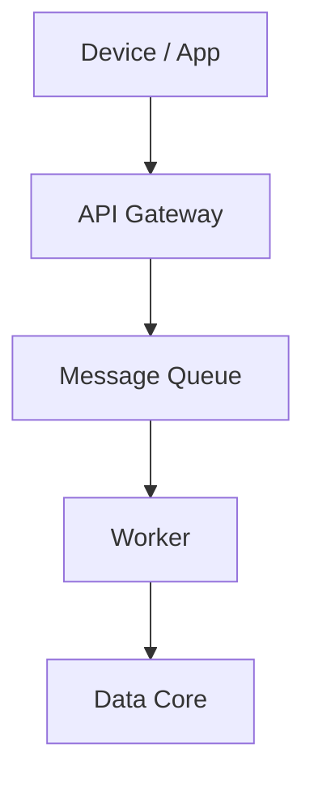

# 메시지 기반 아키텍처 요약

- REST 구조의 연쇄 장애, 추적 한계 극복을 위해 **Pub/Sub 기반 구조** 도입  
- AWS Kinesis 활용 → **관리형 인프라**로 운영 최적화  
- trace ID + 메시지 목록 = **운영 관측성** 확보  
- 네임스페이스 기반 계층 분리로 기능 그룹화 및 협업 정렬

> **"시스템은 연결로 복잡해지고, 메시지로 단순해진다."**